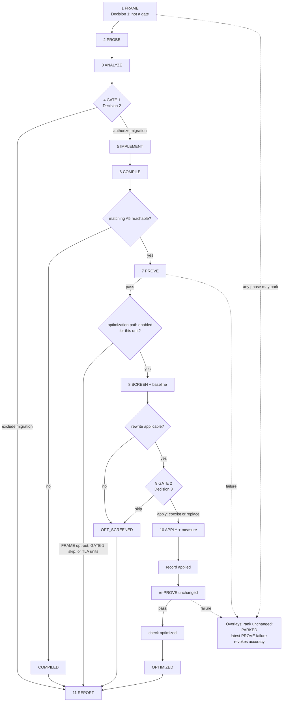

# CATLASS A2/A3 → Ascend950 migration

This is the technical user guide for an attended CATLASS operator-migration campaign from
`CATLASS_ARCH=2201` (AtlasA2/A3, `Arch::AtlasA2`) to `CATLASS_ARCH=3510` (Ascend950/A5,
`Arch::Ascend950`). The workflow preserves the operator contract, records a successful target
compile separately from device accuracy, and can then screen and apply one specific non-TLA
`L0C→UB` data-path rewrite.

The workflow is intentionally evidence-driven:

- target-tree conventions are discovered rather than inferred;
- source-code writes require one of two rendered human gates;
- accuracy is established only by a numeric result from this campaign on matching A5 hardware;
- missing tools or hardware limit the claims in the report but do not block the campaign from
  recording everything it can establish.

## Preconditions and discovery

The target must be a CATLASS-family tree with an examples hierarchy and CATLASS's normal
example/kernel/block/tile-copy/epilogue/scheduler decomposition. One source example directory maps
to one new target example directory. A tree without that shape is refused rather than forced through
an assumed profile.

Everything within that shape is discovered for the selected checkout:

- target naming and numbering;
- build entry, target name, artifact path, and architecture gating;
- registration surfaces and their symbols;
- CPU-golden entry point, tolerance path, and run arguments;
- the source and target type stacks;
- shared components and existing consumers;
- plausible existing counterparts.

Do not overwrite an existing target directory. If discovery finds a possible counterpart, compare
its contract and type stack and present the result at GATE 1. A matching name alone is not a
counterpart verdict.

A campaign should contain the units that share one dispatch policy, so a shared component is changed
once with all of its consumers visible. Run one campaign at a time for a target checkout, and migrate
its units serially.

## Migration contract

Unless GATE 1 explicitly chooses otherwise, the target preserves:

- dtype, layouts, scale and mask semantics, aliasing, supported domain, and problem shape;
- CLI arguments, input generation, CPU golden, comparator entry point, `computeNum`, and tolerances;
- Kernel, Block, Scheduler, Epilogue, and tile choices except where the selected architecture-facing
  route requires a change;
- source form: non-TLA remains non-TLA and TLA remains TLA.

A non-TLA-to-TLA implementation is a GATE-1 override, not an automatic escalation. The migrated
example may add exactly one machine-readable `CATLASS_EVIDENCE` record while preserving its existing
human-readable success and failure tokens.

The route ladder describes increasing change surface:

| Route | Permitted change | Preserved |
|---|---|---|
| `retarget` | architecture tag, architecture-parameterized dispatch, and target-required copy/sync/launch plumbing | source policy stack and external contract |
| `unblock` | `retarget` plus an A2-bound policy, checker, guard, or copy wrapper made architecture-generic | data flow and external contract |
| `reimplement` | an architecture-facing layer replaced by a target-native equivalent | external contract |
| `redesign` | external contract changes | nothing contractual; this is reported and parked, not migrated |

ANALYZE must rule on the chosen route and every cheaper route it supersedes. Shared declarations,
unit paths, and registration surfaces form the GATE-1 write ledger. Shared declarations land first;
each unit lands next; that unit's registration surfaces land only after its new directory exists.
Any generalized component also requires a source-architecture regression of its existing consumers.

### Non-goals

This is not a generic performance-tuning campaign. It does not change tile shapes, swizzles,
scheduling, block count, core count, fusion, workspace policy, or autotuning. `SPLIT_N` is explicitly
out of scope. The `SPLIT_M` optimization mode described later is part of the fixed `L0C→UB` data
path, not permission to tune the operator generally.

It also does not:

- supply a missing target backend;
- redesign dtype, layout, scale, mask, aliasing, or supported domain;
- edit the A2/A3 source example used as the reference;
- edit the CPU golden or relax a tolerance;
- turn a compile, exit code, success string, registry row, or previous run into an accuracy claim.

### Hard refusal: direct Cube int4

A unit is refused, with no override, when either operand that reaches Cube/Mmad is
`AscendC::int4b_t`. Supplying a target s4 Cube path is new-backend work, not a migration.

The refusal is about the Cube operands, not storage. A unit may store int4 and use a Vector-stage
Cast to `int8_t` before Cube; in that case the Cube operands are int8 and the unit remains eligible
for migration.

## Lifecycle: three decisions, two write gates



The three human decisions are:

1. **FRAME:** settle the requested scope and intake. FRAME creates no authorization event and is
   not a gate. It may create campaign metadata, but it authorizes no source-code write.
2. **CONFIRM / GATE 1:** authorize or exclude each migration after the contract, route, shared
   blast radius, and exact write ledger are known. On an optimization-enabled campaign, this is also
   the early per-unit opportunity to skip later optimization with `--skip-optimize`.
3. **CONFIRM-OPT / GATE 2:** after a unit is proven, screened, and baselined, choose apply or skip
   and, if applying, `coexist` or `replace`.

Questions do not create a fourth decision. Resolve ambiguity, update the underlying artifacts, and
render the packet again. Each `confirm --intent` value stores the final human decision **verbatim**:
do not summarize, normalize, or reconstruct it. A gate binds the packet most recently rendered; if a
bound artifact changes, render and decide again.

`PARKED` and a latest proof failure are overlays, not lifecycle ranks. A parked unit keeps the rank
it earned and carries its reason. A failed build, run, or evidence check revokes an earlier accuracy
claim until a later `prove` passes, without pretending the earlier successful observation never
happened.

## FRAME intake and initialization

FRAME puts four items into one intake decision before `init`:

1. **Resolved units:** show every requested `source → target` pair using naming measured from the
   target tree. If the request names no operator, ask for the scope and stop; never invent one.
2. **Hardware access:** declare A2/A3 and A5 reachability, including transport when a device is
   remote. Zero, one, or both sides may be reachable.
3. **Performance cases:** accept a supplied table or use the bundled template.
4. **Global optimization scope:** optimization defaults on. Setting `optimize.enabled` to `false`
   opts the whole campaign out at FRAME and is frozen by `init`; changing that decision later
   requires a new run directory.

Optional intake items use their stated defaults when the final response does not address them. Do
not repeatedly ask about an optional item.

### Plan

Create `plan.json`:

```json
{
  "version": 1,
  "request": "<original request, verbatim>",
  "target_root": "<path to the CATLASS checkout>",
  "optimize": { "enabled": true },
  "units": [
    {
      "id": "<stable unit id>",
      "source": "<existing source example directory>",
      "target": "<new target example directory>"
    }
  ]
}
```

Replace every placeholder. `request` is the original request exactly as received. Each `id` is one
path-safe token; each source exists; each target is a tree-relative path that does not yet exist.
Omitting `optimize` is equivalent to enabling it. Leave `refs` omitted to use the fixed source
revisions listed under **Pinned sources**. If included, each named reference must exactly reproduce
its canonical full lowercase pin; it cannot select an alternate revision.

### Access declaration

Access is settled at `init`, not inferred later from a run result. A declaration may describe both
sides or mark either side unreachable:

```json
{
  "a2": {
    "reachable": false,
    "notes": "<measured reason>"
  },
  "a5": {
    "reachable": true,
    "arch": "3510",
    "soc": "Ascend950",
    "host": "<declared device location>",
    "device": "<measured device identity or selector>",
    "transport": {
      "kind": "ssh",
      "host": "<ssh destination>",
      "workdir": "/<absolute remote work directory>",
      "identity_file": "<local key path>"
    }
  }
}
```

Every reachable side requires non-empty `arch`, `soc`, `host`, and `device`. `arch` is exactly
`2201` for `a2` or `3510` for `a5`. Its `soc` must identify the same family: `910`, `Atlas A2`,
`Atlas A3`, or `2201` for `a2`; `950`, `Ascend950`, `A5`, or `3510` for `a5`. `device` records the
measured device identity or selector observed at FRAME, not an arbitrary selector; `prove` never
infers or relabels any part of that identity.

Replace the placeholders and omit fields that do not apply. For a local device, omit `transport` or
use `{"kind": "local"}`. A remote device requires `kind: "ssh"`, a destination, and an absolute
remote `workdir`; optional `user`, `port`, `identity_file`, `password_env`, and `ssh_options` refine
the connection. `password` and `password_env` are mutually exclusive. Password transport requires
`sshpass`; if it is unavailable, only the device operation is refused and the compile result still
stands.

The build always runs in the local checkout. For a declared remote side, the device stage and
profiling run in the declared workdir and their logs are fetched into the run directory. A
remote-looking device declaration without a usable transport cannot support a device claim.

Access never blocks FRAME, discovery, or an attempted compile. It bounds the evidence:

- no reachable A5 means a successful unit stops at `COMPILED` and is reported as not verified on
  device;
- reachable A5, local or transported, permits the accuracy run;
- A2/A3 access permits source-side performance measurements but is not a substitute for A5 proof.

A passing proof retains the exact declared `{arch, soc, host, device}` in `proof.json` and its
`unit.proven` hardware object. Current accuracy requires the latest proof to carry that bound
identity and no later `unit.prove_failed`; an old `unit.proven` event without it is a historical
observation, not current accuracy.

### Performance-case input

Pass a user-supplied table with `init --perf-cases <path>`. If none is supplied,
`assets/perf_case_template.md` is staged automatically as `<run-dir>/perf_cases.md`. The staged file
is the campaign record used by both gates and the report.

Fill every cell the declared access can measure and leave every other cell blank. A blank means
“not measured”; never estimate a value or copy one from a different campaign. Keep the environment
and shape context beside the measurements. Performance data never substitutes for accuracy proof.

## Command walkthrough

`--run-dir` is required on every command except `init`. `init` prints the run directory; keep using
that exact path. At any interruption, `status` prints the next command for each unit.

```sh
S=.agents/skills/catlass-ascend950-migration/scripts/mig.py

# Add --perf-cases <path> only when supplying a table.
python3 "$S" init --plan plan.json --access access.json
R='<run directory printed by init>'

python3 "$S" refs --run-dir "$R"

# PROBE: record build, golden, registration, and arch-gating discovery in profile.json.
python3 "$S" profile --run-dir "$R"

# ANALYZE: record each unit's findings.json, then validate one unit or the full campaign.
python3 "$S" check --run-dir "$R" --phase analyzed --unit '<id>'

# GATE 1 renders the migration packet and deliberately exits with status 2.
python3 "$S" gate --run-dir "$R"
python3 "$S" confirm --run-dir "$R" \
  --intent '<final GATE-1 human decision, verbatim>'

# After landing only the authorized migration ledger:
python3 "$S" check --run-dir "$R" --phase implemented --unit '<id>'
python3 "$S" prove --run-dir "$R" --unit '<id>'

# For a PROVEN unit still on the optimization path, record screen.json and its baseline first.
python3 "$S" check --run-dir "$R" --phase screened --unit '<id>'
python3 "$S" gate --run-dir "$R" --phase optimize
python3 "$S" confirm --run-dir "$R" --phase optimize \
  --intent '<final GATE-2 human decision, verbatim>'

# After the authorized rewrite is applied and measured, in this exact order:
python3 "$S" check --run-dir "$R" --phase applied --unit '<id>'
python3 "$S" prove --run-dir "$R" --unit '<id>'
python3 "$S" check --run-dir "$R" --phase optimized --unit '<id>'

python3 "$S" report --run-dir "$R"
python3 "$S" status --run-dir "$R"
```

At GATE 1, add `--exclude <comma-separated ids>` to omit units from migration. On a globally enabled
campaign, add `--skip-optimize <comma-separated ids>` to migrate and prove those units but bypass
SCREEN, GATE 2, and APPLY for them. `--skip-optimize` is a migration-confirm option; it is not a
substitute for the FRAME-wide opt-out.

At GATE 2, `--exclude <comma-separated ids>` records “skip the rewrite”; the proven migration still
stands. Before either `confirm`, make the artifacts reflect the final decision, re-render if they
changed, and pass the exact final human response as `--intent`. Shell quoting may change how text is
passed, so verify that the argument value itself remains verbatim.

Use `prove --compile-only` instead of the normal `prove` command when the access declaration has no
reachable A5. Use `park --run-dir "$R" --unit '<id>' --reason '<reason>'` when a premise fails or a
unit cannot proceed. Always generate the final report, including for excluded, compiled-only,
screened-out, failed, and parked units.

## PROBE and ANALYZE outputs

`profile.json` has one answered section for each discovery concern:

- `build`: configure/build entry, architecture argument, leaf target, and artifact convention;
- `golden`: generator, CPU computation, comparator, tolerance path, and run surface;
- `registration`: every file and symbol that makes a target example reachable;
- `arch-gating`: architecture macros, values, and where each is applied.

A missing concern is recorded as a gap, not filled with a generic default.

Each `units/<id>/findings.json` freezes:

- counterpart verdict and evidence;
- external contract, tensors, shape, golden, comparator, and `computeNum`;
- source type stack and adjudicated route ladder;
- build and run arguments used by `prove`;
- shared components, their existing consumers, and registration surfaces;
- the exact writable paths.

GATE 1 presents these findings plus the ordered write ledger. The gate is the point to correct a
route, contract reading, target form, counterpart verdict, or blast radius. An ambiguous or
conditional response is a question, not authorization.

## COMPILED is not PROVEN

`prove` first runs the discovered build. A successful build records `COMPILED` before any device
operation. `--compile-only` stops at that outcome.

Before building, the engine records whether the declared executable and sourced environment scripts
are visible, but it still attempts the build. This environment check is diagnostic, not a blocker:
a failure with a missing prerequisite is reported as an environment limitation, not as a verdict on
the migrated code.

`PROVEN` requires all of the following:

- a fresh artifact produced for this campaign;
- execution on declared, matching A5 hardware;
- exactly one parseable `CATLASS_EVIDENCE` record from the migrated example;
- the frozen shape, dtype, comparator path, and `computeNum`;
- `errors == 0` against the unchanged CPU golden.

A compile, process exit code, or `Compare success.` string is never enough. `PROVEN` establishes the
frozen case only. If the latest `prove` fails, the report marks the previous accuracy result revoked
until a later unchanged proof passes.

## The non-TLA `L0C→UB` rewrite

Optimization defaults on, but the rewrite is considered only after migration proof. SCREEN reads the
built target, records a profiler baseline, and answers whether all of these are true:

1. the target is a Gemm-family stack with an M×N C tile;
2. it has an epilogue;
3. the active C-producing and C-consuming path is non-TLA;
4. the active BlockMmad still copies L0C to GM;
5. the active epilogue still copies that C data from GM to UB.

The readings, rationale, measured baseline, proposed strategy, and complete file manifest are shown
at GATE 2. A failed applicability condition is a successful screen outcome: the unit reaches
`OPT_SCREENED`, authorizes no rewrite, and goes to the report.

### Gate-2 strategies

| Strategy | Result | Decision consequence |
|---|---|---|
| `coexist` | keep the proven baseline and the new direct path as separate build variants; the rewritten path is the default exercised by the unchanged proof | baseline remains compilable and `optimize.json` must record its non-empty profiler sample re-measured in the same session as the rewrite |
| `replace` | remove the old path and retain only the rewrite | no rollback is provided; explicit human approval is required |

GATE 2 decides apply or skip and, for apply, one of these strategies. It also authorizes the exact
file manifest. If implementation reveals that the manifest is incomplete, update the screen,
re-check it, render GATE 2 again, and obtain a new verbatim decision before touching the additional
path.

### Data-path modes

The strategy controls coexistence in the tree; the mode controls how Fixpipe delivers the C tile to
the AIV sub-blocks:

| Mode | Delivery and UB budget | Use when |
|---|---|---|
| `SPLIT_M` | split even M across the two AIV sub-blocks; each receives a compact M/2 tile and uses the dual-destination flag protocol | default when the epilogue is separable across M and the per-half UB calculation fits |
| `NO_SPLIT` | deliver the full M tile to one AIV sub-block and use the single-destination flag protocol | the actual runtime M interval or tail is odd and cannot be padded, the epilogue couples M halves, or the full-tile UB calculation fits |

Choose the mode from the migrated unit's M shape, dtype, stage count, epilogue semantics, and UB
budget. “Odd” here describes the actual runtime M interval or tail. It does not permit an odd
compile-time `SPLIT_M` tile M: that M remains even as the implementation reference requires. Do not
choose the mode from preference or a benchmark. `SPLIT_N` is not available in this workflow.

### APPLY convergence

For an authorized unit:

1. land only the authorized manifest;
2. measure the rewritten path and record its non-empty profiler sample in `optimize.json`; under
   `coexist`, re-measure the baseline variant in the same session and record its non-empty profile
   sample beside it. `check --phase applied` rejects a coexist artifact without that baseline;
   `replace` requires no baseline profile field;
3. run `check --phase applied` to record that the declared files exist;
4. run the original `prove` command unchanged, against the same golden and frozen case;
5. run `check --phase optimized`, which requires a successful proof recorded after the applied
   event.

Only then is the unit `OPTIMIZED`. A failed re-proof is not an optimization result: fix the rewrite
within the authorized scope or park the unit. Never change the golden, comparison set, or tolerance.

Profiler output must be written beneath the unit's run-directory logs and fetched there when the A5
device is remote. Do not allow a profiler's default output location to scatter data into the target
tree.

## Artifacts, containment, and resume

Campaign metadata, reference checkouts, logs, and generated reports live under
`<target_root>/.agents-work/`. Authorized source edits land only at paths named by the applicable
gate. The tool adds `.agents-work/` to `$GIT_DIR/info/exclude`; it does not edit the tracked
`.gitignore` and does not use a home-directory cache.

```text
<target_root>/.agents-work/
  .cache/refs/
    catlass@<pin>/
    asc-devkit@<pin>/
  catlass-ascend950-migration/<run-id>/
    plan.json
    access.json
    perf_cases.md
    profile.json
    tree_baseline.txt
    events.jsonl
    report.md
    units/<id>/
      findings.json
      proof.json
      screen.json
      optimize.json
      logs/
```

`plan.json` is the frozen request and scope. `tree_baseline.txt` distinguishes pre-existing dirty
paths from campaign writes. `events.jsonl` is append-only campaign state. The unit artifacts contain
the evidence rendered by the gates and report; `logs/` holds build, run, and profiler output.

Resume with the same run directory:

```sh
python3 .agents/skills/catlass-ascend950-migration/scripts/mig.py status \
  --run-dir '<existing run directory>'
```

Do not run `init` to resume; it creates a different campaign. `report` generates `report.md` from the
recorded state and retains a **Not established** section for every claim the campaign could not make.

## Pinned sources

All fixed CATLASS and Ascend950 compatibility facts used by this workflow are bounded to these two
source revisions:

- CATLASS — https://gitcode.com/cann/catlass at
  `89e1fc39881a715882b9b47459add06ba270105c`
- asc-devkit — https://gitcode.com/cann/asc-devkit at
  `512674e996da0feaee6e7f435e4efc1cad1d74fb`

`mig.py refs` resolves these revisions into the campaign cache. The selected target checkout remains
authoritative for its own build, registration, naming, golden, and active data path; re-discover
those facts instead of projecting the pinned trees onto it.
