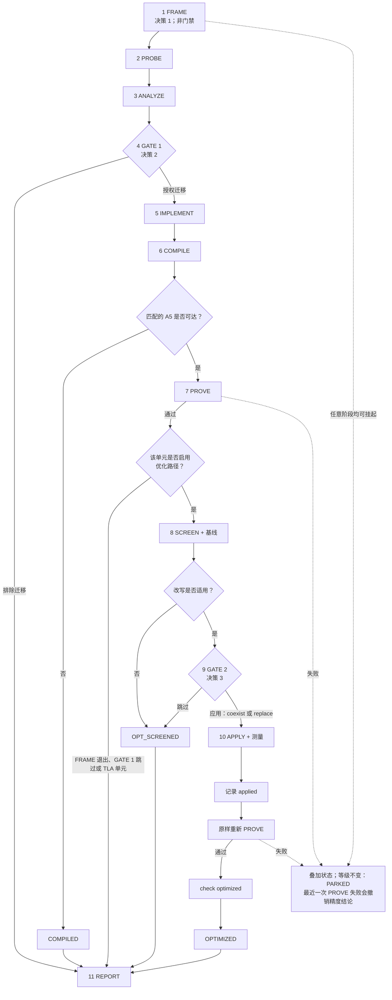

# CATLASS A2/A3 → Ascend950 迁移

本文是 CATLASS 算子迁移活动（campaign）的技术使用指南：在人工参与决策下，将算子从
`CATLASS_ARCH=2201`（AtlasA2/A3，`Arch::AtlasA2`）迁移到 `CATLASS_ARCH=3510`（Ascend950/A5，
`Arch::Ascend950`）。该工作流保持算子契约不变，将目标平台编译成功与上板精度分开记录，随后还可以
筛查并应用一项特定的非 TLA `L0C→UB` 数据通路改写。

该工作流刻意采用证据驱动的方式：

- 目标目录树的约定通过探测获得，而不是靠推断；
- 对源代码的写入必须经过两道渲染出的人工门禁之一；
- 精度只能由本次活动在匹配的 A5 硬件上得到的数值结果确立；
- 工具或硬件缺失只会限制报告中可以做出的结论，不会阻止活动记录它能够确立的一切。

## 前提条件与探测

目标必须是 CATLASS 系列的目录树，具备 examples 层级结构，以及 CATLASS 常规的
example/kernel/block/tile-copy/epilogue/scheduler 分解方式。一个源样例目录对应一个新的目标样例
目录。不满足这一结构的目录树会被拒绝，而不是按假设的画像强行处理。

在该结构之内的一切都针对所选检出目录逐项探测：

- 目标命名与编号规则；
- 构建入口、构建目标名、产物路径与架构门控；
- 注册点（registration surface）及其符号；
- CPU 标杆（Golden）入口、容忍度选择路径与运行参数；
- 源与目标的类型栈；
- 共享组件及其现有使用方；
- 疑似已存在的对应实现（counterpart）。

不要覆盖已存在的目标目录。如果探测发现疑似对应实现，需比较其契约与类型栈，并在 GATE 1 呈现
比较结果。仅凭名字相符不构成对应实现的判定。

一次活动应包含共享同一调度策略（dispatch policy）的那些单元，使得共享组件只被修改一次，且修改
时其全部使用方都可见。同一个目标检出目录同一时间只运行一次活动，并串行迁移其中的单元。

## 迁移契约

除非 GATE 1 明确另作选择，目标保持以下内容不变：

- 数据类型、数据布局、scale 与 mask 语义、别名关系、支持的输入范围与问题形状；
- 命令行参数、输入数据生成、CPU 标杆（Golden）、比对入口、`computeNum` 与容忍度；
- Kernel、Block、Scheduler、Epilogue 与 Tile 的选择，除非所选的面向架构的路线要求改动；
- 源代码形态：非 TLA 保持非 TLA，TLA 保持 TLA。

将非 TLA 实现改为 TLA 属于 GATE 1 的显式改判，而不是自动升级。迁移后的样例可以恰好新增一条
机器可读的 `CATLASS_EVIDENCE` 记录，同时必须保留其原有的人类可读成功与失败输出标识。

路线阶梯按改动面从小到大排列：

| 路线 | 允许的改动 | 保持不变 |
|---|---|---|
| `retarget` | 架构标签、按架构参数化的调度分发，以及目标平台必需的搬运/同步/启动配套代码 | 源策略栈与外部契约 |
| `unblock` | 在 `retarget` 基础上，将一个绑定 A2 的策略、校验器、守卫或搬运包装改为架构通用 | 数据流与外部契约 |
| `reimplement` | 用目标原生的等价实现替换一个面向架构的层 | 外部契约 |
| `redesign` | 外部契约发生变化 | 契约层面无任何保持；这类单元只报告并挂起，不做迁移 |

ANALYZE 必须对所选路线以及被它取代的每一条更低成本路线给出裁定。共享声明、单元路径与注册点共同
构成 GATE 1 的写入台账（write ledger）。共享声明最先落地；随后是各个单元；单元的注册点只有在其
新目录已存在之后才能落地。任何被通用化的组件还要求对其现有使用方做一次源架构回归验证。

### 非目标

这不是一次通用的性能调优活动。它不改动 Tile 形状、swizzle、调度、基本块数量、核数、融合、
workspace 策略或自动寻优。`SPLIT_N` 明确不在范围内。后文描述的 `SPLIT_M` 优化模式属于固定的
`L0C→UB` 数据通路的一部分，并不是对算子做一般性调优的许可。

它同样不会：

- 补齐缺失的目标后端；
- 重新设计数据类型、数据布局、scale、mask、别名关系或支持范围；
- 编辑作为参考的 A2/A3 源样例；
- 编辑 CPU 标杆或放宽容忍度；
- 把一次编译、退出码、成功字符串、注册表记录或以前的运行当作精度结论。

### 硬性拒绝：int4 直接进 Cube

当到达 Cube/Mmad 的任一操作数是 `AscendC::int4b_t` 时，该单元被拒绝，且没有任何改判余地。
补一条目标平台的 s4 Cube 通路属于新后端开发，而不是迁移。

这条拒绝针对的是 Cube 操作数，而不是存储形式。一个单元可以以 int4 存储数据，并在进入 Cube
之前用 Vector 阶段的 Cast 转为 `int8_t`；这种情况下 Cube 操作数是 int8，该单元仍然可以迁移。

## 生命周期：三次决策、两道写入门禁



三次人工决策是：

1. **FRAME：** 敲定所请求的范围与初始信息。FRAME 不产生任何授权事件，也不是门禁。它可以创建
   活动元数据，但不授权任何源代码写入。
2. **CONFIRM / GATE 1：** 在契约、路线、共享影响范围与确切的写入台账都已明确之后，对每个迁移
   给出授权或排除。在启用优化的活动中，这里也是通过 `--skip-optimize` 提前为单个单元跳过后续
   优化的机会。
3. **CONFIRM-OPT / GATE 2：** 在单元完成验证、筛查并记录基线之后，决定应用或跳过；若应用，
   选择 `coexist` 或 `replace`。

提问不构成第四次决策。先消除歧义、更新底层产物，再重新渲染信息包。每个 `confirm --intent`
取值**逐字**保存最终的人工决策：不要概括、规范化或重新组织它。门禁绑定的是最近一次渲染出的
信息包；如果被绑定的产物发生变化，就重新渲染并重新决策。

`PARKED` 与最近一次证明失败都是叠加状态，不是生命周期等级。被挂起的单元保留其已获得的等级，
并附带挂起原因。构建、运行或证据检查失败会撤销此前的精度结论，直到之后某次 `prove` 通过为止，
但不会假装早先那次成功观测从未发生。

## FRAME 信息收集与初始化

FRAME 在 `init` 之前把四项内容汇总为一次决策确认：

1. **解析后的单元列表：** 用从目标目录树实测得到的命名，展示每个所请求的 `source → target`
   映射。如果请求没有点名任何算子，询问范围并停下；绝不自行虚构。
2. **硬件访问：** 声明 A2/A3 与 A5 的可达性，设备为远程时还要包含传输方式。可达侧可以是零个、
   一个或两个。
3. **性能用例：** 接受用户提供的表格，或使用自带模板。
4. **全局优化范围：** 优化默认开启。将 `optimize.enabled` 置为 `false` 会让整个活动在 FRAME
   阶段退出优化，并由 `init` 冻结；之后要改变这一决定需要新的运行目录。

最终回复未涉及的可选项按其声明的默认值处理。不要就某个可选项反复追问。

### 计划文件

创建 `plan.json`：

```json
{
  "version": 1,
  "request": "<原始请求，逐字保留>",
  "target_root": "<CATLASS 检出目录的路径>",
  "optimize": { "enabled": true },
  "units": [
    {
      "id": "<稳定的单元 id>",
      "source": "<已存在的源样例目录>",
      "target": "<尚不存在的目标样例目录>"
    }
  ]
}
```

替换所有占位符。`request` 是逐字保留的原始请求。每个 `id` 是一个路径安全的令牌；每个 source
必须存在；每个 target 是相对目录树的路径且尚不存在。省略 `optimize` 等价于启用优化。不写
`refs` 即使用**固定源码版本**一节列出的固定源码修订版本。如果写了，每个具名引用必须与其规范的
完整小写固定提交完全一致；不能选择其他修订版本。

### 硬件访问声明

访问在 `init` 时敲定，而不是事后从运行结果反推。声明可以描述两侧，也可以将任一侧标记为不可达：

```json
{
  "a2": {
    "reachable": false,
    "notes": "<实测得到的原因>"
  },
  "a5": {
    "reachable": true,
    "arch": "3510",
    "soc": "Ascend950",
    "host": "<声明的设备位置>",
    "device": "<实测的设备标识或选择器>",
    "transport": {
      "kind": "ssh",
      "host": "<ssh 目标地址>",
      "workdir": "/<绝对路径的远程工作目录>",
      "identity_file": "<本地密钥路径>"
    }
  }
}
```

每个可达侧都要求非空的 `arch`、`soc`、`host` 与 `device`。`arch` 对 `a2` 恰为 `2201`，对 `a5`
恰为 `3510`。`soc` 必须标识同一产品系列：`a2` 为 `910`、`Atlas A2`、`Atlas A3` 或 `2201`；
`a5` 为 `950`、`Ascend950`、`A5` 或 `3510`。`device` 记录的是 FRAME 阶段实际观测到的设备标识
或选择器，而不是任意填写的选择器；`prove` 绝不推断或改写该标识的任何部分。

替换占位符并省略不适用的字段。本地设备可省略 `transport` 或写 `{"kind": "local"}`。远程设备
要求 `kind: "ssh"`、目标地址和绝对路径的远程 `workdir`；可选的 `user`、`port`、
`identity_file`、`password_env` 与 `ssh_options` 用来细化连接。`password` 与 `password_env`
互斥。密码传输依赖 `sshpass`；若不可用，只有设备操作被拒绝，编译结果仍然有效。

构建始终在本地检出目录中运行。对声明为远程的一侧，设备阶段与性能采集在声明的 workdir 中运行，
其日志会被取回到运行目录。看起来是远程设备却没有可用传输方式的声明，无法支撑任何设备侧结论。

访问声明从不阻塞 FRAME、探测或编译尝试。它限定的是证据范围：

- 没有可达的 A5 时，成功的单元止步于 `COMPILED`，并在报告中记为未经上板验证；
- A5 可达（本地或经传输）时，允许精度运行；
- A2/A3 可达允许源侧性能测量，但不能替代 A5 的精度证明。

通过的证明会在 `proof.json` 及其 `unit.proven` 硬件对象中原样保留声明的
`{arch, soc, host, device}`。当前精度成立要求最近一次证明携带该绑定标识，且之后没有
`unit.prove_failed`；不带该标识的旧 `unit.proven` 事件只是历史观测，不代表当前精度。

### 性能用例输入

用 `init --perf-cases <path>` 传入用户提供的表格。未提供时，`assets/perf_case_template.md`
会被自动暂存为 `<run-dir>/perf_cases.md`。暂存后的文件就是两道门禁与报告共同使用的活动记录。

把声明的访问能力可以测量的每个单元格都填上，其余单元格全部留空。空白表示“未测量”；绝不估算
数值，也不从其他活动拷贝数值。把环境与形状上下文和测量数据记录在一起。性能数据永远不能替代
精度证明。

## 命令流程

除 `init` 外，每条命令都必须携带 `--run-dir`。`init` 会打印运行目录；此后一直使用该确切路径。
任何中断之后，`status` 都会为每个单元打印下一条命令。

```sh
S=.agents/skills/catlass-ascend950-migration/scripts/mig.py

# 仅在提供表格时加 --perf-cases <path>。
python3 "$S" init --plan plan.json --access access.json
R='<init 打印的运行目录>'

python3 "$S" refs --run-dir "$R"

# PROBE：把构建、标杆、注册与架构门控的探测结果记入 profile.json。
python3 "$S" profile --run-dir "$R"

# ANALYZE：记录每个单元的 findings.json，然后校验单个单元或整个活动。
python3 "$S" check --run-dir "$R" --phase analyzed --unit '<id>'

# GATE 1 渲染迁移信息包，并有意以状态码 2 退出。
python3 "$S" gate --run-dir "$R"
python3 "$S" confirm --run-dir "$R" \
  --intent '<GATE 1 的最终人工决策，逐字>'

# 仅落地已授权的迁移台账之后：
python3 "$S" check --run-dir "$R" --phase implemented --unit '<id>'
python3 "$S" prove --run-dir "$R" --unit '<id>'

# 对仍在优化路径上的 PROVEN 单元，先记录 screen.json 及其基线。
python3 "$S" check --run-dir "$R" --phase screened --unit '<id>'
python3 "$S" gate --run-dir "$R" --phase optimize
python3 "$S" confirm --run-dir "$R" --phase optimize \
  --intent '<GATE 2 的最终人工决策，逐字>'

# 已授权的改写应用并测量之后，严格按此顺序：
python3 "$S" check --run-dir "$R" --phase applied --unit '<id>'
python3 "$S" prove --run-dir "$R" --unit '<id>'
python3 "$S" check --run-dir "$R" --phase optimized --unit '<id>'

python3 "$S" report --run-dir "$R"
python3 "$S" status --run-dir "$R"
```

在 GATE 1，加 `--exclude <逗号分隔的 id>` 可将单元排除出迁移。在全局启用优化的活动中，加
`--skip-optimize <逗号分隔的 id>` 会迁移并验证这些单元，但为它们跳过 SCREEN、GATE 2 与
APPLY。`--skip-optimize` 是迁移确认时的选项，不能替代 FRAME 阶段的整体退出。

在 GATE 2，`--exclude <逗号分隔的 id>` 记录“跳过改写”；已验证的迁移仍然成立。任一 `confirm`
之前，先让产物反映最终决策，产物有变化则重新渲染，并把最终的人工回复原样作为 `--intent`
传入。Shell 引号处理可能改变文本的传递方式，务必确认参数值本身仍是逐字原文。

当访问声明没有可达的 A5 时，用 `prove --compile-only` 代替常规的 `prove` 命令。当前提不成立
或单元无法继续时，用 `park --run-dir "$R" --unit '<id>' --reason '<原因>'`。最终报告必须始终
生成，包括被排除、仅编译、筛查未通过、失败与挂起的单元。

## PROBE 与 ANALYZE 的产出

`profile.json` 为每个探测关注点提供一个已回答的小节：

- `build`：configure/构建入口、架构参数、叶子构建目标与产物约定；
- `golden`：数据生成器、CPU 计算、比对器、容忍度选择路径与运行入口；
- `registration`：使目标样例可达的每一个文件与符号；
- `arch-gating`：架构宏、其取值以及各自的生效位置。

缺失的关注点记录为空缺，而不是用通用默认值填充。

每个 `units/<id>/findings.json` 冻结以下内容：

- 对应实现判定及其证据；
- 外部契约、张量、形状、标杆、比对器与 `computeNum`；
- 源类型栈与经过裁定的路线阶梯；
- `prove` 使用的构建与运行参数；
- 共享组件、其现有使用方与注册点；
- 确切的可写路径。

GATE 1 呈现这些发现以及有序的写入台账。门禁是纠正路线、契约解读、目标形态、对应实现判定或
影响范围的时机。含糊或有条件的回复是提问，不是授权。

## COMPILED 不等于 PROVEN

`prove` 首先运行探测得到的构建。构建成功即在任何设备操作之前记录 `COMPILED`。
`--compile-only` 到此为止。

构建之前，引擎会记录声明的可执行文件与被 source 的环境脚本是否可见，但仍会尝试构建。该环境
检查用于诊断，不构成阻塞：因前置条件缺失导致的失败会被报告为环境限制，而不是对迁移代码的裁定。

`PROVEN` 要求同时满足：

- 为本次活动新构建的产物；
- 在声明且匹配的 A5 硬件上执行；
- 迁移后的样例恰好输出一条可解析的 `CATLASS_EVIDENCE` 记录；
- 冻结的形状、数据类型、比对路径与 `computeNum`；
- 相对未改动的 CPU 标杆 `errors == 0`。

一次编译、进程退出码或 `Compare success.` 字符串永远不够。`PROVEN` 只确立冻结用例本身。如果
最近一次 `prove` 失败，报告会把此前的精度结果标记为已撤销，直到之后一次未改动的证明通过。

## 非 TLA `L0C→UB` 改写

优化默认开启，但改写只在迁移证明之后才被考虑。SCREEN 读取已构建的目标，记录 profiler 基线，
并回答以下条件是否全部成立：

1. 目标是带有 M×N C Tile 的 Gemm 系列类型栈；
2. 它有 Epilogue；
3. 当前生效的产生 C 与消费 C 的通路是非 TLA；
4. 当前生效的 BlockMmad 仍然把 L0C 搬出到 GM；
5. 当前生效的 Epilogue 仍然把这份 C 数据从 GM 搬入 UB。

读数、依据、实测基线、建议策略与完整文件清单都会在 GATE 2 呈现。某项适用性条件不满足也是一次
成功的筛查结论：该单元达到 `OPT_SCREENED`，不授权任何改写，直接进入报告。

### GATE 2 策略

| 策略 | 结果 | 决策后果 |
|---|---|---|
| `coexist` | 将已验证的基线与新的直达通路保留为两个独立的构建变体；改写后的通路是默认路径，由未改动的证明流程执行 | 基线必须保持可编译，且 `optimize.json` 必须记录与改写在同一会话中重新测得的非空 profiler 采样 |
| `replace` | 删除旧通路，只保留改写 | 不提供回滚；需要人工明确批准 |

GATE 2 决定应用或跳过；若应用，选择其中一种策略。它同时授权确切的文件清单。如果实现过程中
发现清单不完整，先更新筛查记录、重新检查、重新渲染 GATE 2，并在触碰额外路径之前获得新的逐字
决策。

### 数据通路模式

策略控制新旧通路在目录树中的共存方式；模式控制 Fixpipe 如何把 C Tile 交付给两个 AIV 核：

| 模式 | 交付方式与 UB 预算 | 适用场景 |
|---|---|---|
| `SPLIT_M` | 将偶数 M 拆分到两个 AIV 核；每个核收到紧凑的 M/2 Tile，使用双目标 flag 同步协议 | Epilogue 可沿 M 拆分且每半块的 UB 空间核算能够容纳时的默认选择 |
| `NO_SPLIT` | 将完整的 M Tile 交付给一个 AIV 核，使用单目标 flag 同步协议 | 实际运行时的 M 区间或尾块为奇数且无法 padding、Epilogue 使 M 两半耦合，或整块的 UB 空间核算能够容纳 |

根据迁移后单元的 M 形状、数据类型、stage 数、Epilogue 语义与 UB 预算选择模式。这里的“奇数”
描述的是实际运行时的 M 区间或尾块。它并不允许编译期 `SPLIT_M` 的 Tile M 为奇数：按照实现参考
的要求，该 M 保持为偶数。不要凭偏好或跑分选择模式。本工作流不提供 `SPLIT_N`。

### APPLY 收敛步骤

对已授权的单元：

1. 只落地已授权的清单；
2. 测量改写后的通路，并把非空的 profiler 采样记入 `optimize.json`；`coexist` 策略下，在同一
   会话中重新测量基线变体并把其非空采样记录在旁。`check --phase applied` 会拒绝缺少该基线的
   coexist 产物；`replace` 不要求基线 profile 字段；
3. 运行 `check --phase applied`，记录声明的文件确实存在；
4. 原样运行最初的 `prove` 命令，针对同一标杆与冻结用例；
5. 运行 `check --phase optimized`，它要求在 applied 事件之后记录过一次成功证明。

至此单元才是 `OPTIMIZED`。重新验证失败不是优化结果：在授权范围内修复改写，或挂起该单元。绝不
修改标杆、比对集合或容忍度。

profiler 输出必须写在该单元运行目录的 logs 之下；A5 设备为远程时要取回到该处。不要让
profiler 的默认输出位置把数据散落进目标目录树。

## 产物、隔离与恢复

活动元数据、参考代码检出、日志与生成的报告都位于 `<target_root>/.agents-work/` 之下。授权的
源代码修改只落在相应门禁点名的路径上。工具会把 `.agents-work/` 加入
`$GIT_DIR/info/exclude`；它不编辑被跟踪的 `.gitignore`，也不使用家目录缓存。

```text
<target_root>/.agents-work/
  .cache/refs/
    catlass@<pin>/
    asc-devkit@<pin>/
  catlass-ascend950-migration/<run-id>/
    plan.json
    access.json
    perf_cases.md
    profile.json
    tree_baseline.txt
    events.jsonl
    report.md
    units/<id>/
      findings.json
      proof.json
      screen.json
      optimize.json
      logs/
```

`plan.json` 是冻结的请求与范围。`tree_baseline.txt` 用于区分活动开始前已存在的脏路径与活动
写入。`events.jsonl` 是只追加的活动状态。单元产物包含门禁与报告渲染所用的证据；`logs/` 存放
构建、运行与 profiler 输出。

用同一运行目录恢复：

```sh
python3 .agents/skills/catlass-ascend950-migration/scripts/mig.py status \
  --run-dir '<已有的运行目录>'
```

不要用 `init` 来恢复；那会创建另一个活动。`report` 依据已记录的状态生成 `report.md`，并为
活动无法确立的每项结论保留 **Not established**（未确立）一节。

## 固定源码版本

本工作流使用的所有固定 CATLASS 与 Ascend950 兼容性事实，都限定在以下两个源码修订版本之内：

- CATLASS —— https://gitcode.com/cann/catlass ，提交
  `89e1fc39881a715882b9b47459add06ba270105c`
- asc-devkit —— https://gitcode.com/cann/asc-devkit ，提交
  `512674e996da0feaee6e7f435e4efc1cad1d74fb`

`mig.py refs` 会把这些修订版本解析到活动缓存中。所选目标检出目录对其自身的构建、注册、命名、
标杆与当前生效数据通路仍然拥有最终解释权；应重新探测这些事实，而不是把固定源码树的情况投射到
它身上。
