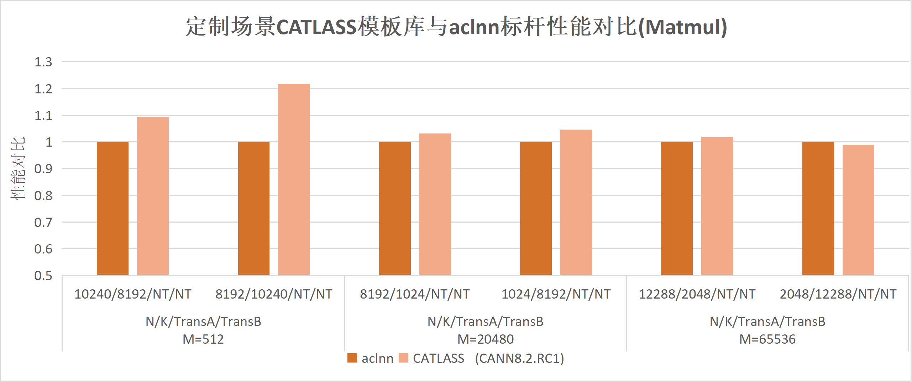

# CATLASS

---

### Latest News
- [2026/02] 社区版[v1.4.0](https://gitcode.com/cann/catlass/releases/v1.4.0)发布，新增 [StreamK Matmul](https://gitcode.com/cann/catlass/blob/v1.4.0/examples/37_streamk_matmul/README.md)、[W4A4 Matmul](https://gitcode.com/cann/catlass/blob/v1.4.0/examples/38_w4a4_matmul_per_token_per_channel_dequant/README.md)、[Sparse Matmul](https://gitcode.com/cann/catlass/blob/v1.4.0/examples/41_sparse_matmul_tla/README.md)等示例
- [2025/12] 社区版[v1.3.0](https://gitcode.com/cann/catlass/releases/v1.3.0)发布，支持[`FixPipe`随路量化](https://gitcode.com/cann/catlass/tree/v1.3.0/include/catlass/gemm/tile/tile_copy.hpp#L373)，[Matmul泛化工程](https://gitcode.com/cann/catlass/tree/v1.3.0/examples/102_dynamic_optimized_matmul/README.md)新增多个模板，并新增[INT4反量化](https://gitcode.com/cann/catlass/tree/v1.3.0/examples/32_w4a8_matmul/README.md)、[2D卷积](https://gitcode.com/cann/catlass/tree/v1.3.0/examples/33_basic_conv2d/README.md)等示例
- [2025/10] 社区版[v1.2.0](https://gitcode.com/cann/catlass/releases/v1.2.0)发布，新增[Matmul算子泛化](https://gitcode.com/cann/catlass/tree/v1.2.0/examples/102_dynamic_optimized_matmul/README.md)等示例
- [2025/09] CATLASS模板库正式开源

请参阅[CHANGELOG](CHANGELOG.md)以查看当前及历史版本的详细更新内容。

---

## 📌 简介

CATLASS(**CA**NN **T**emplates for **L**inear **A**lgebra **S**ubroutine**s**)，中文名为昇腾算子模板库，是一个聚焦于提供高性能矩阵乘类算子基础模板的代码库。  

通过抽象分层的方式将矩阵类算子代码模板化，从而实现算子计算逻辑的白盒化组装，让算子代码可复用，可替换，可局部修改。针对昇腾硬件特点进行设计，可以支持复杂场景流水排布，如`Flash Attention`等算子。在上层代码逻辑共享的同时，支持底层硬件差异特化。

模板库针对定制场景使能快速开发能力，提供不同场景下的性能优化模块供开发者组装定制，在定制shape下的性能能达到相应算子标杆性能的0.98~1.2倍。

<div align="center">



</div>

<div align="center">


</div>

本代码库为CATLASS联创代码仓。结合昇腾生态力量，共同设计研发算子模板，并提供典型算子的高性能实现代码样例，概述详情参考[这里](./docs/summary.md)。

## ⚡️ 快速上手

为快速体验CATLASS的算子开发与使用，请参考下述内容。

- [快速入门](./docs/quickstart.md)：快速上手模板库使用，编译执行已有的算子样例。
- [基础开发指南](./docs/dev_guide.md)：以基础Matmul算子为例，介绍基于CATLASS的算子开发实践；
- [开发者实践](./docs/tutorials.md): 从算子编写至编译测试，再到Tiling调优与算子优化，从新手到进阶的实践示例。

## 📚 进阶参考

下述资料可助力您深入开展CATLASS算子的开发与调优，实现更优性能的GEMM类算子。

- [CATLASS API](./docs/contents/advanced/api.md): 介绍CATLASS的分层特征与通用矩阵乘法GEMM API。
- [CATLASS性能调测](./docs/evaluation_collections.md): 汇总CATLASS工程开发中的调测办法，有助于消除漏洞，分析性能的瓶颈点。
- [CATLASS进阶实践](./docs/advanced_collections.md): 汇总CATLASS的进阶知识，如Tiling调参方法、Dispatch策略等，实现更高性能。

## 📁 目录结构说明

关键目录如下，详细目录参见[项目目录](./docs/dir_structure.md)。

```bash
catlass
├── cmake                     # cmake工程文件
├── docs                      # 文档存放目录
├── examples                  # kernel算子样例总目录
|   ├── 00_basic_matmul       # 单算子样例
|   |   ├── basic_matmul.cpp  # Host侧算子调用
|   |   ├── CMakeLists.txt
|   |   └── README.md         # 算子说明示例
|   ├── ...   
|   └── python_extension      # Python调用CATLASS算子
|                             # 的工程组件
├── include                   # 模板头文件集
|   ├── catlass               # 不同层级的算子实现逻辑
|   └── tla                   # 计算关联的基础数据结构
├── scripts                   # 编译脚本
|   └── build.sh              # 算子样例编译脚本
├── tests                     # 测试用例
└── tools                     # 相关工具
    └── tuner                 # Tiling自动寻优工具
```

## 💻 软硬件配套说明

CATLASS所需的软硬件环境依赖如下：

- 昇腾产品：[Atlas A2训练/推理产品](https://www.hiascend.com/document/detail/zh/AscendFAQ/ProduTech/productform/hardwaredesc_0001.html), [Atlas A3训练/推理产品](https://www.hiascend.com/document/detail/zh/AscendFAQ/ProduTech/productform/hardwaredesc_0001.html)
- CPU架构：`aarch64`/`x86_64`
- 系统：支持的Linux（进行[兼容性查询](https://www.hiascend.com/hardware/compatibility)）
- 软件依赖：
  - `gcc` >= 7.5, < 13.0
  - `cmake` >= 3.16
  - `python` >= 3.8, < 3.12

不同CATLASS发行版可支持的硬件平台及所需的最低[CANN](https://www.hiascend.com/developer/download/community/result?module=cann)版本如下表：

<table style="width: 75%; margin: 0 auto;">
  <colgroup>
    <col style="width: 25%">
    <col style="width: 22%">
    <col style="width: 22%">
  </colgroup>
  <thead>
      <tr>
          <th>CATLASS社区版本</th>
          <th>最低支持CANN包版本</th>
          <th>支持昇腾产品</th>
      </tr>
  </thead>
  <tbody style="text-align: center">
  <tr>
          <td><a href="https://gitcode.com/cann/releases/v1.2.2">v.1.2.2 及以上</a>
          <td>社区版<a href="https://www.hiascend.com/developer/download/community/result?module=cann&cann=8.2.RC1">8.2.RC1</a></td>
          <td><a href="https://www.hiascend.com/document/detail/zh/AscendFAQ/ProduTech/productform/hardwaredesc_0001.html">Atlas A2训练/推理产品</a> <br>
          <a href="https://www.hiascend.com/document/detail/zh/AscendFAQ/ProduTech/productform/hardwaredesc_0001.html">Atlas A3训练/推理产品</a></td>
      </tr>
      <tr>
          <td><a href="https://gitcode.com/cann/catlass/releases/v1.2.1">v1.2.1</a>~<a href="https://gitcode.com/cann/catlass/releases/v1.0.0">v1.0.0</a></td>
          <td>社区版<a href="https://www.hiascend.com/developer/download/community/result?module=cann&cann=8.2.RC1.alpha002">8.2.RC1.alpha002</a></td>
          <td><a href="https://www.hiascend.com/document/detail/zh/AscendFAQ/ProduTech/productform/hardwaredesc_0001.html">Atlas A2训练/推理产品</a> <br>
          <a href="https://www.hiascend.com/document/detail/zh/AscendFAQ/ProduTech/productform/hardwaredesc_0001.html">Atlas A3训练/推理产品</a></td>
      </tr>
  </tbody>
</table>

- 对于某些调测工具，可能需要较上述更新的CANN版本，详情参考[调测工具文档](./docs/evaluation_collections.md)。

下述环境经测试支持[当前CATLASS](https://gitcode.com/cann/catlass)构建：

<table style="width: 75%; margin: 0 auto;">
  <colgroup>
      <col style="width: 15%">
      <col style="width: 15%">
      <col style="width: 10%">
      <col style="width: 10%">
      <col style="width: 10%">
  </colgroup>
  <thead>
      <tr style="text-align: center">
          <th>系统</th>
          <th><code>CANN</code></th>
          <th><code>gcc</code></th>
          <th><code>cmake</code></th>
          <th><code>python</code></th>
      </tr>
  </thead>
  <tbody style="text-align: center">
      <tr>
          <td>Ubuntu 20.04.5</td>
          <td><code>8.2.RC1</code></td>
          <td><code>9.3</code></td>
          <td><code>3.16</code></td>
          <td><code>3.10</code></td>
      </tr><tr>
          <td>Ubuntu 22.04.5</td>
          <td><code>8.2.RC1</code></td>
          <td><code>11.3</code></td>
          <td><code>3.22</code></td>
          <td><code>3.10</code></td>
      </tr>
      <tr>
          <td>openEuler 22.03 SP4</td>
          <td><code>8.2.RC1</code></td>
          <td><code>10.3</code></td>
          <td><code>3.22</code></td>
          <td><code>3.10</code></td>
      </tr>
  </tbody>
</table>

## 👥 合作贡献者

#### [华南理工大学 陆璐教授团队](https://www2.scut.edu.cn/cs/2017/0629/c22284a328108/page.htm)

#### 科大讯飞 研究院工程组

## 📝相关信息

- [贡献指南](CONTRIBUTING.md)
- [安全声明](SECURITYNOTE.md)
- [许可证](LICENSE)
