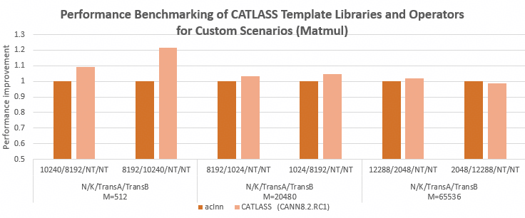
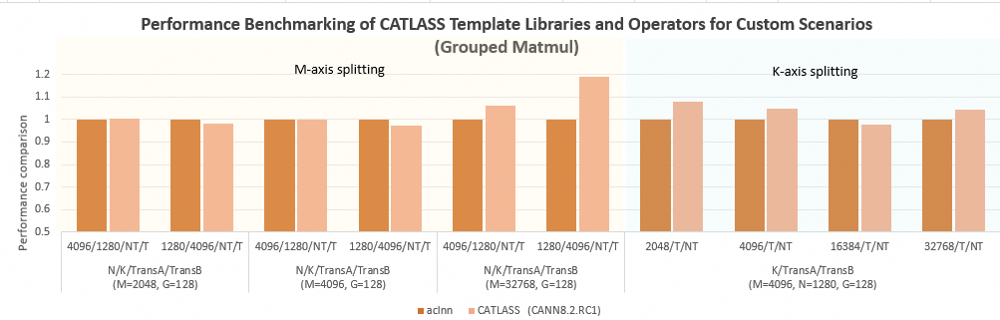

<h1 align="center">CATLASS</h1>

<p align="center">
  <a href="https://deepwiki.com/ascend-catlass/catlass"></a>
</p>

<p align="center">
  <a href="README.md"><strong>中文</strong></a> |
  <a href="README_en.md"><strong>English</strong></a>
</p>

<p align="center">
  <a href="https://catlass.readthedocs.io/zh-cn/latest/"><strong>Official Documentation</strong></a> |
  <a href="https://www.hiascend.com/cn/developer/operator?tag=catlass&amp;tab=catlass"><strong>Operator Development Journey</strong></a> |
  <a href="https://etherpad-cann.meeting.osinfra.cn/p/sig-catlass"><strong>Community Meetings</strong></a> |
  <a href="https://www.hiascend.com/"><strong>About Ascend</strong></a>
</p>

## Latest News

- [2026/06] [v1.6.0](https://gitcode.com/cann/catlass/releases/v1.6.0) released: added [**MXFP8/MXFP4 quantization templates**](https://gitcode.com/cann/catlass/blob/v1.6.0/examples/53_ascend950_fp8_mx_matmul/README.md), the [**EVG declarative post-processing framework**](https://gitcode.com/cann/catlass/blob/v1.6.0/examples/64_ascend950_matmul_evg/README.md), and [**BlockMmad based on Mutex synchronization primitives**](https://gitcode.com/cann/catlass/blob/v1.6.0/include/catlass/gemm/block/block_mmad_pingpong_mutex_tla.hpp); added [Ascend 950 Tile components](https://gitcode.com/cann/catlass/tree/v1.6.0/include/catlass/gemm/tile/ascend950), a complete set of [unit tests](https://gitcode.com/cann/catlass/blob/v1.6.0/tests/unittest/catlass/gemm/tile/README.md), and the [operator-level test framework (optest)](https://gitcode.com/cann/catlass/blob/v1.6.0/tests/optest/README.md); and added 16 **Ascend 950** operator examples, including [StreamK Matmul](https://gitcode.com/cann/catlass/blob/v1.6.0/examples/66_ascend950_streamk_matmul/README.md), [Flash Attention Chunk Prefill](https://gitcode.com/cann/catlass/blob/v1.6.0/examples/70_ascend950_flash_attention_chunk_prefill/README.md), and [Conv2d](https://gitcode.com/cann/catlass/blob/v1.6.0/examples/56_ascend950_basic_conv2d_tla/README.md).

- [2026/04] [v1.5.0](https://gitcode.com/cann/catlass/releases/v1.5.0) released: added **Ascend 950** series examples, such as [Basic Matmul](https://gitcode.com/cann/catlass/blob/v1.5.0/examples/43_ascend950_basic_matmul/README.md), [Flash Attention Inference](https://gitcode.com/cann/catlass/blob/v1.5.0/examples/49_ascend950_flash_attention_infer/README.md), and [Per-Group & Per-Block Quant Matmul TLA](https://gitcode.com/cann/catlass/blob/v1.5.0/examples/51_ascend950_quant_matmul_per_group_per_block_tla/README.md); enhanced **TLA** capabilities, including `origin_shape`, `TileView`, and more; and added [103 Dynamic W8A8 Per-Token Quantization](https://gitcode.com/cann/catlass/tree/v1.5.0/examples/103_dynamic_optimized_quant_matmul_per_token_basic/README.md) to the [Matmul Generalization Project](https://gitcode.com/cann/catlass/tree/v1.5.0/examples/102_dynamic_optimized_matmul/README.md).

<details>
<summary>More news</summary>

- [2026/03] The mainline officially started adding support for the next-generation Ascend hardware Ascend 950PR/Ascend 950DT.

- [2026/02] [v1.4.0](https://gitcode.com/cann/catlass/releases/v1.4.0) released, adding examples such as [StreamK Matmul](https://gitcode.com/cann/catlass/blob/v1.4.0/examples/37_streamk_matmul/README.md), [W4A4 Matmul](https://gitcode.com/cann/catlass/blob/v1.4.0/examples/38_w4a4_matmul_per_token_per_channel_dequant/README.md), and [Sparse Matmul](https://gitcode.com/cann/catlass/blob/v1.4.0/examples/41_sparse_matmul_tla/README.md).

- [2025/12] [v1.3.0](https://gitcode.com/cann/catlass/releases/v1.3.0) released, supporting [`FixPipe` inline quantization](https://gitcode.com/cann/catlass/tree/v1.3.0/include/catlass/gemm/tile/tile_copy.hpp#L373), adding multiple templates to the [Matmul Generalization Project](https://gitcode.com/cann/catlass/tree/v1.3.0/examples/102_dynamic_optimized_matmul/README.md), and adding examples such as [INT4 Dequantization](https://gitcode.com/cann/catlass/tree/v1.3.0/examples/32_w4a8_matmul/README.md) and [2D Convolution](https://gitcode.com/cann/catlass/tree/v1.3.0/examples/33_basic_conv2d/README.md).

- [2025/10] [v1.2.0](https://gitcode.com/cann/catlass/releases/v1.2.0) released, adding examples such as [Matmul Operator Generalization](https://gitcode.com/cann/catlass/tree/v1.2.0/examples/102_dynamic_optimized_matmul/README.md).

- [2025/09] The CATLASS template library was officially open sourced.

</details>

See [CHANGELOG](CHANGELOG_en.md) for detailed updates in current and historical versions.

---

## 📌 Introduction

CATLASS (**CA**NN **T**emplates for **L**inear **A**lgebra **S**ubroutine**s**), known in Chinese as the Ascend Operator Template Library, is a code repository focused on providing base templates for high-performance matrix multiplication operators.  

CATLASS templates matrix operator code through layered abstraction. Therefore, it enables white-box assembly of operator compute logic and makes operator code reusable, replaceable, and partially modifiable. It is designed for Ascend hardware characteristics and supports complex pipeline layouts for operators such as `Flash Attention`. In addition, it shares upper-layer code logic while supporting specialization for differences in underlying hardware.

The template library enables fast development for custom scenarios. It provides performance optimization modules for different scenarios, so developers can assemble and customize them. Under custom shapes, its performance can reach 0.98 to 1.2 times the benchmark performance of the corresponding operator.

<p align="center">
  
</p>

<p align="center">
  
</p>

This repository is the co-created repository for CATLASS. It combines the strengths of the Ascend ecosystem to jointly design and develop operator templates, and provides high-performance implementation code examples for typical operators. For an overview, see [here](./docs/en/2_Design/00_project_overview.md#catlass-project-introduction).

## ⚡️ Quick Start

To quickly try CATLASS operator development and usage, see the following content.

- [Quick Start](./docs/en/1_Practice/01_quick_start.md): Quickly get started with the template library, and compile and run existing operator examples.

- [Basic Development Guide](./docs/en/1_Practice/02_host_example_assembly.md): Uses the basic Matmul operator as an example to introduce CATLASS-based operator development practices.

- [Developer Practices](./docs/en/README.md#1-practices): Provides practice examples from writing code at each operator layer to compilation and testing, then to Tiling tuning and operator optimization, from beginner to advanced levels.

## 📚 Advanced References

The following materials can help you further develop and tune CATLASS operators and implement GEMM-class operators with better performance.

- [CATLASS API](./docs/en/README.md#3-api-documentation): Introduces the layered features of CATLASS and the general matrix multiplication GEMM API.

- [CATLASS Design Summary](./docs/en/README.md#2-design): Summarizes documents such as example algorithm design, swizzle strategies, and TLA design in the CATLASS project.

## 📁 Directory Structure Description

The key directories are as follows. For the detailed directory structure, see [Project Directory](docs/en/2_Design/00_project_overview.md#project-directory).

```bash
catlass
├── 3rdparty                     # Third-party deps
├── cmake                        # Build config
├── docs                         # Documentation
├── examples                     # Operator examples
├── include                      # Template headers
├── python                       # Python related codes
├── scripts                      # Scripts
├── tests                        # Tests
└── tools                        # Tools

```

## 💻 Software and Hardware Requirements

CATLASS depends on the following software and hardware environments:

- Ascend products:
  - [Atlas A2 Training Series Products / Atlas A2 Inference Series Products](https://www.hiascend.com/document/detail/en/AscendFAQ/ProduTech/productform/hardwaredesc_0001.html)
  - [Atlas A3 Training Series Products / Atlas A3 Inference Series Products](https://www.hiascend.com/document/detail/en/AscendFAQ/ProduTech/productform/hardwaredesc_0001.html)
  - Ascend 950PR/Ascend 950DT
- CPU architecture: `aarch64`/`x86_64`
- System: Linux supported by CANN (perform a [compatibility query](https://www.hiascend.com/hardware/compatibility))
- Software dependencies:
  - `gcc` >= 7.5, < 13.0
  - `cmake` >= 3.16
  - `python` >= 3.8, < 3.12
  (The [unittest](tests/unittest/catlass/gemm/tile/README.md) requires `gcc` <= 12.0 to compile.)

The hardware platforms supported by different CATLASS releases and the required minimum [CANN](https://www.hiascend.com/developer/download/community/result?module=cann) versions are shown in the following table:

| CATLASS Community Version                                                                                             | Minimum Supported CANN Package Version                                                                                                                                                                                                    | Supported Ascend Products                                                                                                                                                                                                                                                                                                                                                                  |
| --------------------------------------------------------------------------------------------------------------------- | ----------------------------------------------------------------------------------------------------------------------------------------------------------------------------------------------------------------------------------------- | ------------------------------------------------------------------------------------------------------------------------------------------------------------------------------------------------------------------------------------------------------------------------------------------------------------------------------------------------------------------------------------------ |
| Current                                                                                                               | [8.5.0](https://www.hiascend.com/developer/download/community/result?module=cann&cann=8.5.0)<br>[9.0.0](https://www.hiascend.com/developer/download/community/result?module=cann&cann=9.0.0) (Ascend 950PR/Ascend 950DT)     | [Atlas A2 Training Series Products / Atlas A2 Inference Series Products](https://www.hiascend.com/document/detail/en/AscendFAQ/ProduTech/productform/hardwaredesc_0001.html) <br>[Atlas A3 Training Series Products / Atlas A3 Inference Series Products](https://www.hiascend.com/document/detail/en/AscendFAQ/ProduTech/productform/hardwaredesc_0001.html)<br>Ascend 950PR/Ascend 950DT |
| [v1.5.0](https://gitcode.com/cann/catlass/releases/v1.5.0)                                                            | [8.2.RC1](https://www.hiascend.com/developer/download/community/result?module=cann&cann=8.2.RC1)<br>[9.0.0.beta2](https://www.hiascend.com/developer/download/community/result?module=cann&cann=9.0.0-beta.2) (Ascend 950PR/Ascend 950DT) | [Atlas A2 Training Series Products / Atlas A2 Inference Series Products](https://www.hiascend.com/document/detail/en/AscendFAQ/ProduTech/productform/hardwaredesc_0001.html) <br>[Atlas A3 Training Series Products / Atlas A3 Inference Series Products](https://www.hiascend.com/document/detail/en/AscendFAQ/ProduTech/productform/hardwaredesc_0001.html)<br>Ascend 950PR/Ascend 950DT |
| [v1.4.0](https://gitcode.com/cann/catlass/releases/v1.4.0)—[v1.2.2](https://gitcode.com/cann/catlass/releases/v1.2.2) | [8.2.RC1](https://www.hiascend.com/developer/download/community/result?module=cann&cann=8.2.RC1)                                                                                                                                          | [Atlas A2 Training Series Products / Atlas A2 Inference Series Products](https://www.hiascend.com/document/detail/en/AscendFAQ/ProduTech/productform/hardwaredesc_0001.html) <br>[Atlas A3 Training Series Products / Atlas A3 Inference Series Products](https://www.hiascend.com/document/detail/en/AscendFAQ/ProduTech/productform/hardwaredesc_0001.html)                              |
| [v1.2.1](https://gitcode.com/cann/catlass/releases/v1.2.1)—[v1.0.0](https://gitcode.com/cann/catlass/releases/v1.0.0) | [8.2.RC1.alpha002](https://www.hiascend.com/developer/download/community/result?module=cann&cann=8.2.RC1.alpha002)                                                                                                                        | [Atlas A2 Training Series Products / Atlas A2 Inference Series Products](https://www.hiascend.com/document/detail/en/AscendFAQ/ProduTech/productform/hardwaredesc_0001.html) <br>[Atlas A3 Training Series Products / Atlas A3 Inference Series Products](https://www.hiascend.com/document/detail/en/AscendFAQ/ProduTech/productform/hardwaredesc_0001.html)                              |

The following environments have been tested and support building [current CATLASS](https://gitcode.com/cann/catlass):

| System                                  | `CANN`      | `gcc` | `cmake` | `python` |
| --------------------------------------- | ----------- | ----- | ------- | -------- |
| Ubuntu 20.04.5                          | 8.5.0       | 9.3   | 3.16    | 3.10     |
| Ubuntu 22.04.5                          | 8.5.0       | 11.3  | 3.22    | 3.10     |
| openEuler 22.03 SP4                     | 8.5.0       | 10.3  | 3.22    | 3.10     |
| Ubuntu 22.04.5 (Compiling 950 Examples) | 9.0.0 | 11.3  | 3.22    | 3.10     |

## 👥 Collaborators

### [South China University of Technology Professor Lu Lu's Team](https://www2.scut.edu.cn/cs/2017/0629/c22284a328108/page.htm)

### iFLYTEK Research Institute Engineering Group

## 📝 Related Information

- [Contribution Guide](CONTRIBUTING_en.md)
- [Security Statement](SECURITYNOTE_en.md)
- [License](LICENSE)
