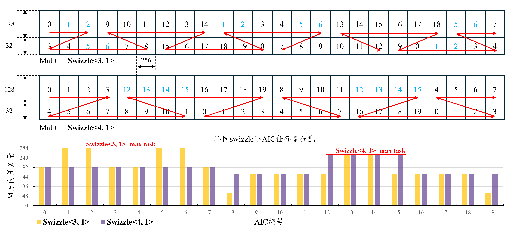

# Template Library Optimization Guide

## CATLASS Sample Positioning

The CATLASS operator template library is positioned as a template sample library for GEMM operators, which differs from typical operator libraries. In typical operator libraries, generalization optimizations are made for different input cases of a specific problem type to provide good out-of-the-box performance in most scenarios. The primary goal of the template library is to provide template samples for different inputs, enabling rapid custom development of high-performance operators. Theoretically, it does not aim to provide optimal generalization performance compared to operator libraries. For example, in a matmul context, the matmul operator or called API in CANN focuses on delivering performance for generalization scenarios through direct calls. The template library, instead, provides multiple matmul implementations, such as basic-matmul, optimized-matmul, splitk-matmul, and padding-splitk-matmul, as samples to demonstrate how to customize development for different inputs to achieve optimal performance. The matmul samples in the repository have different applicable scopes and tuning methods for different inputs, allowing on-demand customization for optimal performance.

For tuning methods, there are two categories: basic and custom. This document focuses on the first category, basic tuning, which achieves performance gains quickly through tiling parameter adjustment and kernel combination.

## Matmul Fundamentals

### Basic Block Tiling of Matrix C for Cores

First, the task partitioning logic for each core. Samples in the repository such as [00_basic_matmul](../../../examples/00_basic_matmul/basic_matmul.cpp) and [06_optimized_matmul](../../../examples/06_optimized_matmul/optimized_matmul.cpp) all tile matrix C into basic blocks before assigning them to cores. Matrix C is tiled along the M and N axes based on `L1TileShape::M` and `L1TileShape::N`, resulting in `CeilDiv(M, L1TileShape::M) * CeilDiv(N, L1TileShape::N)` basic blocks. These basic blocks are then assigned to cube cores according to the [swizzle policy](../2_Design/01_kernel_design/02_swizzle.md).

### Matmul Hardware Visualization

See [Basic Architecture](https://www.hiascend.com/document/detail/en/canncommercial/850/opdevg/Ascendcopdevg/atlas_ascendc_10_0008.html).
The following figure shows the hardware architecture involved in basic Matmul tiling, data movement, and computation. Because double buffering is enabled, two tiles of data are stored in L1/L0A/L0B.


### TileShape Constraints

From the above, TileShape must be set such that it does not exceed the L1/L0A/L0B/L0C memory space. Additionally, TileShape values must be multiples of 16.

- Scenario 1: FP16 input and output, L1TileShape<128,256,256>, L0TileShape<128,256,64>

For FP16 input and output, to maintain calculation precision, the cube core's mmad output to L0C is of FP32 data type. The fixpipe casts it to FP16 when writing back to global memory.

```text
L1 size: 512 KB
Actual L1 usage = L1::M * L1::K * 2(Byte) * 2(doubleBuffer) + L1::K * L1::N * 2(Byte) * 2(doubleBuffer)
        = 128 * 256 * 2 * 2 + 256 * 256 * 2 * 2
        = 393216 B = 384 KB = 3/4 L1_SIZE

L0A size: 64 KB
Actual L0A usage = L0::M * L0::K * 2(Byte) * 2(doubleBuffer)
        = 128 * 64 * 2 * 2
        = 32768 B = 32 KB = 1/2 L0A_SIZE

L0B size: 64 KB
Actual L0B usage = L0::K * L0::N * 2(Byte) * 2(doubleBuffer)
        = 64 * 256 * 2 * 2
        = 65536 B = 64 KB = 1 L0B_SIZE

L0C size: 128 KB
Actual L0C usage = L0::M * L0::N * 4(Byte)
        = 128 * 256 * 4
        = 131072 B = 128 KB = 1 L0C_SIZE
```

- Scenario 2: FP32 input and output, L1TileShape<128,128,256>, L0TileShape<128,128,64>

```text
L1 size: 512 KB
Actual L1 usage = L1::M * L1::K * 4(Byte) * 2(doubleBuffer) + L1::K * L1::N * 4(Byte) * 2(doubleBuffer)
        = 128 * 256 * 4 * 2 + 128 * 256 * 4 * 2
        = 524288 B = 512 KB = 1 L1_SIZE

L0A size: 64 KB
Actual L0A usage = L0::M * L0::K * 4(Byte) * 2(doubleBuffer)
        = 128 * 64 * 4 * 2
        = 65536 B = 64 KB = 1 L0A_SIZE

L0B size: 64 KB
Actual L0B usage = L0::K * L0::N * 4(Byte) * 2(doubleBuffer)
        = 64 * 128 * 4 * 2
        = 65536 B = 64 KB = 1 L0B_SIZE

L0C size: 128 KB
Actual L0C usage = L0::M * L0::N * 4(Byte)
        = 128 * 128 * 4
        = 65536 B = 64 KB = 1/2 L0C_SIZE
```

## Tuning Policy

### Sample Coverage and Selection

The basic Matmul operators currently in the repository are listed below. For more details, see the [matrix multiplication template summary](../2_Design/01_kernel_design/04_matmul_summary.md):

- [00_basic_matmul](../../../examples/00_basic_matmul/basic_matmul.cpp): Uses the dispatch policy of `MmadAtlasA2Pingpong` and enables the ping-pong policy.

```cpp
template <bool ENABLE_UNIT_FLAG_ = false>
struct MmadAtlasA2Pingpong : public MmadAtlasA2  {
    static constexpr uint32_t STAGES = 2;
    static constexpr bool ENABLE_UNIT_FLAG = ENABLE_UNIT_FLAG_;
};
```

- [04_padding_matmul](../../../examples/04_padding_matmul/padding_matmul.cpp): Adds padding for the input matrices based on 00_basic_matmul. Experiments have shown that when the shape[1] of a RowMajor matrix is aligned to 512 bytes, data movement efficiency is higher. Therefore, adding padding improves performance for **non-aligned** scenarios.
- [06_optimized_matmul](../../../examples/06_optimized_matmul/optimized_matmul.cpp): Uses the `dispatchPolicy` of `MmadAtlasA2Preload` to enable preloading and `shuffleK`. Preloading reduces interruptions in the movement pipeline. ShuffleK randomizes the order in which different cores move `L1Tiles`, reducing bank conflicts and causing the addresses accessed by cores in the same row or column of basic blocks when accessing A and B matrices to be staggered. It also adds `padding` to align input matrices to `L1TileShape`. Compared to [`basic_matmul`](../../../examples/00_basic_matmul/README.md), it introduces more optimization actions but also incurs overhead from enabling vector cores and some scalar computations.

```cpp
template <bool ENABLE_UNIT_FLAG_ = false, bool ENABLE_SHUFFLE_K_ = false>
struct MmadAtlasA2Preload : public MmadAtlasA2 {
    static constexpr uint32_t STAGES = 2;
    static constexpr bool ENABLE_UNIT_FLAG = ENABLE_UNIT_FLAG_;
    static constexpr bool ENABLE_SHUFFLE_K = ENABLE_SHUFFLE_K_;
};
```

- [09_splitk_matmul](../../../examples/09_splitk_matmul/splitk_matmul.cpp): Adds K-axis partitioning for per-core block assignment based on 00_basic_matmul. When the M/N axes are small and there are few basic blocks to tile, tiling the K-axis can improve cube core utilization. However, vector cores are required for accumulation after tiling the K-axis, so gains only occur when the K-axis has sufficient length.
- [22_padding_splitk_matmul](../../../examples/22_padding_splitk_matmul/padding_splitk_matmul.cpp): Integrates the features of `04_padding_matmul` and `09_splitk_matmul`. It yields performance gains in non-aligned scenarios where the M/N axes are small and the K-axis has sufficient length.

### TileShape Adjustment

Under the constraints of (1) being a multiple of 16 and (2) not exceeding hardware limits, adjust the TileShape to achieve load balancing. To achieve optimal performance while simplifying the tiling policy, the current solution in the repository restricts `L0TileShape::M == L1TileShape::M` and `L0TileShape::N == L1TileShape::N` to reduce tuning complexity. It is advised to set `L0TileShape::K == 1/4 L1TileShape::K`.

- Case 1

Context: Matrix A RowMajor, matrix B ColumnMajor, M: 1024, N: 576, K: 6144, FP16 input and output, 20 AIC cores

Using 06_optimized_matmul with default L1TileShape<128,256,256> and L0TileShape<128,256,64>, the execution time is **72.5 µs** (performance may vary across different chip platforms, CANN packages, and drivers; this is for reference only).

Analysis: The number of tiled basic blocks is `CeilDiv(1024/128) x CeilDiv(576/256) = 24`. Therefore, 4 of the 20 AIC cores need to compute two basic blocks each, while the remaining 16 process one basic block each, resulting in load imbalance.

Adjust L1TileShape<256,128,256> and L0TileShape<256,128,64>. The number of tiled basic blocks becomes `CeilDiv(1024/256) x CeilDiv(576/128) = 20`. Thus, all 20 AIC cores process only one basic block each, achieving load balance. The execution time is **48.6 µs**.

- Case 2

Context: Matrix A RowMajor, matrix B zN, M: 20, N: 6144, K: 16384, FP16 input and output, 20 AIC cores

Here, matrix B is in zN format (same as NZ format). Using 21_basic_matmul_preload_zN with default L1TileShape<128,256,256> and L0TileShape<128,256,64>, the execution time is **181.4 µs**.

Analysis: The number of basic blocks partitioned is `CeilDiv(20/128) x CeilDiv(6144/256) = 24`. Therefore, 4 of the 20 AIC cores need to compute two basic blocks each, while the remaining 16 process one basic block each, resulting in load imbalance.

Adjust L1TileShape<32,320,128> and L0TileShape<32,320,32>. The number of tiled basic blocks becomes `CeilDiv(20/32) x CeilDiv(6144/320) = 20`. Thus, all 20 AIC cores process only one basic block each, achieving load balance. The execution time is **139.6 µs**.

- Case 3

Context: Matrix A RowMajor, matrix B ColumnMajor, M: 1, N: 768, K: 5120, FP32 input and output, 24 AIC cores

Here, both matrices A and B are laid out along the K-axis. The K-axis is 512-byte aligned. Using 00_basic_matmul directly with L1TileShape<128,128,256> and L0TileShape<128,128,64>, which are common for FP32 data type, the execution time is **36.3 µs**.

Analysis: The number of tiled basic blocks is `CeilDiv(1/128) x CeilDiv(768/128) = 6`. Therefore, only 6 of the 24 AIC cores are engaged in computation, resulting in load imbalance.

Given that matrix B is in ColumnMajor format, a finer-grained tiling along the N-axis is possible. Adjust L1TileShape<16,32,1024> and L0TileShape<16,32,256>. The number of tiled basic blocks becomes `CeilDiv(1/16) x CeilDiv(768/32) = 24`. Thus, all 24 AIC cores work and process only one basic block each, achieving load balance. The execution time is **15.5 µs**.

- ⚠️ Note

Experiments have shown that for RowMajor/ColumnMajor layouts, movement performance is higher when L1::M/L1::N/L1::K are multiples of 256, but there is a trade-off with load balancing. For the zN format, the impact of being a multiple of 256 is smaller.
For example, in Case 2, if matrix B were in RowMajor instead of zN layout, the performance with the default L1TileShape<128,256,256> and L0TileShape<128,256,64> would be **238.8 µs**. After adjusting to L1TileShape<32,320,128> and L0TileShape<32,320,32>, the performance becomes **252.4 µs**. Load balancing did not yield gains in this scenario.

### Swizzle Adjustment

In CATLASS, [Swizzle](../2_Design/01_kernel_design/02_swizzle.md) describes the read/write order of matrices. It is referred to as `Gemm::Block::GemmIdentityBlockSwizzle<a, b>` using the notation `<a, b>`. When both matrices A and B are in `RowMajor` layout, `<3, 0>` is typically chosen when `m > n`, and `<3, 1>` when `m < n`. In general, the approach to adjusting `Swizzle` is to first determine the `SwizzleDirection` (`0` or `1`), then adjust the `SwizzleOffset`. In some scenarios, this can better achieve load balancing.

- Case 1

Context: Matrix A RowMajor, matrix B zN, M: 160, N: 6144, K: 2048, FP16 input and output, 20 AIC cores

Using 21_basic_matmul_preload_zN with default L1TileShape<128,256,256> and L0TileShape<128,256,64>, and swizzle set to <3, 1>, the execution time is **40.6 µs**. Setting swizzle to <4, 1> results in an execution time of **35.3 µs**.

Basic block analysis: The M-axis is tiled into two blocks of lengths 128 and 32, and the N-axis is tiled into 24 blocks of length 256, resulting in a total of 48 basic blocks. The figure below shows the assignment of basic blocks to AIC cores for swizzle <3, 1> and swizzle <4, 1>. With swizzle <3, 1>, cores 1, 2, 5, and 6 have a maximum task size along the M-axis of (128 + 128 + 32). With swizzle <4, 1>, cores 12, 13, 14, and 15 have a maximum task size along the M-axis of (128 + 128), achieving better load balance.


### Brief Overview of Custom Tuning

- Currently, the Matmul samples in the repository each have their own characteristics and advantages. You can perform custom development through deep code reassembly. For example, [21_basic_matmul_preload_zN](../../../examples/21_basic_matmul_preload_zN/basic_matmul_preload_zN.cpp) assembles the `MmadAtlasA2Preload` dispatch policy based on 00_basic_matmul, while [22_padding_splitk_matmul](../../../examples/22_padding_splitk_matmul/padding_splitk_matmul.cpp) assembles the features of 04_padding_matmul and 09_splitk_matmul. After becoming familiar with the different sample codes in the repository, you can perform deep development based on your needs to achieve better performance. The template library will also continuously add Matmul samples that use new algorithms and apply to more use cases.
- In addition to basic matmul custom tuning, some derived samples in the repository (such as [03_matmul_add](../../../examples/03_matmul_add/matmul_add.cpp), [20_matmul_bias](../../../examples/20_matmul_bias/matmul_bias.cpp), etc.) are often based on samples like 00_basic_matmul with new features added. These samples can also be customized to use different basic Matmul samples and undergo tiling parameter tuning to achieve better performance.
