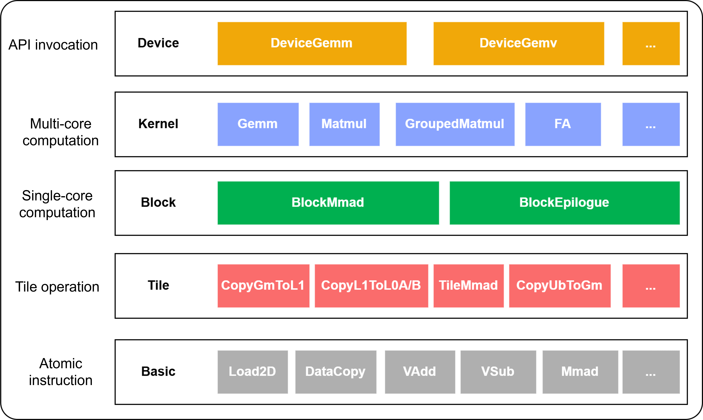

# Introduction to CATLASS

In the `Transformer` model, General Matrix Multiplication (GEMM) handles much of the computation. Optimizing GEMM boosts overall efficiency. Different scenarios require various GEMM operator implementations, and evolving algorithms create new customization needs. This makes it hard to predict all variants in advance. Directly developing GEMM operators based on hardware is challenging and time-intensive. To address this issue, the CANN team has launched the CATLASS operator template library, which uses a layered, modular design to decouple GEMM computation into flexible components such as data tiling policies and compute unit settings.

This speeds up development tailored to Atlas hardware. The library offers reusable templates, basic components, and example cases, helping developers quickly set up the computation pipeline. They can customize compute kernels based on hardware and needs, enhancing efficiency and maintaining high performance.

The CATLASS operator template library uses a layered design. It divides the implementation into multiple levels by analyzing hardware architectures and GEMM requirements. Each level's common logic is abstracted into templates, with room for custom extensions. This ensures software matches specific hardware and computation stages. Specific steps in algorithms are left to subclasses, allowing the subclasses to redefine these steps without altering the overall structure.

## Layered Modular Design of Operator Implementation



## Flexible Configuration of Operator Pipeline

The template library allows for flexible development. Developers can reuse preset patterns to quickly set up basic functions, modify modules for custom needs, or swap components to create custom pipelines. This design ensures high performance and gives developers enough flexibility and scalability.


## Project Directory

The full project directory structure is as follows:

```bash
catlass
├── cmake                     # CMake project file
├── docs                      # Documentation directory
├── examples                  # Directory for storing all kernel operator examples
|   ├── 00_basic_matmul       #  Single-operator example
|   |   ├── basic_matmul.cpp  # Operator calling on the host
|   |   ├── CMakeLists.txt
|   |   └── README.md         # Operator sample description
|   ├── ...
|   └── python_extension      # CATLASS operator calls in Python
|                             # Project components
├── include                   # Template header files
|   ├── catlass               # Implementation logic of operators at different levels
|   └── tla                   # Basic data structure associated with computation
├── scripts                   # Build scripts
|   └── build.sh              # Operator sample compilation script
├── tests                     # Test cases
└── tools                     # Tools
    └── tuner                 # The Tiling tool for auto tuning
```
