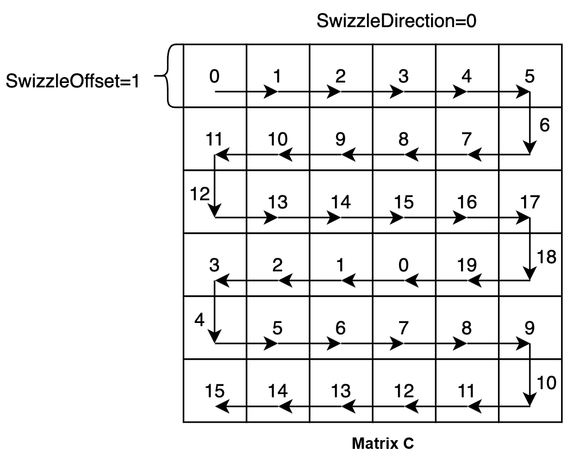
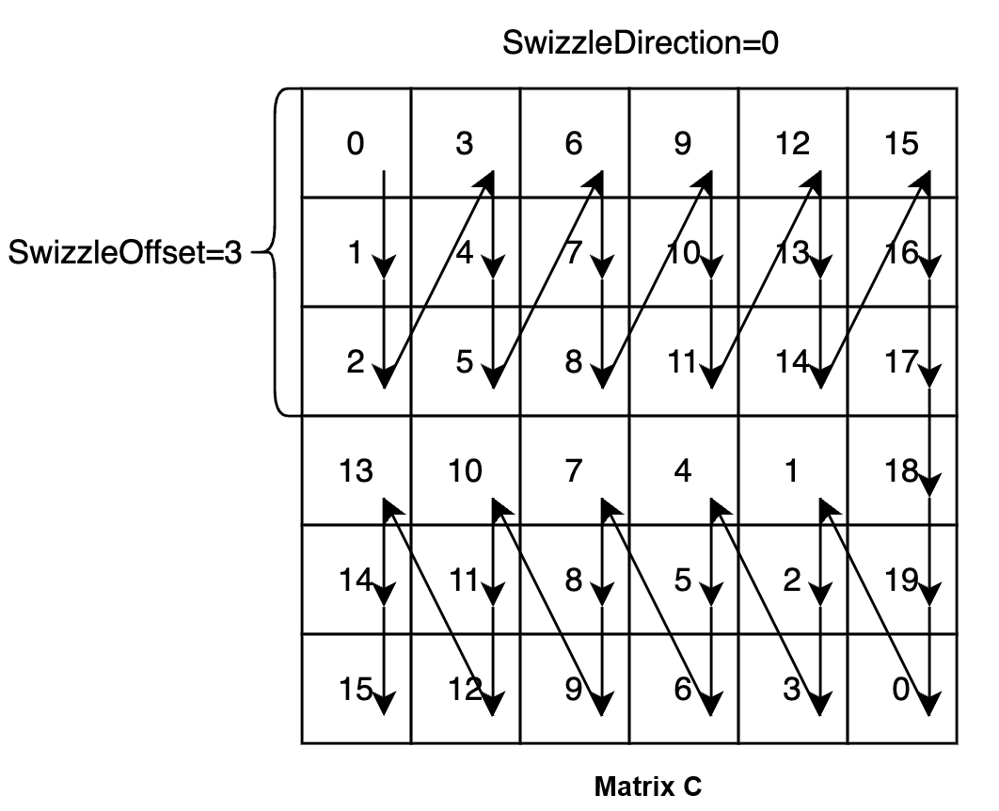
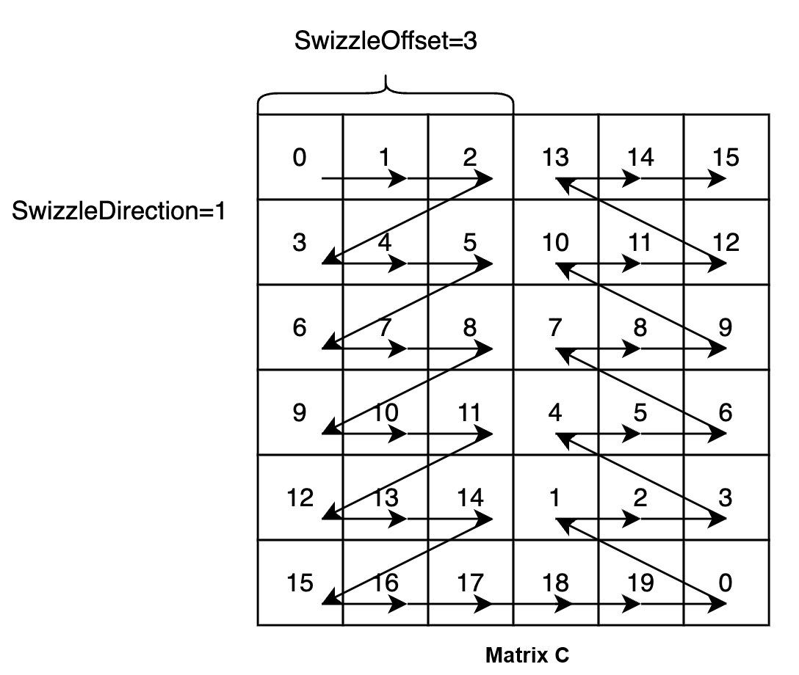

# Swizzle Policies

Swizzle policies determine the sequence in which AI Core computes basic blocks. Adjusting Swizzle policies helps improve cache hit ratios and reduce data read overheads, thereby improving the overall computation efficiency of matrix multiplication.

The following shows three Swizzle policies. Each block represents a basic block of matrix C, and the number in each block indicates the ID of an AI Core (in this example, it is assumed that there are 20 AI Cores). The arrow direction indicates the traversal sequence of basic blocks under a specific Swizzle policy. We allocate basic blocks to AI Cores in this order for processing. The 20 basic blocks numbered 0 to 19 are computed in parallel.

## Example 1

The default Swizzle policy is SwizzleOffset=1 and SwizzleDirection=0, that is:

```c++
 using BlockScheduler = typename Gemm::Block::GemmIdentityBlockSwizzle<>;
```



## Example 2

SwizzleOffset=3, SwizzleDirection=0

```c++
 using BlockScheduler = typename Gemm::Block::GemmIdentityBlockSwizzle<3, 0>;
```



## Example 3

SwizzleOffset=3, SwizzleDirection=1

```c++
 using BlockScheduler = typename Gemm::Block::GemmIdentityBlockSwizzle<3, 1>;
```



## Swizzle Policy Selection

If the size of matrix C is M x N, when M >= N, using SwizzleOffset=3 and SwizzleDirection=0 typically works better. When M < N, using SwizzleOffset=3 and SwizzleDirection=1 typically works better. You can also explore other parameter settings to achieve a higher cache hit rate, thereby further improving matrix computation performance.
