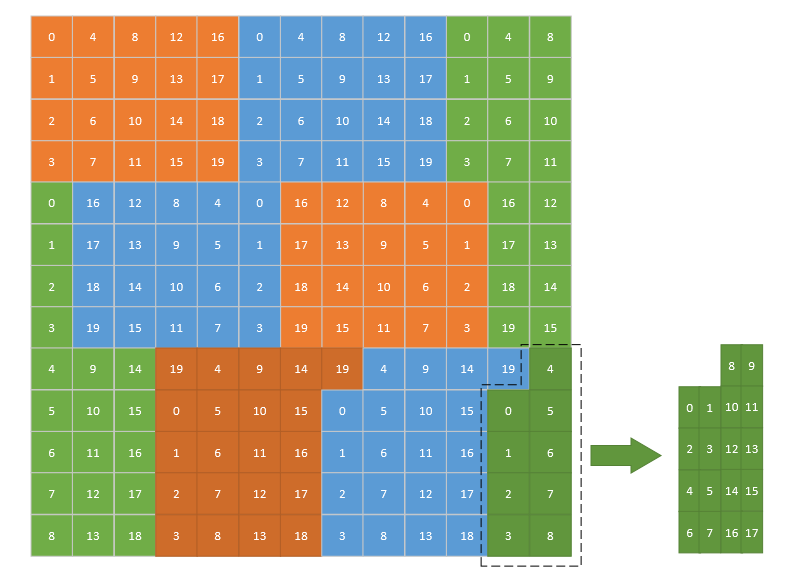

# Adaptive Sliding Window Tiling Policy

The Adaptive Sliding Window Tiling (ASWT) policy determines the core allocation and computation sequence of basic blocks. Similar to [Swizzle](./02_swizzle.md), ASWT uses the S-shaped sliding window mechanism to improve the L2 cache hit ratio and reduce the data read overhead. In particular, when the total basic blocks cannot be evenly assigned to each AI Core, ASWT further tiles the remaining basic blocks to ensure that they are as evenly distributed as possible to each AI Core, achieving load balancing.

The following shows the ASWT policy. Each block represents a basic block of matrix C, and the number in each block indicates the ID of an AI Core (in this example, it is assumed that there are 20 AI Cores). The basic blocks are assigned to AI Cores for processing in the order of the S-shaped sliding window. Finally, there are nine basic blocks left, which cannot be evenly distributed to the 20 AI Cores. To balance the load of each AI Core and improve data parallelism efficiency, the remaining nine basic blocks are tiled so that the number of tiled blocks (18 blocks) is at least more than half of the total number of AI Cores.

## Applications

Assume that the shape of the left matrix is (m, k), the shape of the right matrix is (k, n), and the size of a basic block on matrix C is (baseM, baseN). The total number of basic blocks is calculated as follows:

$$\mathrm{tileNum = Ceil(\mathrm{m, baseM}) * Ceil(n, baseN)}$$

When the number of basic blocks cannot be evenly assigned to all AI Cores, and the number of remaining basic blocks is less than half of the total number of AI Cores:

$$ \mathrm{tileNum \space \%  \space coreNum <= \frac{coreNum}{2} }$$

In the preceding formula, coreNum indicates the total number of AI Cores.

In this case, the ASWT policy tiles the basic blocks, which are then assigned to AI Cores as evenly as possible, improving data parallelism efficiency.

## Performance Gains

The following table compares the performance of basic_matmul using ASWT with that using [Swizzle](./02_swizzle.md) when the same tileShape and data type are used.

|[M, N, K]|basic_matmul_swizzle|basic_matmul_aswt|Acceleration Ratio|
|---------|--------------|-------------------|-------|
|[1024, 1024, 1024]| 14.95 µs| 15.08 µs| 0.99 |
|[2048, 2048, 256]| 11.95 µs| 12.09 µs| 0.99 |
|[2208, 2048, 512]| 22.07 µs| 18.65 µs| 1.18 |  
|[2208, 2048, 1024]| 38.15 µs| 30.51 µs| 1.25 |
|[1024, 2368, 512]| 16.02 µs| 12.00 µs| 1.34 |
|[1024, 2368, 1024]| 26.18 µs| 19.82 µs| 1.32 |
|[1024, 2368, 2048]| 45.88 µs| 34.25 µs| 1.34 |

### Remarks

- basic_matmul_swizzle indicates that the [basic_matmul](../../../../examples/43_ascend950_basic_matmul/README.md) of the Swizzle policy is used.
- basic_matmul_aswt indicates that the basic_matmul of the ASWT policy is used.
- L1TileShape: [256, 256, 128]
- L0TileShape: [256, 256, 64]
- The data type of matrices A and B is half, and the data type of matrix C is float.
