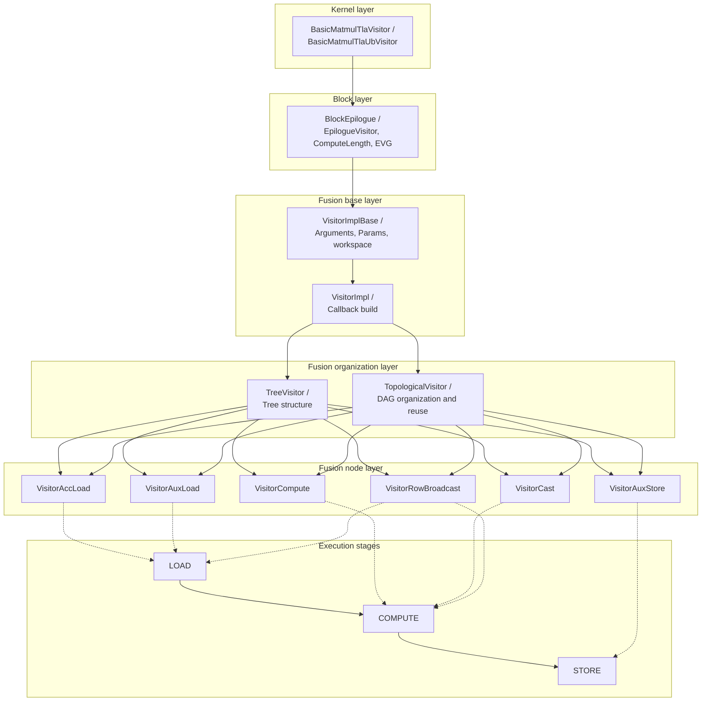
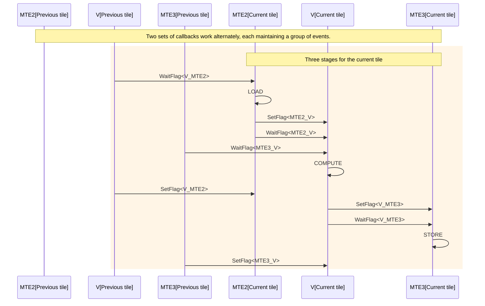
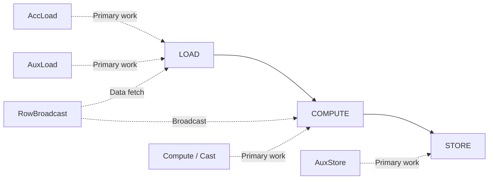
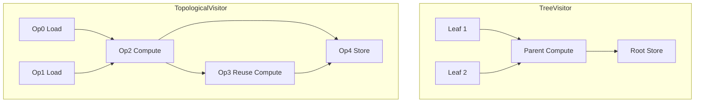

# EVG Design Overview

`Epilogue Visitor Graph` (EVG) is a declarative assembly framework that CATLASS uses in the GEMM epilogue stage. It breaks down operations like reading data, doing element-wise computations, and writing results into composable `Visitor` nodes. These nodes are connected through a graph structure and executed using a unified three-stage execution model to complete the epilogue pipeline.

The current implementation is mainly distributed in the following locations:

- `include/catlass/epilogue/fusion/`: EVG graph organization and node implementations
- `include/catlass/epilogue/block/block_epilogue_visitor.hpp`: block-level executor
- `include/catlass/gemm/kernel/basic_matmul_tla_visitor.hpp`: GM workspace path
- `include/catlass/gemm/kernel/basic_matmul_tla_ub_visitor.hpp`: UB workspace path

## Design Objectives

The problem EVG aims to solve is that epilogue logic changes frequently, but the code for data movement, tiling, synchronization, and double buffering is not something developers want to rewrite each time. It's not to replace the GEMM main loop, but to transform the epilogue part from manually orchestrating events and UB space into expression-based declarations.

Take `D = C + X` as an example. Developers only need to describe:

- Take `C` from the GEMM result.
- Take `X` from the external input.
- Perform element-wise `Add`.
- Write the result back to `D`.

As for tiling, when to move, when to compute, and when to write back, these are handled uniformly by the Block and Kernel components where EVG resides.

## Layering Relationships

The responsibilities of EVG in the current code can be summarized into three layers.

### Kernel Layer

The kernel layer connects the GEMM main loop with the EVG epilogue. Currently, there are two entry points:

- `BasicMatmulTlaVisitor` (code path: `include/catlass/gemm/kernel/basic_matmul_tla_visitor.hpp`): AIC first writes the MMAD result to the GM workspace. AIV then reads from the GM workspace and executes EVG.
- `BasicMatmulTlaUbVisitor` (code path: `include/catlass/gemm/kernel/basic_matmul_tla_ub_visitor.hpp`): AIC keeps the result in UB. AIV directly consumes the data in UB and executes EVG.

Both paths pass `EVG::Arguments` through to `BlockEpilogue`, but the workspace organization differs:

- GM workspace path: workspace = `M * N * sizeof(C)` + EVG's own workspace
- UB workspace path: The workspace is reserved only for `EVG`, with no additional allocation for the entire matrix `C`.

### Block Layer

The block-level executor is `BlockEpilogue<EpilogueVisitor<...>, ArchTag, ComputeLength, EVG, ElementC>` (code path: `include/catlass/epilogue/block/block_epilogue_visitor.hpp`).

It is responsible for:

- Splitting the output of a block into smaller tiles
- Allocating two sets of callbacks to EVG to form double buffering
- Driving each tile in the order `LOAD -> COMPUTE -> STORE`
- Using event synchronization to coordinate the MTE2, V, and MTE3 pipelines

There are two important template parameters:

- `EpilogueVisitor<false>`: GM workspace path
- `EpilogueVisitor<true>`: UB workspace path

`ComputeLength` determines how many elements are processed in UB at once. It affects both the tile size and the UB space available to EVG nodes.

### Fusion Layer

The fusion layer is responsible for "how a graph is described" and "how nodes are executed". The current code provides two organization methods:

- `TreeVisitor` (code path: `include/catlass/epilogue/fusion/tree_visitor.hpp`): Suitable for tree expressions. Child nodes are accessed first, then the parent node is called.
- `TopologicalVisitor` (code path: `include/catlass/epilogue/fusion/topological_visitor.hpp`): Suitable for DAGs, allowing intermediate results to be reused by multiple nodes.

The basic nodes in the graph come from `visitor_*.hpp`. For example:

- `VisitorAccLoad`
- `VisitorAuxLoad`
- `VisitorCompute`
- `VisitorCast`
- `VisitorAuxStore`
- `VisitorRowBroadcast`

## Three-Stage Execution Model

Node execution in EVG uniformly follows the three stages defined by `VisitStage` (code path: `include/catlass/epilogue/fusion/visitor_impl_base.hpp`):

- `LOAD`: Loads the required inputs to the UB.
- `COMPUTE`: Performs element-wise computation, broadcasting, or type conversion in the UB.
- `STORE`: Writes the result back to the GM or perform operations that truly modify the content of the external output address.

This staged design has two advantages:

1. Node responsibilities are clear. You only need to declare what each node does in which stage.
2. The Block layer can uniformly organize the pipeline double buffering without needing to know the specific computation performed inside each node.

The current pipeline model of `BlockEpilogue` is as follows:

1. Wait for the previous round to release a readable buffer, and then execute `LOAD` for the current tile.
2. Wait for the input and output dependencies to be satisfied, and then execute `COMPUTE` for the current tile.
3. Wait for the computation results to be ready for writing, and then execute `STORE` for the current tile.
4. Use two sets of callbacks alternately to form double buffering.

The core timing of the double-buffered pipeline at the tile level can be understood as follows:

The relationship between the three stages and common nodes can be understood as follows:

## Graph Organization Methods

### TreeVisitor

`TreeVisitor<NodeOp, ChildOps...>` is suitable for scenarios where results are directly synthesized from several inputs, for example:

- `D = C + X`
- `D = silu(C)`
- `D = cast(add(C, X))`

Its characteristics are:

- The structure is intuitive and close to expression semantics.
- Child node outputs are passed to the parent node in order.
- Suitable for chain or tree combinations.

### TopologicalVisitor

`TopologicalVisitor<EdgeTuple, Ops...>` is suitable for scenarios where intermediate results need to be reused, for example:

- `exp(2x)` is used by both the numerator and denominator.
- An intermediate node is consumed by multiple subsequent nodes.

Its characteristics are:

- Nodes are tiled in topological order.
- The last node is considered the root node.
- Each visit starts from the root node and recursively backtracks through dependencies, and uses caching to avoid repeated computation of visited nodes in the same tile and stage.

`matmul_tanh_evg` in the repository uses this method.

Compared to `TreeVisitor`, it is more suitable for explicit reuse of intermediate results:

## Space and Tiling

EVG resource management focuses on two aspects:

- `ComputeLength`
- `get_callbacks(...)` of each node

During execution, the Block layer aligns the current tile and then hands it off to each node to request UB space. Nodes such as `VisitorAccLoad`, `VisitorAuxLoad`, `VisitorCompute`, and `VisitorCast` consume UB. `VisitorAuxStore` is primarily responsible for writing back and does not require additional compute buffers.

Therefore, for `ComputeLength`, you cannot consider only the size of the result tile. You also need to consider the following:

- How many UB data blocks will reside in this EVG chain at the same time
- Whether dual buffering is enabled
- Whether the current path is a GM workspace or a UB workspace

## Current Implementation Boundaries

This document only maintains design-level boundaries. For details on nodes, operators, kernel entry points, and samples, refer to [evg_api](../../3_API/evg_api.md). For file distribution within the `fusion` directory, see [fusion/README](../../3_API/include/catlass/epilogue/fusion/README.md).
