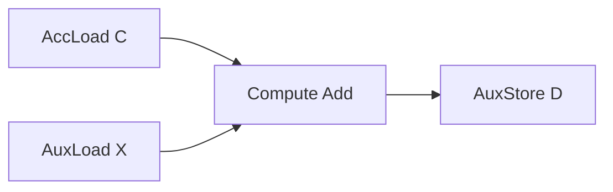

# EVG Quick Start

If you just want to run the first EVG sample and then understand how it is assembled, this document can serve as a quick start guide. For more complete API descriptions, see [evg_api](../../3_API/evg_api.md). For the design background, see [01_evg_design](./01_evg_design.md).

## Objectives

The following uses the simplest EVG scenario to describe the integration process:

- The GEMM main loop first calculates `C = A x B`.
- EVG then completes the element-wise addition `D = C + X`.

The corresponding graph structure can be understood as follows:

- Read `C` from the GEMM result.
- Read the external input `X` from the GM.
- Perform an element-wise `Add`.
- Write the result back to `D`.



## Step 1: Define EVG

This step describes only the epilogue logic and does not involve tiling, double buffering, or event synchronization.

`D = C + X` can be written as a `TreeVisitor` in the current API:

```cpp
#include "catlass/epilogue/fusion/fusion.hpp"

using LayoutX = LayoutC;
using LayoutD = LayoutC;

using AddVisitor = Epilogue::Fusion::TreeVisitor<
    Epilogue::Fusion::VisitorCompute<Epilogue::Fusion::Add, ElementC>,
    Epilogue::Fusion::VisitorAccLoad<ElementC>,
    Epilogue::Fusion::VisitorAuxLoad<ElementC, LayoutX>
>;

using EVG = Epilogue::Fusion::TreeVisitor<
    Epilogue::Fusion::VisitorAuxStore<ElementC, LayoutD>,
    AddVisitor
>;
```

The responsibilities of each node are as follows:

- `VisitorAccLoad`: reads the GEMM result.
- `VisitorAuxLoad`: reads the external input `X`.
- `VisitorCompute<Add, ...>`: completes `C + X`.
- `VisitorAuxStore`: writes back to `D`.

`TreeVisitor` works well if you need only this type of epilogue, that is, fetching data, performing element-wise computation, and then writing back the result.

## Step 2: Assemble BlockEpilogue

EVG itself only describes the graph. `BlockEpilogue` is what actually connects it to GEMM.

For the most common GM workspace path, you can write:

```cpp
using ArchTag = Arch::Ascend950;

constexpr uint32_t computeLength =
    (216 * 1024 / 3 / 2 / sizeof(ElementC)) / BYTE_PER_C0 * BYTE_PER_C0;

using BlockEpilogue = Epilogue::Block::BlockEpilogue<
    Epilogue::EpilogueVisitor<false>,
    ArchTag,
    Int<computeLength>,
    EVG,
    ElementC
>;
```

Remember two key points:

- `EpilogueVisitor<false>` indicates that the GM workspace path is used.
- `computeLength` determines the number of elements processed in the UB at once.

For details about the complete conventions of `computeLength`, see "computeLength Selection" in [evg_api](../../3_API/evg_api.md). For the first integration, you are advised to directly use the existing EVG sample's computation method.

## Step 3: Select visitor kernel

When connecting EVG to the GEMM main loop, use the visitor kernel under the current main repository convention:

```cpp
#include "catlass/gemm/kernel/basic_matmul_tla_visitor.hpp"

using MatmulKernel =
    Gemm::Kernel::BasicMatmulTlaVisitor<BlockMmad, BlockEpilogue, BlockScheduler>;
```

If the UB workspace path is to be used later, use `BasicMatmulTlaUbVisitor` here and switch `EpilogueVisitor<false>` and `VisitorAccLoad` to the UB mode.

## Step 4: Prepare EVG Arguments

EVG arguments are placed in `EVG::Arguments` and then passed to kernel `Arguments` as `evg_args`.

The argument order of `TreeVisitor` is "child before parent". Therefore, `D = C + X` can be written as follows:

```cpp
typename EVG::Arguments evg_args{
    {
        {},
        {deviceX, layoutX},
        {}
    },
    {deviceD, layoutD}
};
```

The mapping is as follows:

- First `{}`: `VisitorAccLoad::Arguments`
- `{deviceX, layoutX}`: `VisitorAuxLoad::Arguments`
- Second `{}`: `VisitorCompute::Arguments`
- `{deviceD, layoutD}`: `VisitorAuxStore::Arguments`

Then, add `evg_args` to the kernel arguments:

```cpp
typename MatmulKernel::Arguments arguments{
    problemShape,
    deviceA, layoutA,
    deviceB, layoutB,
    deviceD, layoutD,
    nullptr,
    evg_args
};
```

There is a fixed convention in the current implementation: Although `ptrC/layoutC` is retained in the public `Arguments`, the actual write-back location of the visitor path is determined by `VisitorAuxStore` in `evg_args`.

## Step 5: Build and Execute

Take `39_ascend950_matmul_add_evg` as an example. The build method is the same as that of other samples.

```bash
bash scripts/build.sh 39_ascend950_matmul_add_evg -DCATLASS_ARCH=3510
```

```bash
cd output/bin
./39_ascend950_matmul_add_evg 256 512 1024 0
```

If `Compare success.` is displayed, the result of the `Matmul + Add` link meets the expectation.

## What to Read Next

If you understand the preceding assembly process, you can continue to read:

- [evg_api](../../3_API/evg_api.md): Learn `TreeVisitor`, `TopologicalVisitor`, node parameters, and `computeLength`.
- [01_evg_design](./01_evg_design.md): Learn the execution model, hierarchical relationship, and double-buffer timing.
- [02_evg_extension](./02_evg_extension.md): Read this when you need to add operators or nodes.

When referring to the code, preferentially check the following files:

- `include/catlass/epilogue/fusion/fusion.hpp`
- `include/catlass/gemm/kernel/basic_matmul_tla_visitor.hpp`
- `include/catlass/epilogue/block/block_epilogue_visitor.hpp`
- EVG sample code
