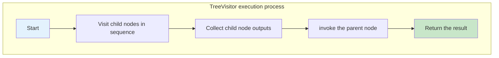

# EVG API

`Epilogue Visitor Graph` (EVG) is the graph-based design pattern API currently used by CATLASS to organize GEMM epilogue. This document focuses exclusively on integration paths, parameter sequencing, and node definitions. For details about the execution model, refer to [01_evg_design](../2_Design/03_evg/01_evg_design.md). For structural constraint extensions, refer to [02_evg_extension](../2_Design/03_evg/02_evg_extension.md).

## Core Entry


| Level    | Entry                                                                                                                                             | Purpose                                      |
| ------ | ----------------------------------------------------------------------------------------------------------------------------------------------- | ---------------------------------------- |
| Kernel | `BasicMatmulTlaVisitor`<br>Code path: include/catlass/gemm/kernel/basic_matmul_tla_visitor.hpp                                              | The AIC writes MMAD results to the Global Memory (GM) workspace, and the AIV subsequently executes the EVG pipeline.|
| Kernel | `BasicMatmulTlaUbVisitor`<br>Code path: include/catlass/gemm/kernel/basic_matmul_tla_ub_visitor.hpp                                         | The AIC retains results in the Unified Buffer (UB), and the AIV executes the EVG pipeline directly within the UB.        |
| Block  | `BlockEpilogue<EpilogueVisitor<...>, ArchTag, ComputeLength, EVG, ElementC>`<br>Code path: include/catlass/epilogue/block/block_epilogue_visitor.hpp| Coordinates tile slicing, double-buffering configurations, and three-phase pipeline scheduling.                    |
| Fusion | `TreeVisitor`<br>Code path: include/catlass/epilogue/fusion/tree_visitor.hpp                                                                | Describes epilogue using a hierarchical tree structure definition.                               |
| Fusion | `TopologicalVisitor`<br>Code path: include/catlass/epilogue/fusion/topological_visitor.hpp                                                   | Describes epilogue using a Directed Acyclic Graph (DAG) to enable intermediate result reuse.                      |


## Integration Sequence

The pipeline setup sequence for an EVG kernel is as follows:

1. Select BlockMmad.
2. Define EVG.
3. Assemble BlockEpilogue using EVG.
4. Select the visitor kernel.
5. Construct `EVG::Arguments`.
6. Fill `EVG::Arguments` into kernel `Arguments`.

A typical implementation is shown below:

```cpp
using EVG = Epilogue::Fusion::TreeVisitor<
    Epilogue::Fusion::VisitorAuxStore<ElementC, LayoutC>,
    Epilogue::Fusion::TreeVisitor<
        Epilogue::Fusion::VisitorCompute<Epilogue::Fusion::Add, ElementC>,
        Epilogue::Fusion::VisitorAccLoad<ElementC>,
        Epilogue::Fusion::VisitorAuxLoad<ElementC, LayoutC>
    >
>;

using BlockEpilogue = Epilogue::Block::BlockEpilogue<
    Epilogue::EpilogueVisitor<false>,
    ArchTag,
    Int<computeLength>,
    EVG,
    ElementC
>;

using MatmulKernel =
    Gemm::Kernel::BasicMatmulTlaVisitor<BlockMmad, BlockEpilogue, BlockScheduler>;
```

If the UB workspace path is used, the modifications are restricted to two locations:

- `Epilogue::EpilogueVisitor<true>`
- Switch the kernel to `BasicMatmulTlaUbVisitor`.

Under this configuration, `VisitorAccLoad` is typically specified as follows:

```cpp
using EpilogueDispatchPolicy = Epilogue::EpilogueVisitor<true>;
using AccLoad = Epilogue::Fusion::VisitorAccLoad<
    ElementC,
    EpilogueDispatchPolicy::USE_UB_WORKSPACE
>;
```

## TreeVisitor

`TreeVisitor<NodeOp, ChildOps...>` is optimized for tree-structured mathematical expressions.

### Form

```cpp
using EVG = Epilogue::Fusion::TreeVisitor<
    ParentOp,
    ChildOp1,
    ChildOp2
>;
```

### Parameter Sequencing

The `Arguments` serialization order of `TreeVisitor` differs from its template declaration order. The evaluation rule is strictly "child before parent".

```cpp
typename EVG::Arguments evg_args{
    {
        ChildOp1::Arguments{},
        ChildOp2::Arguments{},
        ParentOp::Arguments{}
    }
};
```

For nested `TreeVisitor` topologies, apply the "child before parent" parsing rule recursively at each hierarchy level.

### Arguments Construction

The `Arguments` type is structurally defined as an aggregate initialization structure, allowing it to be instantiated directly with nested initialization braces. You do not need to explicitly declare each layer as a discrete `XXX::Arguments` variable type.

For example, D = C + X can be directly written as follows:

```cpp
typename EVG::Arguments evg_args{
    {
        {},
        {deviceX, layoutX},
        {}
    },
    {deviceD, layoutD}
};
```

Under this configuration, `{}`, `{deviceX, layoutX}`, and `{deviceD, layoutD}` are automatically mapped to the corresponding node's `Arguments` data type based on their relative position. As long as the nesting hierarchy and sequence remain correct, explicit type declarations are optional.

### Applicable Scenarios

- `D = C + X`
- `D = silu(C)`
- `D = cast(add(C, X))`

### Execution Process



## TopologicalVisitor

TopologicalVisitor<EdgeTuple, Ops...> is optimized for scenarios where intermediate execution results must be reused.

### Form

```cpp
using Edges = tla::tuple<
    tla::seq<>,
    tla::seq<0>,
    tla::seq<1>,
    tla::seq<2>,
    tla::seq<2>,
    tla::seq<3, 4>,
    tla::seq<5>
>;

using EVG = Epilogue::Fusion::TopologicalVisitor<
    Edges,
    Op0, Op1, Op2, Op3, Op4, Op5, Op6
>;
```

### Parameter Sequencing

`TopologicalVisitor` Arguments are strictly in the flattened order of `Ops...`.

```cpp
typename EVG::Arguments evg_args{
    Op0::Arguments{},
    Op1::Arguments{},
    Op2::Arguments{},
    Op3::Arguments{},
    Op4::Arguments{},
    Op5::Arguments{},
    Op6::Arguments{}
};
```

### Arguments Construction

`TopologicalVisitor` can also be directly filled using braces in the order of nodes. You do not need to explicitly write the type of each node.

```cpp
typename EVG::Arguments evg_args{
    {},
    {{2.0f}},
    {},
    {{-1.0f}},
    {{1.0f}},
    {},
    {deviceD, layoutD}
};
```

The decision rule is simple:

- The node is written in the corresponding position.
- If there are several fields in the node `Arguments`, write several layers of braces in the field order.
- If there is no field, directly write `{}`.

### Applicable Scenarios

- The same intermediate result is consumed by multiple subsequent nodes.
- Repeated computation on a tile is to be avoided.

### Execution Process

```mermaid
graph TB
    subgraph "Execution process of TopologicalVisitor"
        A2 [Start a visit] --> B2 [Reset the visited flag]
        B2 --> C2 [Use the last node as the root node]
        C2 --> D2 [Enter the current node]
        D2 --> E2 {Whether the current node has been visited}
        E2 --Yes--> F2 [Return the cached output directly]
        E2 --No--> G2 [Recursively access dependencies in the order of EdgeTuples]
        G2 --> H2 [Call the visit function of the current node.]
        H2 --> I2 [Cache the output and mark it as visited.]
        I2 --> K2 [Return the output of the current node.]
        F2 --> J2 [Return the result of the root node.]
        K2 --> J2
    end

    style A2 fill:#e3f2fd
    style J2 fill:#c8e6c9
```

The cache here only covers the current `visit<Stage>(...)` call, that is, the current stage of the current tile. When entering the next stage, a new round of access will start from the root node. For details about the trade-offs between the two organization modes, see the "Graph Organization Mode" section in the design document.

## Node Overview

In the current implementation, the commonly used EVG nodes are as follows.


| Node                                                     | Header File                        | Purpose                     |
| ------------------------------------------------------- | --------------------------- | ----------------------- |
| `VisitorAccLoad<Element, USE_UB_WORKSPACE>`             | `visitor_acc_load.hpp`      | Reads the GEMM result.             |
| `VisitorAuxLoad<Element, Layout>`                       | `visitor_aux_load.hpp`      | Reads the input from the external GM.            |
| `VisitorCompute<ComputeFn, ElementCompute, Scalars...>` | `visitor_compute.hpp`       | Performs element-wise computation.                 |
| `VisitorCast<ElementTo, ElementFrom, RoundStyle>`       | `visitor_cast.hpp`          | Performs type conversion.                  |
| `VisitorAuxStore<Element, Layout>`                      | `visitor_aux_store.hpp`     | Write the result back to the GM.               |
| `VisitorRowBroadcast<Element, Layout>`                  | `visitor_row_broadcast.hpp` | Read the `1 × N` row vector and broadcast it to the tiles.|


## Phases and Placement Rules

All nodes run in the unified three-phase model:

- `LOAD`
- `COMPUTE`
- `STORE`

However, not every node performs operations in all three phases:

- `VisitorAccLoad` and `VisitorAuxLoad` mainly work in `LOAD`.
- `VisitorCompute` and `VisitorCast` mainly work in `COMPUTE`.
- `VisitorAuxStore` mainly works in `STORE`.
- `VisitorRowBroadcast` spans across both `LOAD` and `COMPUTE`.

When organizing the graph, you can use these simple rules for initial placement:

- Leaf nodes serve as data sources: `VisitorAccLoad`, `VisitorAuxLoad`, and `VisitorRowBroadcast`
- Intermediate nodes handle transformation and computation: `VisitorCast` and `VisitorCompute`
- Root node for output: `VisitorAuxStore`

If `TopologicalVisitor` is used, the node responsibilities remain identical. However, nodes are no longer nested, but are instead flattened in dependency order.

The relationship diagram between phases and node responsibilities, as well as the double-buffered pipeline timing diagram of `BlockEpilogue`, have been added to the design document. For details, see the "Three-Stage Execution Model" section in [01_evg_design](../2_Design/03_evg/01_evg_design.md).

## Node Description

The following describes the template parameters, placement positions, `Arguments` syntax, and special requirements for each node.

It is more convenient to check the quick reference table first:


| Node                   | Common Placement Position| Number of Inputs | Form Directly Written into `Arguments`| Special Restrictions                           |
| --------------------- | ------ | ----- | -------------------- | ------------------------------- |
| `VisitorAccLoad`      | Leaf node  | 0     | `{}`                 | Directly consumes MMAD UB results through the UB path.        |
| `VisitorAuxLoad`      | Leaf node  | 0     | `{ptr, layout}`      | `layout` describes the entire tensor                |
| `VisitorAuxStore`     | Root node   | 1     | `{ptr, layout}`      | Actually responsible for writing data back GM                    |
| `VisitorCast`         | Intermediate node  | 1     | `{}`                 | Input type must match `ElementFrom`         |
| `VisitorRowBroadcast` | Leaf node  | 0     | `{ptr, layout}`      | `layout` uses a 2D layout of `(1, n)`|
| `VisitorCompute`      | Intermediate node  | 1 or more| `{}` or `{{...}}`    | All input types must match `ElementCompute`    |


### VisitorAccLoad

```cpp
VisitorAccLoad<Element, USE_UB_WORKSPACE>
```

- `Element`: element type read out, which usually matches the MMAD output type
- `USE_UB_WORKSPACE`: whether to directly read the MMAD result from the UB

Position and usage requirements:

- Generally used as a leaf node.
- Does not receive input from child nodes.
- Outputs the `C` of the current tile.
- In the GM workspace, data is moved to the UB during the `LOAD` phase.
- In the UB workspace, it directly fetches the current MMAD result from the UB.
- Typically placed upstream of compute nodes such as `VisitorCompute` and `VisitorCast`.

Common usage:

```cpp
using AccLoad0 = Epilogue::Fusion::VisitorAccLoad<ElementC>;
using AccLoad1 = Epilogue::Fusion::VisitorAccLoad<ElementC, true>;
```

Corresponding `Arguments`:

```cpp
typename AccLoad0::Arguments acc_args{};
typename AccLoad1::Arguments acc_ub_args{};
```

When written directly within the entire graph initialize list:

```cpp
{}
```

### VisitorAuxLoad

```cpp
VisitorAuxLoad<Element, Layout>
```

- `Element`: element type of the external input tensor
- `Layout`: layout type corresponding to the external input

Position and usage requirements:

- Generally used as a leaf node.
- Does not receive input from child nodes.
- Reads data from the GM based on the global coordinates of the current tile during the `LOAD` phase.
- Suitable to be placed upstream of compute nodes such as `VisitorCompute` and `VisitorCast`.
- The `layout` describes the complete input tensor, not just the current tile.
- The `layout` passed must be a concrete layout object, not a layout tag.
- The `layout` type must match the template parameter `Layout`.
- `layout` must reflect the actual memory layout of the data pointed to by `ptr`.

Common usage:

```cpp
using XLoad = Epilogue::Fusion::VisitorAuxLoad<ElementC, LayoutX>;
```

Corresponding `Arguments`:

```cpp
typename XLoad::Arguments x_args{deviceX, layoutX};
```

When written directly within the entire graph initialize list:

```cpp
{deviceX, layoutX}
```

Example:

```cpp
auto layoutX = tla::MakeLayout<ElementC, layout::RowMajor>(m, n);
using LayoutX = decltype(layoutX);
using XLoad = Epilogue::Fusion::VisitorAuxLoad<ElementC, LayoutX>;
```

### VisitorAuxStore

```cpp
VisitorAuxStore<Element, Layout>
```

- `Element`: element type of the data to be written back
- `Layout`: layout type of the output tensor

Position and usage requirements:

- Receives one input and is generally used as an output node.
- Typically placed as the root node of the entire graph, handling the final writeback.
- The actual writeback to external memory occurs during the `STORE` phase.
- In the current implementation, the input data is transparently passed through and returned, meaning it can technically still participate in further node composition.
- In documentation and examples, it is usually placed at the very end as the node for flushing results to GM.
- The input element type must match the template parameter `Element`. If they differ, a `VisitorCast` must be inserted beforehand.
- The `layout` describes the complete output tensor, not just the current tile.
- The `layout` passed must be a concrete layout object, not a layout tag.
- The `layout` type must match the template parameter `Layout`.
- The `layout` must reflect the actual memory layout of the destination GM.

Common usage:

```cpp
using Store = Epilogue::Fusion::VisitorAuxStore<ElementC, LayoutD>;
```

Corresponding `Arguments`:

```cpp
typename Store::Arguments store_args{deviceD, layoutD};
```

When written directly within the entire graph initialize list:

```cpp
{deviceD, layoutD}
```

Example:

```cpp
auto layoutD = tla::MakeLayout<ElementC, layout::RowMajor>(m, n);
using LayoutD = decltype(layoutD);
using Store = Epilogue::Fusion::VisitorAuxStore<ElementC, LayoutD>;
```

### VisitorCast

```cpp
VisitorCast<ElementTo, ElementFrom, RoundStyle>
```

- `ElementTo`: target type after conversion
- `ElementFrom`: input type
- `RoundStyle`: rounding mode, which defaults to `AscendC::RoundMode::CAST_NONE`

Position and usage requirements:

- Receives one input and is typically used as an intermediate parent node.
- Suitable to be placed above a leaf node or a compute node to pass the converted result to subsequent compute nodes.
- The actual mathematical computation occurs during the `COMPUTE` phase.
- Input type must match `ElementFrom`.
- The output type is fixed to `ElementTo`.
- If the upstream and downstream data types are already identical, this node is redundant and should be omitted.
- Generally placed above a leaf node or a compute node. It does not serve as a data source or final output node.

Common usage:

```cpp
using CastFp16ToFp32 =
    Epilogue::Fusion::VisitorCast<float, half, AscendC::RoundMode::CAST_NONE>;
```

Corresponding `Arguments`:

```cpp
typename CastFp16ToFp32::Arguments cast_args{};
```

When written directly within the entire graph initialize list:

```cpp
{}
```

### VisitorRowBroadcast

```cpp
VisitorRowBroadcast<Element, Layout>
```

- `Element`: element type of the row vector
- `Layout`: layout type of the `1 × N` input

Note that the current implementation processes this input as a 2D tensor. Therefore, `Layout` must use a layout type that describes a `(1, n)` matrix, rather than a vector layout type that only describes `(n)`.

Position and usage requirements:

- Generally used as a leaf node.
- Does not receive input from child nodes.
- During the `LOAD` phase, it reads the `1 × tile_n` slice corresponding to the current column range.
- During the `COMPUTE` phase, it replicates this row to match the current `tile_m × tile_n shape`.
- Ideal for inputs like bias that are shared across columns and broadcasted across rows.
- Currently, the implementation uses a 2D layout of `(1, n)`, not a 1D vector layout of `(n)`.
- The `layout` passed must be a concrete layout object, not a layout tag.
- The `layout` type must match the template parameter `Layout`.

Common usage:

```cpp
auto layoutBias = tla::MakeLayout<ElementC, layout::RowMajor>(1, n);
using LayoutBias = decltype(layoutBias);
using BiasLoad = Epilogue::Fusion::VisitorRowBroadcast<ElementC, LayoutBias>;
```

Corresponding `Arguments`:

```cpp
typename BiasLoad::Arguments bias_args{deviceBias, layoutBias};
```

When written directly within the entire graph initialize list:

```cpp
{deviceBias, layoutBias}
```

### VisitorCompute

```cpp
VisitorCompute<ComputeFn, ElementCompute, Scalars...>
```

The three parameters represent:

- `ComputeFn`: specific operator, for example, `Add`, `Exp`, or `Muls`
- `ElementCompute`: element data type on which the operator operates
- `Scalars...`: types of additional scalar arguments; omit if none are required

Usage requirements:

- Typically used as an intermediate compute node.
- Inputs are sourced from `AccLoad`, `AuxLoad`, `RowBroadcast`, `Cast`, or other `Compute` nodes.
- The actual mathematical computation occurs during the `COMPUTE` phase.
- The number of inputs must match the `ComputeFn` semantics.
- All input types must match `ElementCompute`.
- If they differ, insert `VisitorCast` first.

Common examples:

```cpp
using AddOp = Epilogue::Fusion::VisitorCompute<Epilogue::Fusion::Add, ElementC>;
using ExpOp = Epilogue::Fusion::VisitorCompute<Epilogue::Fusion::Exp, ElementC>;
using MulsOp = Epilogue::Fusion::VisitorCompute<Epilogue::Fusion::Muls, ElementC, ElementC>;
using AddsOp = Epilogue::Fusion::VisitorCompute<Epilogue::Fusion::Adds, ElementC, ElementC>;
using LeakyReluOp =
    Epilogue::Fusion::VisitorCompute<Epilogue::Fusion::LeakyRelu, ElementC, ElementC>;
```

Corresponding `Arguments`:

```cpp
typename AddOp::Arguments add_args{};
typename ExpOp::Arguments exp_args{};
typename MulsOp::Arguments muls_args{{2.0f}};
typename AddsOp::Arguments adds_args{{1.0f}};
typename LeakyReluOp::Arguments leaky_args{{0.1f}};
```

When directly written within the entire graph initialize list, you can use nested braces:

```cpp
typename EVG::Arguments evg_args{
    {},
    {{2.0f}},
    {},
    {deviceD, layoutD}
};
```

The reason `{{2.0f}}` requires double braces is that `VisitorCompute::Arguments` wraps a `scalars` tuple inside. If `Scalars...` contains multiple scalar fields, write them sequentially:

```cpp
using SomeOp = Epilogue::Fusion::VisitorCompute<SomeComputeFn, ElementC, float, int32_t>;
typename SomeOp::Arguments some_args{{1.0f, 2}};
```

When written directly within the entire graph initialize list, the corresponding position is filled as:

```cpp
{{1.0f, 2}}
```

VisitorCompute strictly validates that all incoming types equal ElementCompute. If there is any type mismatch, a VisitorCast must be inserted first.

## Common ComputeFn

`VisitorCompute` depends on the operator definitions in `operations.hpp`. The following are commonly used in the current implementation:


| Type   | Operators                                    |
| ----- | -------------------------------------- |
| Unary   | `Exp`, `Relu`, `Silu`, `Sqrt`, `RsqrtFast`|
| With scalar  | `LeakyRelu`, `Muls`, `Adds`             |
| Binary or multi| `Add`, `Sub`, `Mul`, `Div`, `Max`, `Min`   |
| Combination   | `AddRelu`                              |


## Key parameters of `BlockEpilogue`

The template argument sequence for the EVG-specific `BlockEpilogue` is as follows:

```cpp
using BlockEpilogue = Epilogue::Block::BlockEpilogue<
    Epilogue::EpilogueVisitor<false>,
    ArchTag,
    Int<computeLength>,
    EVG,
    ElementC
>;
```

Key points:

- `EpilogueVisitor<false>`: Fetches the MMAD result from the GM workspace.
- `EpilogueVisitor<true>`: Fetches the MMAD result directly from the UB.
- `computeLength`: Number of elements processed in a single tile, aligned by `BYTE_PER_C0`.
- `EVG`: Entire epilogue graph.
- `ElementC`: Element type of the MMAD output.

## Kernel-side Arguments

Taking `BasicMatmulTlaVisitor` as an example, `evg_args` must be included in the `Arguments` structure along with matrix handles (A, B, C) and their layouts:

```cpp
struct Arguments {
    GemmCoord problemShape;
    GM_ADDR ptrA; LayoutA layoutA;
    GM_ADDR ptrB; LayoutB layoutB;
    GM_ADDR ptrC; LayoutC layoutC;
    GM_ADDR ptrBias{nullptr};
    typename BlockEpilogue::EVG::Arguments evg_args;
};
```

This`Arguments` structure can also be initialized directly using braced initializer lists without explicitly declaring the internal type names:

```cpp
typename MatmulKernel::Arguments arguments{
    problemShape,
    deviceA, layoutA,
    deviceB, layoutB,
    deviceD, layoutD,
    nullptr,
    {
        {
            {},
            {deviceX, layoutX},
            {}
        },
        {deviceD, layoutD}
    }
};
```

Ensure structural alignment on two critical fronts:

- The outer field sequence must match the definition order in `MatmulKernel::Arguments`.
- The nested layout inside `evg_args` must precisely match the structural nesting of `EVG::Arguments`.

Layout-specific constraints and semantics are as follows:

- `layoutA` and `layoutB` must receive concrete layout objects.
- The `layout` passed must be a concrete layout object, not a layout tag.
- These layout objects are utilized directly to construct the underlying GM tensors.
- While `layoutC` remains reserved in the public API of the visitor kernel, it is ignored during the actual execution of the visitor path. The runtime writeback layout is determined by the layout object passed to `VisitorAuxStore`.

Note that the `ToUnderlyingArguments()` implementation of the current visitor kernel does not consume `ptrC` or `layoutC`. The actual writeback logic and destination address are governed by the `VisitorAuxStore` contained within `evg_args`.

If the GM workspace path is used:

- `GetWorkspaceSize()` returns the sum of `C workspace + EVG workspace`.

If the UB workspace path is used:

- `GetWorkspaceSize()` returns only `EVG workspace`.

## computeLength Selection

`computeLength` indicates the number of elements processed by the current execution pipeline in each iteration. Theoretically, a larger value reduces iteration overhead and maximizes performance. However, it cannot exceed the hard physical limits of the UB. In practice, you must calculate the maximum allowable capacity before declaring `computeLength`.

The calculation depends on three variables:

- Total UB capacity allocated to the EVG
- Number of concurrently resident UB buffers
- Whether double buffering is enabled

The final calculated capacity must be aligned downward to `BYTE_PER_C0`.

### Example 1: D = C + X Through the GM Workspace Path

This execution pipeline requires three concurrently resident UB buffers:

- `C`
- `X`
- `Out`

Since double buffering is enabled, the maximum valid `computeLength` can be derived using the following formula:

```cpp
constexpr uint32_t computeLength =
    (ArchTag::UB_SIZE / 3 / 2 / sizeof(ElementC)) / BYTE_PER_C0 * BYTE_PER_C0;
```

For the A5 architecture, EVG reference code rarely utilizes the absolute maximum theoretical UB size to avoid runtime allocation failures. Instead, a conservative budget of `216 × 1024` bytes is typically substituted as the total available workspace:

```cpp
constexpr uint32_t computeLength =
    (216 * 1024 / 3 / 2 / sizeof(ElementC)) / BYTE_PER_C0 * BYTE_PER_C0;
```

The value `216 × 1024` represents the safe, conservative budget limit for the A5 architecture.

### Example 2: `D = C + X` Through the UB Workspace Path

If the UB workspace path is used, `VisitorAccLoad<..., true>` does not allocate an additional UB buffer. Therefore, the pipeline only needs to reserve space for the following two buffers:

- `X`
- `Out`

However, the EVG can no longer claim the entire UB workspace because a fixed segment has been pre-allocated to hold the raw MMAD output. In the current implementation, the EVG's memory allocation offset starts at `ArchTag::L0C_SIZE / 2`. Adhering to the same conservative budget model, the total available space is calculated by taking the base `216 × 1024` budget. The maximum valid `computeLength` formula is written as:

```cpp
constexpr uint32_t computeLength =
    ((216 * 1024 - ArchTag::L0C_SIZE / 2) / 2 / 2 / sizeof(ElementC)) /
    BYTE_PER_C0 * BYTE_PER_C0;
```

### Allocation Rules

- For each unique node that allocates its own UB workspace, increment the buffer count in the denominator by 1.
- `VisitorAuxStore` generally does not occupy an independent computation buffer and should be excluded from the count.
- Under the GM workspace path, `VisitorAccLoad`, `VisitorAuxLoad`, `VisitorRowBroadcast`, `VisitorCompute`, and `VisitorCast` typically need to be counted.
- Under the UB workspace path, `VisitorAccLoad<..., true>` is excluded from the buffer count because it directly operates on the MMAD output already resident in the UB.
- Under the UB workspace path, the memory footprint reserved for the MMAD output must be subtracted from the total available UB budget before calculating the maximum value.
