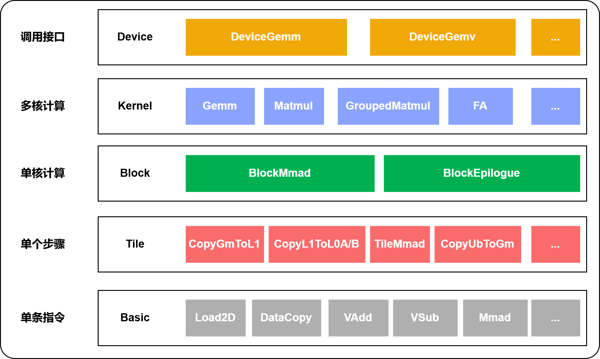
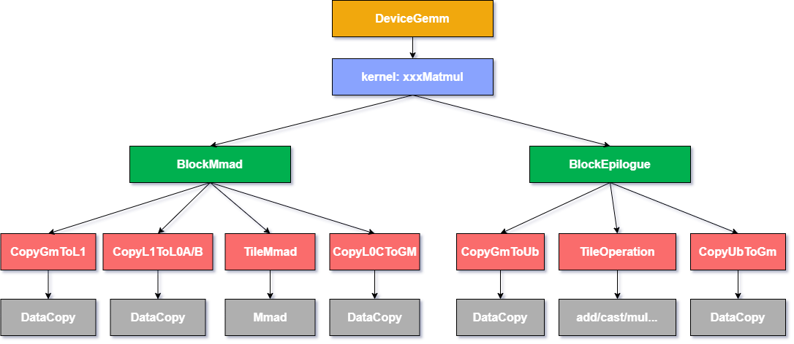

# CATLASS 项目介绍

`Transformer`架构中矩阵乘法（GEMM, General Matrix Multiplication）计算占据重要比重，其性能优化对提升整体计算效率至关重要。针对GEMM类算子编程，不同场景不同优化点的实现变种众多，且在算法演进和创新过程中会诞生大量新的定制化开发诉求，难以事先预备枚举。直接基于硬件能力定制开发GEMM类算子面临着开发难度大，开发周期长的问题。为此，昇腾CANN推出CATLASS算子模板库，采用分层模块化设计，将GEMM计算解耦为可灵活组合的数据分块策略和计算单元配置等组件，实现快速搭建拼装的开发范式。

CATLASS算子模板库面向昇腾硬件亲和性优化，通过提供可复用的模板、基础组件和典型算子实践案例，使开发者能够基于模块化组装快速完成计算流水线编排。开发者可以根据具体硬件特性和计算需求灵活定制计算内核，在确保高性能的同时，显著提升开发效率。

CATLASS算子模板库采用分层抽象的设计理念，通过分析硬件架构特性和GEMM计算需求，将整体实现划分为多个层次。该设计通过模板化方式提取各层共性逻辑，同时保留必要的差异化扩展能力，使得不同层级的软件抽象能够精准对应到特定硬件结构和计算流水阶段。算法框架中的特定步骤会延迟到子类实现，使得子类能够在不改变算法整体结构的情况下，灵活重定义其中的某些关键步骤。

## 算子实现分层模块化设计



## 算子流水自定义灵活配置

模板库提供了灵活的开发方式，开发者可以复用预置的范式来快速实现基础功能，也能够针对特定需求修改模块进行定制开发，还可以通过更换组件来实现自定义的流水组合。这种设计在保证计算性能的同时，为开发者提供了充分的灵活性和拓展空间。



## 项目目录

项目全量目录介绍如下：

```bash
catlass
├── 3rdparty                     # 三方依赖库
|   └── googletest               # GoogleTest测试框架
├── cmake                        # cmake公共函数
├── docs                         # 文档存放目录
├── examples                     # kernel算子样例总目录
|   ├── 00_basic_matmul          # 单算子样例
|   |   ├── basic_matmul.cpp     # Host侧算子调用
|   |   ├── CMakeLists.txt
|   |   └── README.md            # 算子说明示例
|   ├── ...
|   ├── advanced                 # 进阶样例
|   └── common                   # 样例公共组件（golden、helper等）
├── include                      # 模板头文件集
|   ├── catlass                  # 不同层级的算子实现逻辑
|   |   ├── arch                 # 硬件架构抽象层
|   |   ├── conv                 # 卷积算子模板
|   |   ├── epilogue             # 后处理模板
|   |   ├── gemm                 # GEMM算子模板
|   |   ├── gemv                 # GEMV算子模板
|   |   └── layout               # 数据布局定义
|   └── tla                      # TLA框架
├── python                       # Python代码生成框架
|   └── catlass_cppgen           # 基于Python的C++核函数代码生成框架
├── scripts                      # 相关脚本
├── tests                        # 测试用例
|   ├── optest                   # Python算子功能测试
|   ├── unittest                 # C++单元测试
|   └── self_contained_includes  # 头文件自包含检查
└── tools                        # 调优工具
```
