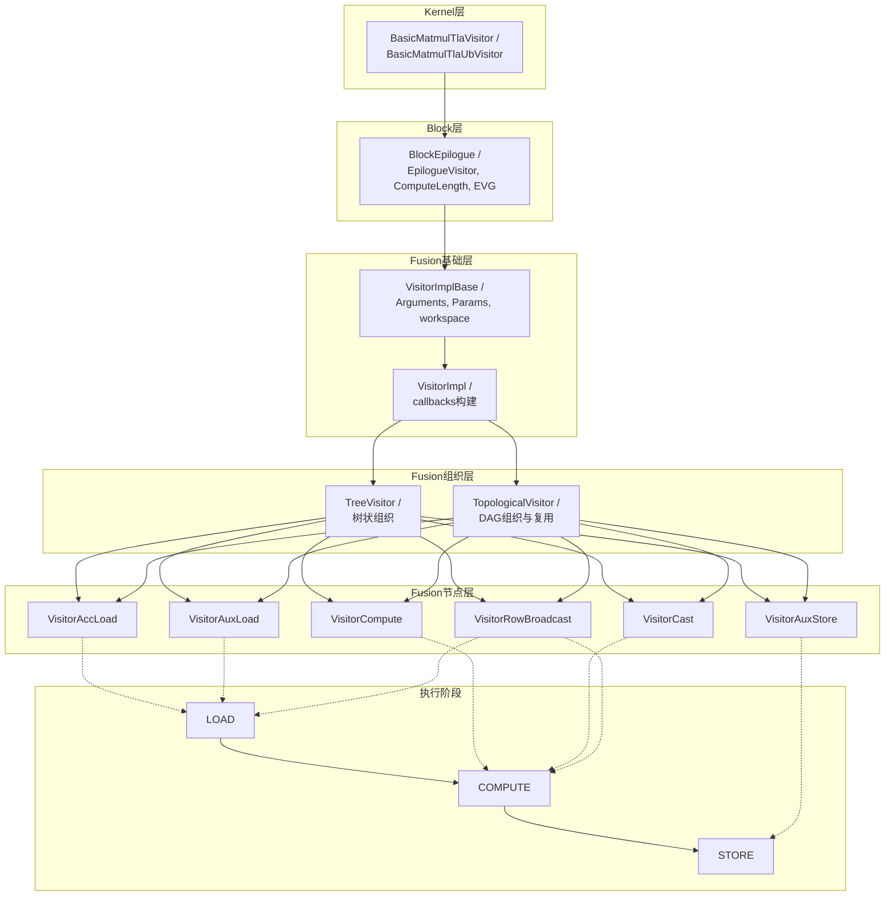
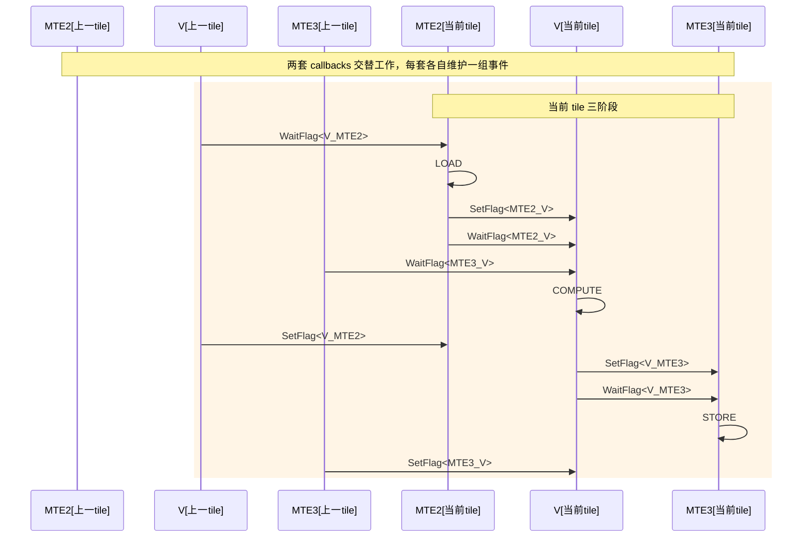
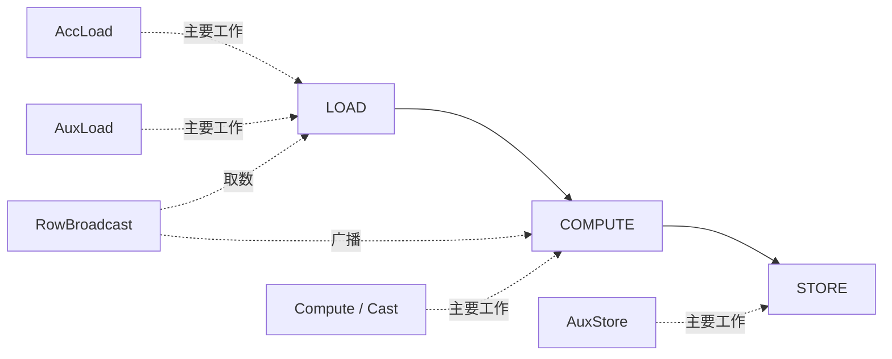
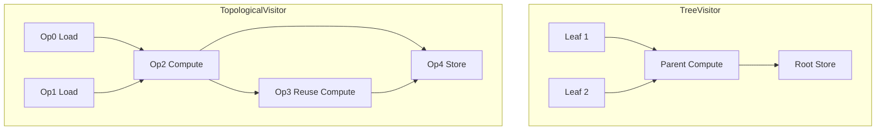

# EVG 设计概览

EVG（`Epilogue Visitor Graph`）是 CATLASS 在 GEMM 尾处理阶段使用的声明式拼装框架。它把“读数据、做逐元素计算、写结果”拆成一组可组合的 `Visitor` 节点，再由图结构把这些节点连接起来，用统一的三阶段执行模型完成尾处理流水。

当前实现主要分布在以下位置：

- `include/catlass/epilogue/fusion/`：EVG 图组织与节点实现
- `include/catlass/epilogue/block/block_epilogue_visitor.hpp`：Block 级执行器
- `include/catlass/gemm/kernel/basic_matmul_tla_visitor.hpp`：GM workspace 路径
- `include/catlass/gemm/kernel/basic_matmul_tla_ub_visitor.hpp`：UB workspace 路径

## 设计目标

EVG 要解决的是“尾处理逻辑经常变化，但搬运、切块、同步、双缓冲这些代码不想每次重写”的问题。它的目标不是替代 GEMM 主循环，而是把尾处理部分从手工组织事件与 UB 空间，变成按表达式声明。

以 `D = C + X` 为例，开发者只需要描述：

- 从 GEMM 结果里取 `C`
- 从外部输入里取 `X`
- 做逐元素 `Add`
- 把结果写回 `D`

至于 tile 切分、何时搬入、何时计算、何时写回，由 EVG 所在的 Block 与 Kernel 组件统一调度。

## 分层关系

EVG 在当前代码中的职责分层可以概括为三层。

### Kernel 层

Kernel 层负责把 GEMM 主循环和 EVG 尾处理接起来，当前真实入口有两条：

- `BasicMatmulTlaVisitor`（代码路径：`include/catlass/gemm/kernel/basic_matmul_tla_visitor.hpp`）：AIC 先把 MMAD 结果写到 GM workspace，AIV 再从 GM workspace 读出并执行 EVG
- `BasicMatmulTlaUbVisitor`（代码路径：`include/catlass/gemm/kernel/basic_matmul_tla_ub_visitor.hpp`）：AIC 把结果保留在 UB，AIV 直接消费 UB 中的数据并执行 EVG

两条路径都会把 `EVG::Arguments` 透传到 `BlockEpilogue`，但 workspace 组织方式不同：

- GM workspace 路径：workspace = `M * N * sizeof(C)` + `EVG` 自身 workspace
- UB workspace 路径：workspace 只为 `EVG` 自身保留，不再额外申请整块 `C`

### Block 层

Block 级的执行器是 `BlockEpilogue<EpilogueVisitor<...>, ArchTag, ComputeLength, EVG, ElementC>`（代码路径：`include/catlass/epilogue/block/block_epilogue_visitor.hpp`）。

它负责：

- 把一个 block 的输出切成更小的 tile
- 为 EVG 分配两套 callback，形成双缓冲
- 按 `LOAD -> COMPUTE -> STORE` 次序驱动每个 tile
- 用事件同步串起 MTE2、V、MTE3 三条流水

其中有两个重要模板参数：

- `EpilogueVisitor<false>`：GM workspace 路径
- `EpilogueVisitor<true>`：UB workspace 路径

`ComputeLength` 决定单次在 UB 内处理多少元素，它既影响 tile 大小，也直接影响 EVG 节点能够分到的 UB 空间。

### Fusion 层

Fusion 层负责“图怎么描述”和“节点怎么执行”。当前代码提供两种组织方式：

- `TreeVisitor`（代码路径：`include/catlass/epilogue/fusion/tree_visitor.hpp`）：适合树状表达式，先访问子节点，再调用父节点
- `TopologicalVisitor`（代码路径：`include/catlass/epilogue/fusion/topological_visitor.hpp`）：适合 DAG，允许中间结果被多个节点复用

图中的基础节点来自 `visitor_*.hpp`，例如：

- `VisitorAccLoad`
- `VisitorAuxLoad`
- `VisitorCompute`
- `VisitorCast`
- `VisitorAuxStore`
- `VisitorRowBroadcast`

## 三阶段执行模型

EVG 的节点执行统一遵循 `VisitStage`（代码路径：`include/catlass/epilogue/fusion/visitor_impl_base.hpp`）定义的三阶段：

- `LOAD`：把需要的输入搬入 UB
- `COMPUTE`：在 UB 中完成逐元素计算、广播或类型转换
- `STORE`：把结果写回 GM，或者执行真正修改外部输出地址内容的动作

这种分阶段设计的意义有两点：

1. 节点职责清晰。每个节点只需声明自己在哪个阶段做什么。
2. Block 层可以统一组织双缓冲流水，而不需要关心节点内部具体做了什么计算。

当前 `BlockEpilogue` 的流水模型是：

1. 等待上一轮释放可读 buffer，执行当前 tile 的 `LOAD`
2. 等待输入与输出依赖满足，执行当前 tile 的 `COMPUTE`
3. 等待计算结果可写回，执行当前 tile 的 `STORE`
4. 交替使用两套 callback，形成双缓冲

双缓冲流水在 tile 级别的核心时序可以按下面理解：

三阶段和常见节点的关系可以按下面理解：

## 图组织方式

### TreeVisitor

`TreeVisitor<NodeOp, ChildOps...>` 适合表达“结果由若干输入直接合成”的场景，例如：

- `D = C + X`
- `D = silu(C)`
- `D = cast(add(C, X))`

它的特点是：

- 结构直观，和表达式语义接近
- 子节点输出会按顺序传给父节点
- 适合链式或树状组合

### TopologicalVisitor

`TopologicalVisitor<EdgeTuple, Ops...>` 适合中间结果需要复用的场景，例如：

- `exp(2x)` 同时被分子和分母使用
- 一个中间节点被多个后续节点消费

它的特点是：

- 节点按拓扑序平铺定义
- 最后一个节点视为根节点
- 每次访问都从根节点递归回溯依赖，并用缓存避免同一个 tile、同一个阶段里重复计算已访问节点

当前仓内 `matmul_tanh_evg` 就使用了这种方式。

和 `TreeVisitor` 相比，它更适合显式复用中间结果：

## 空间与切块

EVG 的资源管理围绕两件事展开：

- `ComputeLength`
- 每个节点的 `get_callbacks(...)`

执行时，Block 层会把当前 tile 对齐后交给各节点申请 UB 空间。像 `VisitorAccLoad`、`VisitorAuxLoad`、`VisitorCompute`、`VisitorCast` 这类节点会占用 UB；`VisitorAuxStore` 主要负责写回，不额外分配计算 buffer。

因此 `ComputeLength` 不能只看结果 tile 大小，还要考虑：

- 本条 EVG 链路里会同时驻留多少块 UB 数据
- 是否启用了双缓冲
- 当前路径是 GM workspace 还是 UB workspace

## 当前实现边界

这篇文档只保留设计层面的边界说明。具体到当前有哪些节点、算子、kernel 入口和样例时，以 [evg_api](../../3_API/evg_api.md) 为准；`fusion` 目录内文件分布见 [fusion/README](../../3_API/include/catlass/epilogue/fusion/README.md)。
