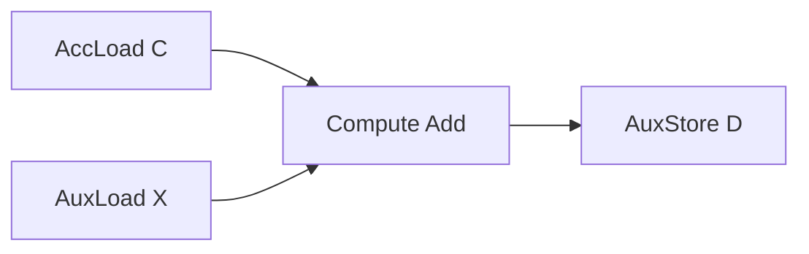

# EVG 快速上手

如果只是想先把第一个 EVG 样例跑起来，再理解它是怎么组装出来的，这篇文档可以直接作为入口。更完整的接口说明见 [evg_api](../../3_API/evg_api.md)，设计背景见 [01_evg_design](./01_evg_design.md)。

## 目标

这里用最简单的一类 EVG 场景说明接入过程：

- GEMM 主循环先算出 `C = A x B`
- EVG 再完成逐元素加法 `D = C + X`

对应的图结构可以理解成：

- 从 GEMM 结果读取 `C`
- 从 GM 读取外部输入 `X`
- 做一次逐元素 `Add`
- 把结果写回 `D`



## 第一步：定义 EVG

这一步只描述尾处理逻辑，不关心 tile 切分、双缓冲和事件同步。

`D = C + X` 在当前接口下可以写成一棵 `TreeVisitor`：

```cpp
#include "catlass/epilogue/fusion/fusion.hpp"

using LayoutX = LayoutC;
using LayoutD = LayoutC;

using AddVisitor = Epilogue::Fusion::TreeVisitor<
    Epilogue::Fusion::VisitorCompute<Epilogue::Fusion::Add, ElementC>,
    Epilogue::Fusion::VisitorAccLoad<ElementC>,
    Epilogue::Fusion::VisitorAuxLoad<ElementC, LayoutX>
>;

using EVG = Epilogue::Fusion::TreeVisitor<
    Epilogue::Fusion::VisitorAuxStore<ElementC, LayoutD>,
    AddVisitor
>;
```

这里各节点的职责分别是：

- `VisitorAccLoad`：读取 GEMM 结果
- `VisitorAuxLoad`：读取外部输入 `X`
- `VisitorCompute<Add, ...>`：完成 `C + X`
- `VisitorAuxStore`：写回 `D`

如果只是做这类“先取数，再做逐元素计算，最后写回”的尾处理，通常直接用 `TreeVisitor` 就够了。

## 第二步：组装 BlockEpilogue

EVG 本身只描述图。真正把它接到 GEMM 后面的，是 `BlockEpilogue`。

对最常见的 GM workspace 路径，可以写成：

```cpp
using ArchTag = Arch::Ascend950;

constexpr uint32_t computeLength =
    (216 * 1024 / 3 / 2 / sizeof(ElementC)) / BYTE_PER_C0 * BYTE_PER_C0;

using BlockEpilogue = Epilogue::Block::BlockEpilogue<
    Epilogue::EpilogueVisitor<false>,
    ArchTag,
    Int<computeLength>,
    EVG,
    ElementC
>;
```

这里真正需要先记住的只有两点：

- `EpilogueVisitor<false>` 表示走 GM workspace 路径
- `computeLength` 决定单次在 UB 中处理多少元素

`computeLength` 的完整口径在 [evg_api](../../3_API/evg_api.md) 的“computeLength 选择”里有单独说明。第一次接入时，直接沿用已有 EVG 样例的计算方式最稳妥。

## 第三步：选择 visitor kernel

把 EVG 接到 GEMM 主循环上时，当前主仓口径下使用 visitor kernel：

```cpp
#include "catlass/gemm/kernel/basic_matmul_tla_visitor.hpp"

using MatmulKernel =
    Gemm::Kernel::BasicMatmulTlaVisitor<BlockMmad, BlockEpilogue, BlockScheduler>;
```

如果后面要走 UB workspace 路径，再把这里替换成 `BasicMatmulTlaUbVisitor`，同时把 `EpilogueVisitor<false>` 和 `VisitorAccLoad` 对应切到 UB 模式。

## 第四步：准备 EVG 参数

EVG 的参数单独放在 `EVG::Arguments` 里，再作为 `evg_args` 传给 kernel `Arguments`。

`TreeVisitor` 的参数顺序是“先子后父”，所以 `D = C + X` 可以这样写：

```cpp
typename EVG::Arguments evg_args{
    {
        {},
        {deviceX, layoutX},
        {}
    },
    {deviceD, layoutD}
};
```

对应关系如下：

- 第一个 `{}`：`VisitorAccLoad::Arguments`
- `{deviceX, layoutX}`：`VisitorAuxLoad::Arguments`
- 第二个 `{}`：`VisitorCompute::Arguments`
- `{deviceD, layoutD}`：`VisitorAuxStore::Arguments`

再把 `evg_args` 放进 kernel 参数：

```cpp
typename MatmulKernel::Arguments arguments{
    problemShape,
    deviceA, layoutA,
    deviceB, layoutB,
    deviceD, layoutD,
    nullptr,
    evg_args
};
```

这里有一个当前实现里的固定点：公开 `Arguments` 里虽然保留了 `ptrC/layoutC`，但 visitor 路径真正的写回位置还是由 `evg_args` 里的 `VisitorAuxStore` 决定。

## 第五步：编译与执行

以 `39_ascend950_matmul_add_evg` 为例，编译方式和其他样例一致：

```bash
bash scripts/build.sh 39_ascend950_matmul_add_evg -DCATLASS_ARCH=3510
```

```bash
cd output/bin
./39_ascend950_matmul_add_evg 256 512 1024 0
```

出现 `Compare success.` 说明这条 `Matmul + Add` 链路的结果符合预期。

## 接下来读什么

如果已经能看懂上面的组装过程，后面可以继续看：

- [evg_api](../../3_API/evg_api.md)：把 `TreeVisitor`、`TopologicalVisitor`、节点参数和 `computeLength` 一次看清楚
- [01_evg_design](./01_evg_design.md)：补执行模型、分层关系和双缓冲时序
- [02_evg_extension](./02_evg_extension.md)：需要新增算子或节点时再看

对照代码时，优先看这几类文件：

- `include/catlass/epilogue/fusion/fusion.hpp`
- `include/catlass/gemm/kernel/basic_matmul_tla_visitor.hpp`
- `include/catlass/epilogue/block/block_epilogue_visitor.hpp`
- EVG 样例代码
