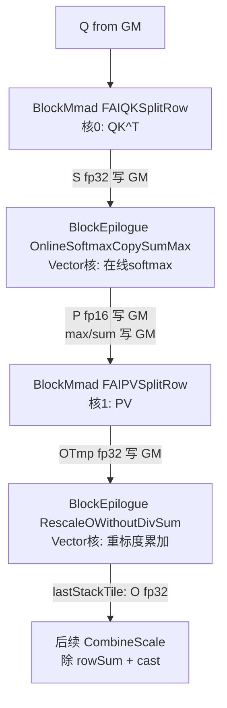

# FAI SplitRow 系列模板设计文档

本文档覆盖 Flash Attention 推理（FAI）SplitRow 系列的 4 个新增模板：

| 模板 | 类型 | 源文件 |
| ---- | ---- | ---- |
| `Gemm::MmadAtlasA2FAIQKSplitRow` | BlockMmad 偏特化 | `include/catlass/gemm/block/block_mmad_fai_qk_split_row.hpp` |
| `Gemm::MmadAtlasA2FAIPVSplitRow` | BlockMmad 偏特化 | `include/catlass/gemm/block/block_mmad_fai_pv_split_row.hpp` |
| `Epilogue::EpilogueAtlasA2OnlineSoftmaxCopySumMax` | BlockEpilogue 偏特化 | `include/catlass/epilogue/block/block_epilogue_online_softmax_copy_glm.hpp` |
| `Epilogue::EpilogueAtlasA2RescaleOWithoutDivSum` | BlockEpilogue 偏特化 | `include/catlass/epilogue/block/block_epilogue_rescale_o_no_div_rowsum.hpp` |

`EpilogueAscend950OnlineSoftmaxCopySumMax` 为 Ascend950 特化，直接继承 AtlasA2 实现（`using Base::Base`），不单独展开。

## 1. 系列概述

SplitRow 系列服务于**共享式（Shared）FA 推理 kernel**：QK GEMM 与 PV GEMM 分属两个 Cube 核，Softmax / RescaleO 作为 Vector epilogue 在 GM 中转数据上工作，通过 stackTile 外层循环遍历超长 KV 序列。相比 Unshared 系列（单核内完成 QK→softmax→PV），它把 softmax 卸载到 Vector 侧，两个 Cube 核可以分别满载 MMAD。



四模板协作要点：

- QK SplitRow 沿 N 维（KV 序列长）切 stackTile，每个 stackTile 产出一块 S 矩阵；
- OnlineSoftmaxCopySumMax 对每块 S 做在线 softmax，输出 P（供 PV 使用）并维护跨 stackTile 的 rowmax/rowsum，**仅在 lastStackTile 时将全局 max/sum 写回 GM**；
- PV SplitRow 预载全部 V，等待 softmax 侧就绪后按 stackTile 消费 P，累加输出 OTmp；
- RescaleOWithoutDivSum 用 `dm = exp(oldMax - newMax)` 对历史累加结果重标度并累加新 OTmp，**lastStackTile 时只输出 fp32 累加和，不除 rowSum、不做 cast**，归一化交给后续 CombineScale epilogue。

## 2. DispatchPolicy 定义

```cpp
// gemm/dispatch_policy.hpp
template <bool PAGED_CACHE_FLAG_ = false, bool ENABLE_UNIT_FLAG_ = false>
struct MmadAtlasA2FAIQKSplitRow {
    using ArchTag = Arch::AtlasA2;
    static constexpr bool PAGED_CACHE_FLAG = PAGED_CACHE_FLAG_;
    static constexpr bool ENABLE_UNIT_FLAG = ENABLE_UNIT_FLAG_;
};
template <bool PAGED_CACHE_FLAG_ = false, bool ENABLE_UNIT_FLAG_ = false>
struct MmadAtlasA2FAIPVSplitRow { /* 同上 */ };

// epilogue/dispatch_policy.hpp
struct EpilogueAtlasA2OnlineSoftmaxCopySumMax { using ArchTag = Arch::AtlasA2; };
struct EpilogueAtlasA2RescaleOWithoutDivSum  { using ArchTag = Arch::AtlasA2; };
struct EpilogueAscend950OnlineSoftmaxCopySumMax { using ArchTag = Arch::Ascend950; };
```

模板参数含义：

- `PAGED_CACHE_FLAG`：KV 是否走 blockTable 分页缓存（PagedAttention）。`true` 时通过 `gBlockTable.GetValue(nowNIdx)` 查表计算 KV 偏移；`false` 时按 `nowNIdx * blockSize * strideKV` 连续寻址。
- `ENABLE_UNIT_FLAG`：预留开关（当前示例均传 `false`）。

## 3. BlockMmad FAIQKSplitRow：Q @ K^T

### 3.1 模板签名与约束

```cpp
template <bool PAGED_CACHE_FLAG_, bool ENABLE_UNIT_FLAG_,
          class L1TileShape_, class L0TileShape_, class A_, class B_, class C_>
class BlockMmad<MmadAtlasA2FAIQKSplitRow<PAGED_CACHE_FLAG_, ENABLE_UNIT_FLAG_>,
                L1TileShape_, L0TileShape_, A_, B_, C_>
```

static_assert 约束：

- `LayoutC` 仅支持 `RowMajor`（S 矩阵按行写 GM，供 softmax 按行读）；
- `N * K <= 32768`（L1B 双缓冲容量限制，K 即 embedding 维）。

### 3.2 内存布局

| 缓冲 | 大小 | 组织 |
| ---- | ---- | ---- |
| L1A | `M * K * sizeof(A)` | 单缓冲，Q 一次性常驻 |
| L1B | `32768 * sizeof(B)` | 双缓冲（乒乓），KV 按 stackTile 分块流入 |

Q 通过 `loadQGM()` 一次搬运，采用扩展签名 `copyGmToL1A`，携带 `tokenNumPerGroup / qHeads * embed / BLOCK_SIZE` 参数实现 **GQA 分组搬运**（`layoutA.GetTileLayout(MakeCoord(singleGroupHeads, embed))`），即按"每组 Q 头"重排数据，避免逐头多次发起搬运。事件号 `EVENT_ID3`。

### 3.3 主循环与流水

`operator()` 三层循环结构：

```
nL1Loop  按 L1TileShape::N 切 stackSeqTile（末轮 getBlockShape 取余量）
 └─ mL0Loop  按 L0TileShape::M 切行块
     └─ kL0Loop  按 L0TileShape::K 切 K 维
         └─ tileMmad(initMmad = (kL0Idx == 0))
```

- 每个外层迭代调用 `getKVOffset(nowNIdx)`：分页模式查 blockTable 得 blockId 后计算 `blockId * blockSize * strideKV` 类偏移；连续模式直接线性寻址。
- 三组乒乓事件支撑全流水：
  - `l1KPPingPongFlag`：`MTE1_MTE2 / MTE2_MTE1`，控制 L1B 的 KV 装载与消费；
  - `l0ABPingPongFlag`：`M_MTE1 / MTE1_M`，控制 L0A/L0B 的装载与 MMAD 消费；
  - `l0CPingPongFlag`：`M_FIX / FIX_M`，控制 L0C 结果经 FixPipe 写 GM 与下一轮覆写。
- `tileMmad` 的 `initMmad` 标志保证 K 维首次累加时初始化 L0C，后续累加。

## 4. BlockMmad FAIPVSplitRow：P @ V

### 4.1 模板签名与约束

```cpp
template <...同上...>
class BlockMmad<MmadAtlasA2FAIPVSplitRow<PAGED_CACHE_FLAG_, ENABLE_UNIT_FLAG_>, ...>
```

static_assert：`M * K <= 32768`（L1A 双缓冲容量限制）。

### 4.2 内存布局

| 缓冲 | 大小 | 组织 |
| ---- | ---- | ---- |
| L1A | `32768 * sizeof(A)` | 双缓冲，偏移 `l1BufAddrStart + L1A_SIZE * i`，P 分块流入 |
| L1B | `N * K * sizeof(B)` | 单缓冲（全部 V 一次性常驻），偏移 `l1BufAddrStart + L1A_SIZE * 2` |

### 4.3 执行时序（核心设计）

```
1. kLoop = CeilDiv(stackSeqTile, blockSize)
   └─ 循环将全部 V 按 block 分页搬入 L1B（分页时查 blockTable），事件 EVENT_ID2
2. Arch::CrossCoreWaitFlag(softmaxFlag)
   └─ 跨核等待：softmax 核已产出可用的 P（GM 中转）
3. mL1Loop × kL1Loop × kL0Loop
   └─ 搬 P 进 L1A（乒乓）→ MMAD 累加（initMmad = (kL1Idx==0 && kL0Idx==0)）
4. 输出 OTmp（fp32）写 GM
5. SetFlag(MTE1_MTE2, EVENT_ID2)
   └─ 结束后释放 V 搬运通道，供下一 stackTile 复用
```

相比 QK 的三组乒乓，PV 侧的同步重点是**先 V 后 P**：V 预载可提前于 softmax 完成进行，`CrossCoreWaitFlag` 只阻塞 P 消费路径，V 装载时间被完全隐藏。

## 5. BlockEpilogue OnlineSoftmaxCopySumMax：在线 Softmax

### 5.1 模板签名

```cpp
template <class OutputType_, class InputType_, class MaskType_>
class BlockEpilogue<EpilogueAtlasA2OnlineSoftmaxCopySumMax, OutputType_, InputType_, MaskType_>
```

- `OutputType_`：P 矩阵类型（fp16/bf16，供 PV GEMM 消费）；
- `InputType_`：S 矩阵类型（fp32，来自 QK GEMM）；
- `MaskType_`：attention mask 类型，支持 `NO_MASK` 与常规 mask 两种路径。

构造函数签名 `BlockEpilogue(resource, scaleValue_)`，`scaleValue_` 即 softmax 前的 `1/sqrt(d)` 缩放系数。

### 5.2 UB 布局

按 `UB_UINT8_BLOCK_SIZE`（16384 字节块）组织，关键偏移：

| 张量 | UB 偏移 | 说明 |
| ---- | ---- | ---- |
| ls（S 本轮值） | `0` | 当前 stackTile 的 scale·S，fp32，容量 `MAX_UB_S_ELEM_NUM = 8192` |
| lp（P 输出）/ mask32 | `4 * block` | 与 mask 的 32 位视图共享空间 |
| tmp（tv） | `10 * block` | 归约中间量 |
| lm / hm | `10 * block + 8/9 * vec` | 本轮/全局行最大值 |
| gm / ll / gl / dm | `10 * block + 10~13 * vec` | 全局 max、本轮行和、全局行和、重标度系数 |
| mask | `11 * block` | mask 原始数据 |

相邻行和/行最大采用乒乓布局（`ROW_SUM_PINGPONG_OFFSET = 64 * 8`），配合行分块循环隐藏 MTE2 装载。`MAX_ROW_NUM_SUB_CORE = 128` 限定单个 SubBlock 处理的最大行数。

### 5.3 在线 Softmax 迭代式

对每个 stackTile，按行维护全局 `gm`（max）与 `gl`（sum）：

```
lm = rowmax(scale · S)                  // 本 tile 行最大
hm = isFirst ? lm : max(lm, gm)         // 更新全局最大
dm = isFirst ? 1 : exp(gm - hm)         // 历史缩放系数
ls = exp(ls - hm)                       // 数值稳定的指数
ll = rowsum(ls)                         // 本 tile 行和
gl = isFirst ? ll : dm * gl + ll        // 重标度累加
gm = hm
```

`isLastStackTile` 时：`gm`/`gl` 经 `Brcb` 展开 + `DataCopy(rowNum, 1, 0, headNum - 1)`（stride 间隔写）输出到 `gSharedMax`/`gSharedSum`，供 RescaleO 与后续 CombineScale 使用。非末 tile 期间 max/sum 只在 UB/寄存器中滚动，不产生 GM 流量。

### 5.4 行归约三分支

`Rowmax`/`Rowsum` 按 `columnNum`（stackTile 序列长）分三档实现：

| 分支 | 条件 | 手段 |
| ---- | ---- | ---- |
| `SPECTILE512` | columnNum == 512 | 3 次 `BlockReduceMax/Sum` 级联 |
| `SPECTILE256` | columnNum == 256 | `SetVecMask(32)` + `SetBlockReduceMask(4)` |
| `TAILTILE` | 其他 | 整 64 元素向量循环 + 尾部 `SetVecMask` 掩码处理 |

### 5.5 P 的降精度输出

`CalcExp` 中 `hm` 经 `Brcb` 广播到整行后计算 `exp`，随后 `DownCastP` 将 fp32 的 P 转为 fp16（`CAST_NONE`）或 bf16（`CAST_RINT`，避免溢出），再 `CopyPUbToGm` 写 GM。bf16 场景选用 RINT 舍入是精度关键点。

### 5.6 SubBlock 切分与预取流水

`operator()` 将行维度对半切给两个 SubBlock（`qNBlockSize == 1` 时 `qSBlockSize / 2` 对半；否则按 qN 乘子扩大）。行方向再按 `maxRowNumPerLoop`（由 8192 元素容量折算）分块，采用 `preLoad = 1` 的乒乓预取：第 i 块计算时预搬第 i+1 块的 S，事件族 `V_MTE2 / MTE2_V / V_MTE3 / MTE3_V`（HardEvent）保证搬运、计算、写出三级流水。

## 6. BlockEpilogue RescaleOWithoutDivSum：O 累加

### 6.1 模板签名

```cpp
template <class OutputType_, class InputType_, class UpdateType_>
class BlockEpilogue<EpilogueAtlasA2RescaleOWithoutDivSum, OutputType_, InputType_, UpdateType_>
```

典型实例化：`OutputType_ = fp16`、`InputType_ = fp32`（OTmp）、`UpdateType_ = fp32`。构造仅接收 `resource`，无额外参数。

### 6.2 UB 布局与共享设计

| 张量 | UB 偏移 |
| ---- | ---- |
| lo（本轮 OTmp） | `6 * block` |
| go（累加 O） | `8 * block`，`goUbTensor16/goUbTensor32` 同址双视图 |
| tmp | `10 * block` |
| hm / gl / dm | `10 * block + 9/12/13 * vec` |

注意 hm/gl/dm 偏移与 OnlineSoftmax epilogue 的布局**完全一致**——两者在同一 kernel 的不同阶段运行，复用同一份 UB 规划，避免跨 epilogue 的布局冲突。`MAX_UB_O_ELEM_NUM = 4096` 限制单块行数 × 列数。

### 6.3 核心算法

```
WaitFlag(V_MTE2, EVENT_ID3)        // 等待 OTmp 可读（与 PV GEMM 握手）
if (isFirstStackTile):
    go = lo                          // 首块直接落位
else:
    lo = GM -> UB（上一 stackTile 的累加结果）
    dm[curStackTileMod * 128] 经 Brcb 广播为 dm_block
    go = go * dm_block               // 按 FLOAT_VECTOR_SIZE=64 分段 Mul
    go = go + lo                     // 累加
SetFlag(V_MTE2, EVENT_ID3)          // 释放握手
if (isLastStackTile):
    CopyFloatOToGm -> gSharedOut     // float 直出，不除 rowSum、不 cast
```

- `EVENT_ID3`（`V_MTE2` 事件对）是本 epilogue 与数据生产方的**跨模块握手信号**；`EVENT_ID0` 为内部 MTE2↔V 同步。
- `CopyFloatOToGm` 内部按 `qNBlockSize == 0` 走单块 `DataCopyPad`，否则逐 qN 块输出。
- 末 tile **不做 `O / rowSum`、不做 fp32→fp16 cast**——除法与降精度统一推迟到下游 CombineScale epilogue，一次性完成，减少中间精度损失与 GM 读写次数。

### 6.4 SubBlock 切分

与 OnlineSoftmax 的行对半不同，本 epilogue 按 qN 维度自适应：`qNBlockSize == 1` 时两个 SubBlock 对分行；`qNBlockSize > 1` 时对分列（outCol 对半），inRow 则按 qN 乘子整体扩大。切分维度与数据的 GM 排布（qN 在行维展开时分行连续）对齐，保证每个 SubBlock 的搬运都是连续段。

## 7. 使用示例

### 7.1 真实工程组装（xllm_ops x_attention）

摘自 xllm_ops（https://gitcode.com/xLLM-AI/xllm_ops）`x_attention/op_kernel/x_attention_catlass_helper.h` 的 `CallSharedInferKernelShort`：

```cpp
using INPUT_T = ...;                 // Q/K/V/P/O 与 mask 的元素类型（如 fp16）
using L0TileShape = GemmShape<16, 16, 16>;

using L1TileShapeQK = GemmShape<128, 128, 128>;   // L1TileShape::K must be embedding
using DispatchPolicyQK = Gemm::MmadAtlasA2FAIQKSplitRow<isPAEnabled, false>;
using BlockMmadQK = Gemm::Block::BlockMmad<DispatchPolicyQK, L1TileShapeQK,
                                           L0TileShape, QType, KType, SType>;
using DispatchPolicyOnlineSoftmax = Epilogue::EpilogueAtlasA2OnlineSoftmaxCopySumMax;
using EpilogueOnlineSoftmax = Epilogue::Block::BlockEpilogue<
    DispatchPolicyOnlineSoftmax, PType, SType, maskType>;
// update rowsum rowmax and copyOut on lastStackTile

using L1TileShapePV = GemmShape<128, 128, 128>;
using DispatchPolicyPV = Gemm::MmadAtlasA2FAIPVSplitRow<isPAEnabled, false>;
using BlockMmadPV = Gemm::Block::BlockMmad<DispatchPolicyPV, L1TileShapePV,
                                           L0TileShape, PType, VType, OTmpType>;
using DispatchPolicyRescaleO = Epilogue::EpilogueAtlasA2RescaleOWithoutDivSum;
using EpilogueRescaleO = Epilogue::Block::BlockEpilogue<
    DispatchPolicyRescaleO, OType, OTmpType, OUpdateType>;
// do not div rowSum or cast on lastStackTile

using SharedFAInferKernel = SharedFAInferKernelShort<
    BlockMmadQK, BlockMmadPV, EpilogueOnlineSoftmax, EpilogueRescaleO, isPAEnabled>;
SharedFAInferKernel kernel(...);
kernel();   // 外层 stackTile 循环内由 kernel 依次驱动四个模板
```

组装要点：

1. **`L1TileShape::K` 必须等于 embedding 维**（128），QK/PV 的 K 都是"收缩维=embedding"；
2. QK 的 C 类型（SType）为 fp32（`LayoutC = RowMajor`），PV 的 C 类型为 fp32 的 OTmp；
3. `isPAEnabled` 直接透传给两个 BlockMmad 的 `PAGED_CACHE_FLAG`，blockTable 指针随 kernel 参数传入；
4. Mask 类型经 `maskType` 传给 OnlineSoftmax epilogue，`NO_MASK` 时走无掩码快路径。

### 7.2 仓内测试

`tests/optest/kernels/23_flash_attention_infer/flash_attention_infer.cpp:741-768` 提供了 SplitRow 路径的完整调用样例（构造、传参、启动），可与上文组装代码互相印证。

## 8. 与 FA Unshared 系列的差异

| 维度 | FAI SplitRow（本文） | FA Unshared（见 01 文档） |
| ---- | ---- | ---- |
| 核拓扑 | QK、PV 两个 Cube 核 + Vector epilogue | 单 Cube 核内 QK→softmax→PV |
| S/P 数据通路 | 经 GM 中转，各模块独立乒乓 | 核内 L0C/UB 直连，无 GM 往返 |
| 长序列处理 | stackTile 外层循环，天然支持超长 KV | 单轮固定 tile，序列长受 L1 约束 |
| softmax 位置 | 独立 epilogue 核，OnlineSoftmax 在线式 | `EpilogueAtlasA2FAUnsharedSoftmax` 单次 softmax |
| 归一化时机 | RescaleO 不除 sum，推迟到 CombineScale | 核内直接完成 |
| 适用场景 | 长序列 / PagedAttention 推理 | 短序列、tile 可整装的推理 |

选型建议：KV 序列长超出单核 L1 容量（`N * K > 32768`）或需要分页 KV 时选 SplitRow；序列短且可整装时 Unshared 的核内直连更省 GM 带宽。
