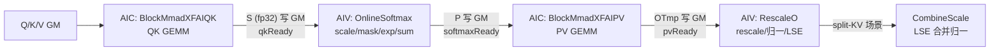

# XFAI Kernel 设计（Atlas A2 推理 Flash Attention）

## 1. 系列概述

XFAI（X Flash Attention Infer）系列面向 **Atlas A2（DaVinci C220）推理场景**的 Flash Attention 算子，与 [FAI SplitRow 系列](./02_fai_split_row_kernel.md) 同属"AIC 算 + AIV 归"的跨核流水形态，但在模板组织上做了更强的面向封装：

- **QK 与 PV 两段 GEMM 分别独立成 `BlockMmad` 模板**，中间的 `S`/`P` 矩阵经 GM 中转；
- **Online Softmax、RescaleO 作为 `BlockEpilogue` 偏特化模板**，RescaleO 引入独立的 `UpdateType_`/`LseType_` 类型参数；
- **原生支持 Paged KV Cache**（`PAGED_CACHE_FLAG_` 策略参数，QK/PV 侧均可开启）；
- 提供 **`CombineScale` 独立模板类**，用于 split-KV 多份局部结果的 LSE 合并归一。

### 1.1 模板清单

| 模板 | 策略（DispatchPolicy） | 位置 |
| --- | --- | --- |
| BlockMmadXFAIQK | `MmadAtlasA2XFAIQK<PAGED_CACHE_FLAG_, ENABLE_UNIT_FLAG_>` | `include/catlass/gemm/block/block_mmad_xfai_qk.hpp` |
| BlockMmadXFAIPV | `MmadAtlasA2XFAIPV<PAGED_CACHE_FLAG_, ENABLE_UNIT_FLAG_>` | `include/catlass/gemm/block/block_mmad_xfai_pv.hpp` |
| BlockEpilogueXFAIOnlineSoftmax | `EpilogueAtlasA2XFAIOnlineSoftmax<LSE_MODE_>` | `include/catlass/epilogue/block/block_epilogue_xfai_online_softmax.hpp` |
| BlockEpilogueXFAIRescaleO | `EpilogueAtlasA2XFAIRescaleO<LSE_MODE_>` | `include/catlass/epilogue/block/block_epilogue_xfai_rescale_o.hpp` |
| CombineScale | `CombineScale<OutputType_, LseType_>`（独立类，非 BlockEpilogue 特化） | `include/catlass/epilogue/block/block_epilogue_xfai_combine_scale.hpp` |

### 1.2 跨核流水全景



核心思想：CUBE 核负责 QK、PV 两段 GEMM，Vector 核负责 softmax 与 rescale；`preLoad=1` 的软件流水使 QK 领先 PV 一个 stackTile，两组乒乓掩盖 GM 中转开销。

## 2. DispatchPolicy 定义

GEMM 侧（`include/catlass/gemm/dispatch_policy.hpp:175-187`）：

```cpp
// 推理 Flash Attention 的 QK GEMM 策略
template <bool PAGED_CACHE_FLAG_ = false, bool ENABLE_UNIT_FLAG_ = false>
struct MmadAtlasA2XFAIQK : public MmadAtlasA2 {
    using ArchTag = AtlasA2;
    static constexpr uint32_t STAGES = 2;               // L1/L0 二级乒乓
    static constexpr bool PAGED_CACHE_FLAG = PAGED_CACHE_FLAG_;
    static constexpr bool ENABLE_UNIT_FLAG = ENABLE_UNIT_FLAG_;
};

// 推理 Flash Attention 的 PV GEMM 策略（模板参数同上）
template <bool PAGED_CACHE_FLAG_ = false, bool ENABLE_UNIT_FLAG_ = false>
struct MmadAtlasA2XFAIPV : public MmadAtlasA2 { ... };
```

Epilogue 侧（`include/catlass/epilogue/dispatch_policy.hpp:283-306`）：

```cpp
// Online Softmax 策略，LSE_MODE_ 控制 logsumexp 输出行为
template <bool LSE_MODE_ = false>
struct EpilogueAtlasA2XFAIOnlineSoftmax {
    using ArchTag = AtlasA2;
    static constexpr bool LSE_MODE = LSE_MODE_;
};

// RescaleO 策略，模板参数含义同上
template <bool LSE_MODE_ = false>
struct EpilogueAtlasA2XFAIRescaleO { ... };
```

## 3. BlockMmadXFAIQK —— QK GEMM 设计

**类形态**（`block_mmad_xfai_qk.hpp:32`）：

```cpp
template <typename DispatchPolicy, typename L1TileShape_, typename L0TileShape_,
          typename AType_, typename BType_, typename CType_>
class BlockMmad<MmadAtlasA2XFAIQK<PAGED_CACHE_FLAG_, ENABLE_UNIT_FLAG_>,
                L1TileShape_, L0TileShape_, AType_, BType_, CType_> { ... };
```

### 3.1 关键常量与存储布局

| 常量 | 值 | 含义 |
| --- | --- | --- |
| BLOCK_SIZE | 16 | KV 分页基础块（head 维分块粒度） |
| EMBED_SPLIT_SIZE | 128 | embed 维单块大小 |
| UNIT_BLOCK_STACK_NUM | 4 | 单次进栈的 unit block 数 |
| KV_BASE_BLOCK | 512 | KV cache 分页基准块 |
| KV_SPLIT_SIZE | 128 | KV split 切分粒度 |

- 构造函数：`BlockMmad(resource, nDyn, kDyn, l1BufAddrStart = 0)`。Q 矩阵在 L1A **单拷常驻**（`l1ATensor` 起始于 `l1BufAddrStart`），B（K）以及 L0A/L0B/L0C 按 `STAGES=2` 双缓冲乒乓——这一布局是 PV 与 QK **共用同一个 CUBE 核 L1 空间**的前提（PV 的 B 区紧跟 QK 占用之后）。
- 输出 C（即 S 矩阵）经 `copyL0CToGm` 从 L0C 直写 GM，交由 AIV 侧消费。

### 3.2 Q 的分组加载：loadQGM

```cpp
void loadQGM(const GlobalTensor<AType>& gA, const LayoutA& layoutA,
             uint32_t rowNum, uint32_t singleGroupHeads, uint32_t qHeads);
```

Q 按 head 分组加载：`tokenNumPerGroup = rowNum / singleGroupHeads`，组间通过偏移跳转，一次 MTE2→MTE1 搬运完成整组入 L1A（`EVENT_ID3` 同步）。分组的目的是让同一份 Q 服务多个 KV split 的循环复用。

### 3.3 分页寻址：getKVOffset

KV 偏移按 `PAGED_CACHE_FLAG_` 走双路径：

- **Paged 路径**：经 `gBlockTable` 查表，`kOffset = blockTableId * KV_BASE_BLOCK * strideKV + ...`，支持 KV cache 稀疏分页；
- **非 Paged 路径**：直接 `nowNIdx * BLOCK_SIZE * strideKV` 连续寻址。

### 3.4 主循环：三层乒乓

`operator()` 内部为 nL1×mL0×kL0 三层循环：nL1 层按 `stackSeqTile` 以 `l1NDynamic` 切分 KV split 块；`l1KvPingPongFlag`（L1 B 区）、`l0ABPingPongFlag`（L0A/L0B）、`l0CPingPongFlag`（L0C）三组乒乓独立翻转，使"加载 K / 计算 QK / 回写 S"三段充分重叠。S 写 GM 后由调用方置 `qkReady` 跨核 flag 通知 AIV。

## 4. BlockMmadXFAIPV —— PV GEMM 设计

**类形态**（`block_mmad_xfai_pv.hpp`）：偏特化签名与 QK 相同，仅 Policy 换为 `MmadAtlasA2XFAIPV`。

### 4.1 L1 布局与构造

```cpp
BlockMmad(resource, nDyn, kDyn, l1BufAddrStart);
// 内部：l1B 置于 l1BufAddrStart + M * kDyn * sizeof(A) * 2
```

PV 与 QK 共用 CUBE 核的 L1：QK 的 Q 常驻区之后紧跟 PV 的 B（V）区。V 区单拷加载、P 区（`l1ATensor[STAGES]`）双缓冲。

### 4.2 operator() 与跨核门控

```cpp
// 节选调用签名
blockMmadPV(gP, gV, gOTmp, ..., blockStackNum, /* Arch::CrossCoreFlag */ softmaxFlag,
            nIdx, nLoop /* 引用出参：当前块序号与总块数 */);
```

执行序：

1. **批量加载 V**：一次将 `blockStackNum` 个 KV 块的 V 预取入 L1（`EVENT_ID4` + `EVENT_ID0` 同步），为后续多个 stackTile 的 PV 复用；
2. **跨核等待**：`CrossCoreWaitFlag(softmaxFlag)` —— 阻塞直到 AIV 侧 Online Softmax 把当前块的 P 写入 GM。这是"QK → softmax → PV"流水衔接的关键门控；
3. **P 流式乒乓**：主循环 nL1×mL1×kL1×kL0 中，P 从 GM 按 `l1PPingPongFlag` 乒乓流入 L1A，`LOAB_BLOCK = 1`；
4. **PV 直写 GM**：结果 O 中间量（OTmp）从 L0C 直写 GM，尾部 `SetFlag`（MTE1_MTE2，`EVENT_ID4`）供 AIV 侧 RescaleO 对齐。

## 5. BlockEpilogueXFAIOnlineSoftmax 设计

**类形态**（`block_epilogue_xfai_online_softmax.hpp:25`）：

```cpp
template <typename OutputType_, typename InputType_, typename MaskType_>
class BlockEpilogue<EpilogueAtlasA2XFAIOnlineSoftmax<LSE_MODE_>,
                    OutputType_, InputType_, MaskType_> { ... };
// OutputType_ = P（下传 PV 的类型），InputType_ = S（fp32），MaskType_ 一般为 int8_t
```

构造函数：`BlockEpilogue(resource, scaleValue)`，`scaleValue` 即 `1/sqrt(d)` 缩放因子。

### 5.1 UB 布局

| 缓冲 | 规格 | 用途 |
| --- | --- | --- |
| lsUbTensor | 8192 元素乒乓 | S 矩阵（fp32），双缓冲配合 preLoad 流水 |
| lpUbTensor | 同 ls | P 矩阵（downcast 后） |
| maskUbTensor / mask16 / mask32 | 三级 | token mask 的原始/16bit/32bit 视图 |
| lm / hm / gm / dm | 行向量标量 | 局部 max / 展开后 max / 全局 max / dm=exp(gm-hm) |
| ll / gl | 行向量标量 | 局部 sum / 全局 sum |
| tv | 行向量标量 | 广播暂存（LSE 输出用） |

### 5.2 Rowsum / Rowmax 三分派

按当前块的列宽分派三种归约特化：**SPECTILE512** / **SPECTILE256** / **TAILTILE**。前两种对齐列宽走整块 `BlockReduceSum/Max`（配合 `SetVecMask`/`SetBlockReduceMask`），TAILTILE 处理尾块非对齐列，保证跨块的行最大/行求和语义正确。

### 5.3 Online Softmax 核心流程

```
CopySGmToUb                // S 从 GM 入 UB
ScaleS                     // S *= scaleValue
[ApplyMask]                // 可选：mask32 * (-3e38) 加到 S 上实现屏蔽
CalcLocalRowMax            // lm = rowmax(S)
UpdateGlobalRowMax         // hm = max(lm, gm); dm = exp(gm - hm); gm ← hm
CalcExp                    // ls = exp(ls - hm)   (Brcb 行广播 hm)
DownCastP                  // fp32 → OutputType_（bf16 走 CAST_RINT 取整策略）
CopyPUbToGm                // P 直写 GM，供 AIC 侧 PV 消费
CalcLocalRowSum            // ll = rowsum(P)
UpdateGlobalRowSum         // gl = dm * gl + ll
```

`dm = exp(gm_old - gm_new)` 即上一轮 P 需要整体乘的衰减因子，交给 RescaleO 使用——这就是经典的 FlashAttention online softmax 递推。

### 5.4 双 operator()：无 mask 版与带 mask 版

```cpp
// 无 mask 版（参数节选）
epilogueOnlineSoftmax(gS, gP, layoutS, layoutP, ..., stackSeqTile);

// 带 mask 版（causal / token mask，13 参，参数节选）
epilogueOnlineSoftmax(gS, gP, gMask, layouts..., qkReady,
                      triUp, triDown, kvSStartIdx, kvSEndIdx, ...);
```

带 mask 版要点：

- 入口先 `CrossCoreWaitFlag(qkReady)` 等 AIC 侧 S 就绪；
- mask 按行三段复制（proTokenNum / integralHeadNum / epiTokenNum），适配 token 级压缩布局；
- `triUp/triDown` 描述 causal 三角的上下边界，配合 `kvSStartIdx/kvSEndIdx` 判定当前 KV 块是否整块可跳过或部分遮蔽；
- `LSE_MODE == LSE_OUT` 时末块借 `tv` 缓冲把 LSE 行值写出。

### 5.5 subBlock 切分与流水

- `qNBlockSize == 1`（每 subBlock 一行 Q）时行数对半切给两个 subBlock 并行处理；
- `preLoad = 1`：S 的 GM 读取与上一块的 softmax 计算重叠，掩盖搬运延迟。

## 6. BlockEpilogueXFAIRescaleO 设计

**类形态**（`block_epilogue_xfai_rescale_o.hpp`）：五类型参数，是本系列对基类模板的扩展点：

```cpp
template <typename OutputType_, typename InputType_, typename UpdateType_, typename LseType_>
class BlockEpilogue<EpilogueAtlasA2XFAIRescaleO<LSE_MODE_>, OutputType_, InputType_, UpdateType_, LseType_>;
// OutputType_ = O（最终输出），InputType_ = OTmp（PV 累加结果），
// UpdateType_ = 中间轮回写类型（fp32），LseType_ = LSE 输出类型
```

构造函数：`BlockEpilogue(resource)`。

### 6.1 核心算法：O 的新旧融合

```
lo  = gInput[当前块]                 // 读上一轮的 O（或首轮读 OTmp 直通）
go  = gUpdate * dm_block + lo        // dm 经 Brcb 行广播；即 O_new = exp(gm_old-gm_new)*O_old + PV_cur
if (!isLastStackTile):
    go → 回写 gUpdate（fp32 中间量，needRowLoop 场景）
else:
    go = go / gl_block               // 末块按全局行和归一
    go → downcast → CopyOToGm        // 按 pro/integral/epi token 三段写出最终 O
    if (LSE_MODE == LSE_OUT):
        lse = ln(gl) + gm            // Brcb 行广播后 DataCopyPad 写 gLse
```

要点：

- **首块直通**：第一个 stackTile 无旧 O 可乘，`go = lo` 直接进入累加；
- **末块归一**：除以全局行和 `gl` 完成 softmax 分母归一，downcast 后按 token 三段（pro/integral/epi）写 GM，兼容变长 seq；
- **LSE 输出**：`lse = ln(gl) + gm`，配合 OnlineSoftmax 侧的 gm/gl 传递即可在末块一次性得到 logsumexp；
- **事件体系**：`EVENT_ID0/1/3/5/6` 管理 GM 读入、广播、写出的多级同步。

## 7. CombineScale 设计（split-KV 合并）

**类形态**（`block_epilogue_xfai_combine_scale.hpp`）：独立模板类，**不是** `BlockEpilogue` 的偏特化，因为它消费的是"多份局部结果"而非单个 tile：

```cpp
template <typename OutputType_, typename LseType_>
class CombineScale { ... };
```

### 7.1 operator() 签名

```cpp
void operator()(uint32_t qHeads, uint32_t kvSplitCoreNum, uint32_t headSizeV,
                __gm__ SplitKvExtraInfo* extraInfo,
                GlobalTensor lGmTensor,        // 各 split 的 LSE（局部）
                GlobalTensor oCoreTmpGmTensor, // 各 split 的 O（局部，未归一）
                GlobalTensor oGmTensor,        // 合并后最终 O
                GlobalTensor gActualQseqlen, bool inputLayoutTND = true);
```

任务遍历：`for (process = subBlockID; process < kvSplitCoreNum * 2; process += subBlockNum)`，从 `extraInfo->splitInfo` 解析 batchIdx/headStartIdx/headEndIdx/qStartIdx/qEndIdx/splitNum 及 LSE/O 任务偏移。

### 7.2 LSE 合并算法

对每个 q 行，把 splitNum 份局部 LSE（记 `ll[n]`）合并为全局值：

```
lm = ReduceMax(ll)                  // 各 split 局部 max 的最大值
tl = exp(ll - lm)                   // 平移防溢出
rs = Ln(ReduceSum(tl))              // log-sum-exp 的核心一步
ts = rs + lm                        // 最终 LSE
gl = exp(ll - ts)                   // 每个 split 的最终缩放系数
```

### 7.3 O 合并

```
O_final = Σ_n O_n * gl[n]           // BroadCast + Mul + Add 循环，loFloat 乒乓累加
```

`toUbTensor` 与 `broadCastOTensor` 共用 UB 空间（时间上错开）以节省 UB。实现细节：

- **TND 布局**：按 `prevQSeqlenSum` 前缀和计算各 batch 的 q 行偏移；
- **q_len == 1 特化**：decode 场景前后半分 subBlock 独立寻址；
- **对齐**：`splitNumAlign` / LSE 块按 8 元素（32bit 语义）对齐，规避 DataCopy 非对齐限制。

## 8. 跨核同步链与软件流水

调用方（kernel 层）持有三个 `Arch::CrossCoreFlag`：

| Flag | 生产者 | 消费者 | 含义 |
| --- | --- | --- | --- |
| qkReady | AIC（QK，PIPE_FIX） | AIV（OnlineSoftmax 带 mask 版） | 当前块 S 已写 GM |
| softmaxReady | AIV（Softmax，PIPE_MTE3） | AIC（PV 内部 WaitFlag） | 当前块 P 已写 GM |
| pvReady | AIC（PV，PIPE_FIX） | AIV（RescaleO） | 当前块 OTmp 已写 GM |

外层循环以 `kvSIdx ∈ [0, kvSLoopNumTotal + preKVNum)` 驱动软件流水：`kvSIdx < kvSLoopNumTotal` 时执行 QK+Softmax，`kvSIdx >= preKVNum` 时执行 PV+RescaleO（`nowkvSIdx = kvSIdx - preKVNum`），使 QK 领先 PV 一个 stackTile，实现"加载-计算-跨核"三线重叠。kernel 尾部 CUBE/VEC 两侧各自 `WaitFlag` 清理事件并 `PipeBarrier<PIPE_ALL>()` 收尾。

## 9. 与 FAI / FD 系列的差异对比

与 [FAI SplitRow](./02_fai_split_row_kernel.md)、[FD 系列](./04_fd_kernel.md) 同场竞技时的选型要点（更完整的七维对比见 FD 文档 §7）：

| 维度 | XFAI（本系列） | FAI SplitRow | FD |
| --- | --- | --- | --- |
| 模板组织 | QK/PV 独立 BlockMmad + 双 Epilogue + CombineScale | QK/PV/TailQK + Epilogue 一体化 | XFAI 的深度演化版（dm 按周期分区等） |
| L1 布局 | PV 显式接续 QK 的 L1 尾部（`l1BufAddrStart` 参数） | 固定布局 | 继承并细化 |
| RescaleO 类型参数 | 5 参数（含 UpdateType_/LseType_） | 4 参数 | 5 参数 + isSplitkv 路由 |
| 分页 KV | `PAGED_CACHE_FLAG_` 策略参数原生支持 | 样例层支持 | 同 XFAI |
| split-KV 合并 | `CombineScale` 独立类（XFAI 专用） | 无（SplitRow 免合并） | `EpilogueAtlasA2CombineScale` 通用化 |

## 10. 使用示例（摘自 xllm-ops 真实工程）

以下代码摘自 xllm_ops（https://gitcode.com/xLLM-AI/xllm_ops）`x_flash_attention_infer/op_kernel/x_flash_attention_infer.h`，演示五个模板的完整组装与调用。

### 10.1 类型组装（FAInfer 入口）

```cpp
using namespace AtlasA2T;

// ---- QK GEMM：L1/L0 tile 与策略 ----
using L1TileShapeQK = Gemm::GemmShape<Q_TILE_CEIL, 128, 128>;
using L0TileShapeQK = Gemm::GemmShape<128, 128, 128>;
using DispatchPolicyQK = Gemm::MmadAtlasA2XFAIQK<PagedCacheFlag, false>;
using ElementS = float;
using BlockMmadQK = Gemm::BlockMmad<DispatchPolicyQK, L1TileShapeQK, L0TileShapeQK,
                                    QType, KType, ElementS>;

// ---- PV GEMM ----
using L1TileShapePV = Gemm::GemmShape<128, 128, 256>;
using DispatchPolicyPV = Gemm::MmadAtlasA2XFAIPV<PagedCacheFlag, false>;
using ElementP = QType;                      // P 与 Q 同精度（bf16/fp16）
using BlockMmadPV = Gemm::BlockMmad<DispatchPolicyPV, L1TileShapePV, L1TileShapePV,
                                    ElementP, VType, ElementOTmp>;

// ---- Epilogue：OnlineSoftmax 与 RescaleO ----
using EpilogueOnlineSoftmax = Epilogue::BlockEpilogue<
    Epilogue::EpilogueAtlasA2XFAIOnlineSoftmax<lseMode>, ElementP, ElementS, ElementMask>;
using EpilogueRescaleO = Epilogue::BlockEpilogue<
    Epilogue::EpilogueAtlasA2XFAIRescaleO<lseMode>, OType, ElementOTmp, ElementUpdate, LseType>;

// ---- 顶层组装 ----
using FAInferKernel = FlashAttention::FAInferKernel<BlockMmadQK, BlockMmadPV,
    EpilogueOnlineSoftmax, EpilogueRescaleO, PagedCacheFlag, maskCategory, inLayout>;
```

### 10.2 构造与跨核 flag

```cpp
BlockMmadQK blockMmadQK(resource, nDynNum, kDynNum);
BlockMmadPV blockMmadPV(resource, nDynNum, kPVDynNum, L1_QK_SIZE);  // L1 接续 QK
EpilogueOnlineSoftmax epilogueOnlineSoftmax(resource, scaleValue);
EpilogueRescaleO epilogueRescaleO(resource);

Arch::CrossCoreFlag qkReady{READY_ID};
Arch::CrossCoreFlag softmaxReady{READY_ID};
Arch::CrossCoreFlag pvReady{READY_ID};
```

### 10.3 CUBE 侧：QK → PV

```cpp
// 软件流水：QK 领先 PV 一个 stackTile
for (uint32_t kvSIdx = 0; kvSIdx < kvSLoopNumTotal + preKVNum; kvSIdx += blockStackNum) {
    if (kvSIdx < kvSLoopNumTotal) {
        // Q 分组加载 + QK 主计算（paged 与非 paged 传参不同）
        blockMmadQK.loadQGM(gQ, layoutQ, rowNum, singleGroupHeads, qHeads);
        blockMmadQK(gQ, gK, gS, gBlockTable, layouts...,
                    actualBlockShapeQK, kvSIdx, kvSLoopNumTotal, pagedBlockSize, strideK);
        CrossCoreSetFlag<0x2, PIPE_FIX>(qkReady);          // 通知 AIV：S 就绪
    }
    if (kvSIdx >= preKVNum) {
        uint32_t nowkvSIdx = kvSIdx - preKVNum;
        blockMmadPV(gP, gV, gOTmp, ..., blockStackNum, softmaxReady, nIdx, nLoop);
        CrossCoreSetFlag<0x2, PIPE_FIX>(pvReady);          // 通知 AIV：OTmp 就绪
    }
}
```

### 10.4 VECTOR 侧：OnlineSoftmax → RescaleO

```cpp
if (causal) {
    // causal 分支：计算三角边界后走带 mask 的 13 参版本
    uint32_t triUp = noSkipKvS - qSBlockSize;
    uint32_t triDown = noSkipKvS;
    bool doTriUMask = triUp < kvSEndIdx - 1;
    epilogueOnlineSoftmax(gS, gP, gMask, ..., qkReady, triUp, triDown,
                          kvSStartIdx, kvSEndIdx, ...);
} else {
    epilogueOnlineSoftmax(gS, gP, ...);                    // 无 mask 版
}
CrossCoreSetFlag<0x2, PIPE_MTE3>(softmaxReady);            // 通知 AIC：P 就绪

CrossCoreWaitFlag(pvReady);                                // 等 OTmp
epilogueRescaleO(gO, gOTmp, gOUpdate, gLse, layouts..., actualBlockShapePV,
                 qSBlockSize, qNBlockSize,
                 /*isFirstStackTile=*/(stackSeqCount - PRE_LAUNCH == 0),
                 /*isLastStackTile=*/..., curStackTileMod);
```

### 10.5 CombineScale 的两种调用形态

**形态一：FD kernel 核内调用**（`x_flash_attention_infer_fd.h`）——`AscendC::SyncAll()` 后在 VEC 侧直接调用：

```cpp
using CombineScale = Epilogue::Block::CombineScale<OType, LseType>;  // FAInferKernelFD 第 5 模板参
...
combineScale(qHeads, extraInfo->totalSplitNodeNum, embedV, extraInfo,
             gmlse, gmlo, gO, gActualQseqlen, /*inputLayoutTND=*/true);
```

**形态二：独立 kernel**（`x_attention/op_kernel/x_attention_catlass_helper.h` 的 `CallCombineScale`）——通用的 split-KV 后处理算子：

```cpp
using Policy = Epilogue::EpilogueAtlasA2CombineScale;
using CombineScaleKernel = Epilogue::BlockEpilogue<Policy, OType(INPUT_T), float>;
// 在 vec 核 SyncAll 后调用，与主 kernel 解耦
```

## 11. 小结

XFAI 系列把推理 Flash Attention 的"AIC/AIV 跨核流水"沉淀为五个可组合模板：两个 GEMM 模板以 `l1BufAddrStart` 显式共享 CUBE 核 L1，两个 Epilogue 模板以 gm/gl/dm 标量链衔接 online softmax 递推，CombineScale 收口 split-KV 合并；三个 `CrossCoreFlag` 加 `preLoad=1` 软件流水构成完整的流水闭环。FD 系列在此基础上做了进一步性能演化（见 [04_fd_kernel.md](./04_fd_kernel.md)）。
