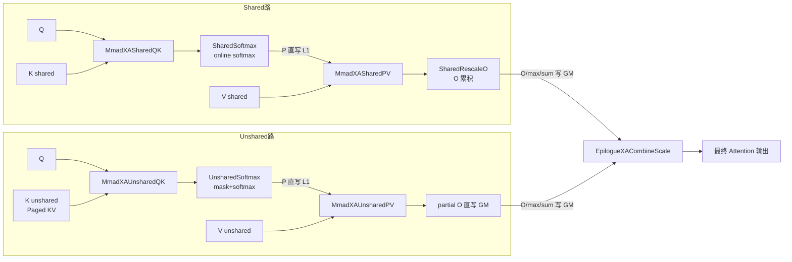
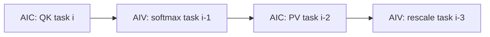

# XA TLA 系列 x_attention 推理核设计文档

## 1. 系列概述

XA TLA 系列是面向 **Ascend 950（Arch::Ascend950）x_attention 推理场景**的 TLA 指令实现。与 FD/XFAI 系列（Atlas A2 硬件路径）不同，本系列：

- 直接特化 `BlockMmadTla`，使用 Cube 侧 TLA 硬件指令（`MmadTla`）完成矩阵乘；
- 面向 **shared / unshared 双路 KV 架构**：shared 路处理 batch 间共享的系统前缀 KV（流式 online softmax），unshared 路处理每 batch 独立的解码 KV（Paged KV Cache + 逐步 mask），最终由 Combine 路合并两路 partial 输出；
- AIC（Cube）与 AIV（Vector）通过跨核 flag 深度协同，形成多级软件流水。

XA TLA 系列共 8 个新增模板（4 GEMM + 4 Epilogue）：

| 模板 | 类型 | 文件 |
| --- | --- | --- |
| `MmadXASharedQK` | BlockMmadTla | `include/catlass/gemm/block/block_mmad_tla_xa_shared_qk_ascend950.hpp` |
| `MmadXAUnsharedQK` | BlockMmadTla | `include/catlass/gemm/block/block_mmad_tla_xa_unshared_qk_ascend950.hpp` |
| `MmadXASharedPV` | BlockMmadTla | `include/catlass/gemm/block/block_mmad_tla_xa_shared_pv_ascend950.hpp` |
| `MmadXAUnsharedPV` | BlockMmadTla | `include/catlass/gemm/block/block_mmad_tla_xa_unshared_pv_ascend950.hpp` |
| `EpilogueXASharedSoftmax` | BlockEpilogue | `include/catlass/epilogue/block/block_epilogue_xa_shared_softmax_ascend950.hpp` |
| `EpilogueXAUnsharedSoftmax` | BlockEpilogue | `include/catlass/epilogue/block/block_epilogue_xa_unshared_softmax_ascend950.hpp` |
| `EpilogueXASharedRescaleO` | BlockEpilogue | `include/catlass/epilogue/block/block_epilogue_xa_shared_rescale_ascend950.hpp` |
| `EpilogueXACombineScale` | BlockEpilogue | `include/catlass/epilogue/block/block_epilogue_xa_combine_scale_ascend950.hpp` |

三路整体数据流：



> Shared 路通过流式 online softmax（isFirstKv/isLastKv 控制）直接在 UB 中累积出 partial O，仅在最后一块 KV 时写出；Unshared 路每个任务独立完成一次完整 softmax（含变长 mask），partial O 直写 GM。两路各写一份 O/max/sum 到 GM，最终由 CombineScale 按 LSE 数学完成合并。

## 2. 注册机制：xa_register.hpp

XA TLA 系列在工程侧（xllm-ops 的 `common/catlass/include/catlass_patch/xa_register.hpp`）通过"**空壳 Policy + 条件 include**"的方式注册：

```cpp
// Gemm 命名空间：4 个空壳 Policy（仅携带 ArchTag 与 STAGES 元信息）
namespace Catlass::Gemm {
template <typename ArchTag_>
struct MmadXASharedQK : MmadBase<ArchTag_, false> {
    static constexpr int32_t STAGES = 2;
};
// MmadXAUnsharedQK / MmadXASharedPV / MmadXAUnsharedPV 同理
} // namespace Catlass::Gemm

// Epilogue 命名空间：4 个空壳结构体
namespace Catlass::Epilogue {
template <typename ArchTag_>
struct EpilogueXASharedSoftmax { using ArchTag = ArchTag_; };
// EpilogueXAUnsharedSoftmax / EpilogueXASharedRescaleO / EpilogueXACombineScale 同理
} // namespace Catlass::Epilogue

// 950 架构下引入全部 8 个 block 特化实现
#if CATLASS_ARCH == 3510
#include "catlass/gemm/block/block_mmad_tla_xa_shared_qk_ascend950.hpp"
// ... 其余 7 个头文件
#endif
```

使用要点：

1. **必须 include 在 catlass 聚合头之后**：空壳 Policy 结构体只做命名空间占位，真正的 `BlockMmadTla<Policy<...>>` / `BlockEpilogue<Policy<...>>` 偏特化由上述 8 个头文件补齐；
2. **通过 `-I` 搜索顺序覆盖**：工程 CMake 中 `common/catlass/include` 路径优先于第三方 `catlass/include`，使第三方子模块保持 xa-free 状态，XA 扩展全部收敛在项目自有代码内；
3. 该机制是把"未提交到 CATLASS 主干的扩展"以工程 patch 形式落地的标准范式。

## 3. GEMM 模板设计

### 3.1 共性骨架

4 个 GEMM 均为如下偏特化形式：

```cpp
template <typename ArchTag_, typename L1TileShape_, typename L0TileShape_,
          typename ElementA_, typename ElementB_, typename ElementC_, typename ElementBias_,
          typename TileCopy_, typename TileMmad_>
class BlockMmadTla<MmadXASharedQK<ArchTag_>, L1TileShape_, L0TileShape_,
                   ElementA_, ElementB_, ElementC_, ElementBias_, TileCopy_, TileMmad_> {
    // STAGES = 2；双缓冲 L1A / L1B / L0A / L0B / L0C
};
```

- **三级搬运**：GM → L1（`CopyGm2L1`）→ L0（`CopyL12L0`）→ TLA 矩阵乘（`MmadTla`）→ L0C →（由 epilogue 或上层消费 L0C/UB 结果）；
- **双缓冲事件 ID 规律**（`i = 0/1` 为槽位）：
  - `l1BEvent = BLOCK_EVENT_ID + i + STAGES`、`l0AEvent = i`、`l0BEvent = i + STAGES`、`l0CEvent = BLOCK_EVENT_ID + i`；
  - 构造函数中对全部事件 `SetFlag` 预置，使首轮搬运无需等待；
- **QK/PV 分组事件段**：QK 类 GEMM `BLOCK_EVENT_ID = 0`，PV 类 `BLOCK_EVENT_ID = 4`，同一 kernel 内两组 GEMM 互不干扰；
- **跨核同步**：`SYNC_MODE = 4`，通过 `CrossCoreWaitFlag<SYNC_MODE, PIPE_FIX>`（+16 偏移的 AIV1 事件）与 AIV 侧同步，等待 epilogue 释放 UB/L1 资源的 flag。

### 3.2 差异矩阵

| 维度 | MmadXASharedQK | MmadXAUnsharedQK | MmadXASharedPV | MmadXAUnsharedPV |
| --- | --- | --- | --- | --- |
| BLOCK_EVENT_ID | 0 | 0 | 4 | 4 |
| A 矩阵供给 | Q 仅 isFirstKv 时 GM→L1，跨 kv 块复用 | 每次调用 GM 加载 | P 常驻 L1（构造不分配 l1A） | P 从传入 L1 tensor 取 |
| B 矩阵供给 | GM→L1 | GM→L1 | GM→L1 | GM→L1 |
| TileShape 约束 | 三轴可不同 | M/K 轴相同；L1_N 是 L0_N 整数倍 | L1/L0 三轴必须相同 | M/N 轴相同；L1_K 是 L0_K 整数倍 |
| 内循环切分 | 单次 mmad（L1 粒度） | nLoops：按 L0_TILE_N 切 N 轴 | 单次 mmad | kLoops：按 L0_TILE_K 切 K 轴（kIdx==0 时 init） |
| L0C 空间 | 常规 | 按 L1_TILE_N 计 L0C 大小 | 常规 | **复用 QK 的 128×256 L0C 前 128×128 区域** |
| 跨核 flag | QK_UB_RELEASE_FLAG（uint64_t） | QK_UB_RELEASE_FLAG（uint16_t） | PV_UB_RELEASE_FLAG（uint16_t） | 无 |
| operator() 附加参数 | isFirstKv / isLastKv / releaseFlag | releaseFlag / taskIdL0C | releaseFlag | 无（三 taskId） |

### 3.3 MmadXASharedQK：跨 KV 块 Q 复用

- Q（beam 维 M 轴）对同一 (batch, qHead) 的所有 KV 块不变，因此仅在 `isFirstKv` 时执行 `CopyGm2L1` 加载 Q 到 L1A；后续 KV 块直接复用，省去重复搬运；
- `isLastKv` 时翻转 l1A 双缓冲槽位（`l1AEvent = 1 - l1AEvent`），保证下一任务的 Q 加载与当前任务的消费不冲突；
- K（N 轴 KV 块）每次从 GM 加载至 L1B；
- 结果 S 写入 UB 的 `qkTensorList[taskIdMod2]` 双缓冲，通过 `QK_UB_RELEASE_FLAG`（uint64_t）向 AIV 侧授权消费。

### 3.4 MmadXAUnsharedQK：N 轴内循环

- 每次调用 Q/K 均从 GM 加载（不同任务 Q 不同）；
- L1 一次装载 `L1_TILE_N` 列，L0 仅 `L0_TILE_N` 列，`nLoops = L1_TILE_N / L0_TILE_N` 次内循环：
  - 每轮 `CopyL12L0` 搬 B 的 L0 列块 → `MmadTla` 累加至同一 L0C 槽；
  - `nLoops` 结束后 L0C → UB；
- 适配 unshared 路径 `blockKvLen = groupCountPerLoop × maxDecodeStep` 大 N 块（如 128×256）场景；
- `operator()` 为 `(tensorA, tensorB, tensorC, actualShape, releaseFlag, taskIdL0A, taskIdL0B, taskIdL0C)` 三 taskId 形式。

### 3.5 MmadXASharedPV：P 常驻 L1

- A 矩阵 P（softmax 输出）由 epilogue 直写 L1（`CopyUb2L1Tla`），因此构造函数**不分配 l1A 缓冲**，仅分配 l1B/l0A/l0B/l0C；
- L1/L0 三轴 TileShape 必须一致（P 在 L1 中按 L1 粒度整块布局）；
- V（B 矩阵）每次 GM→L1→L0；
- 计算结果 O_tmp 写入 `pvTensorList[taskIdMod2]` UB 双缓冲，`PV_UB_RELEASE_FLAG` 由 SharedRescaleO epilogue 消费后置位释放。

### 3.6 MmadXAUnsharedPV：K 轴内循环 + L0C 复用

- P（A）从传入的 L1 tensor 获取（epilogue 直写），V（B）GM→L1→L0；
- `kLoops = L1_TILE_K / L0_TILE_K` 次 K 轴内循环切分，`kIdx == 0` 时 `init=false`（首矩阵），其后 `init=true` 累加；
- **L0C 复用**：`SHARED_L0C_STAGE_SIZE = L1_TILE_M × L1_TILE_K × sizeof(acc)`，直接复用 QK GEMM 已申请的 128×256 L0C 区域的前 128×128 子区，PV 构造时 L0C 指针指向该区域，节省 L0C 总量（L0C 有限，QK 与 PV 分时复用是 950 上常见手法）；
- 无跨核 release flag：O_tmp 结果由 AIC 直接经 FIX 通道写 GM（unshared 路 partial O 直写）。

## 4. Epilogue 模板设计

### 4.1 EpilogueXASharedSoftmax：流式在线 softmax

```cpp
template <typename Policy_, typename L1TileShape_, typename PType_, typename SType_>
class BlockEpilogue<EpilogueXASharedSoftmax<...>, ...> {
    BlockEpilogue(Resource *resource, uint32_t &ubBufAddrStart,
                  float scaleValue, int32_t qHeads);
    // operator() 共 18 参数
};
```

- **UB 资源**：`pNzOutTensorList[2]`（P 的 NZ 格式乒乓）+ `maxBrcb/sumBrcb` 广播中间量；
- **operator() 关键参数**：五组 softmax 标量（`lastExpSum/nowExpSum/nowExpMax/lastMax/nowMax`，三缓冲随 taskIdMod3 轮转）、三组 flag（`SYNC_QK_READY / SYNC_SOFTMAX_READY / QK_UB_RELEASE`）、`isUpdate / isLastKv`；
- **执行流程**：
  1. `CrossCoreWaitFlag(SYNC_QK_READY)` 等 AIC 完成 QK；
  2. `ComputeScaleandMax`：S×scale 后行 ReduceMax，`UpdateMax` 融合历史 max（`nowMax = max(lastMax, rowMax)`）；
  3. `ComputeExpSubSum`：S 经 `exp(nowMax - S)` 得 P，以 **NZ 格式**（Half 非 16 对齐的奇偶分离布局）经 `DATA_BLOCK_COPY` 写 UB，再求行 exp 部分和；
  4. `CrossCoreSetFlag(QK_UB_RELEASE)` 释放 QK 的 UB 双缓冲；
  5. `CopyUb2L1Tla`：P 直接从 UB 写入 L1 的 PV A 矩阵区域；
  6. `CrossCoreSetFlag(SYNC_SOFTMAX_READY)` 通知 AIC 启动 PV；
  7. `UpdateExpSumAndExpMax`：`nowExpSum = lastExpSum×exp(lastMax-nowMax) + curSum`；
  8. `isLastKv` 时 `CopyOutMaxAndSum`：Brcb + `DataCopyPad` 按 `qHeads` stride 把每行 max/sum 写 GM（供 CombineScale 消费）。

### 4.2 EpilogueXAUnsharedSoftmax：mask + 独立 softmax

```cpp
BlockEpilogue(Resource *resource, uint32_t &ubBufAddrStart, float scaleValue,
              int32_t unsharedKvLen, int32_t maxDecodeStep,
              int32_t groupCountPerLoop, int32_t groupSize);
```

- **mask 机制（核心差异）**：unshared 路 KV 为变长解码步，构造时 `InitUnsharedMask` 按 `groupCountPerLoop / groupSize / maxDecodeStep` 用 `Duplicate` 预生成 uint8 mask（0/1），加载到 `maskUbTensor`（HALF_MASK_BLOCK_SIZE）；有效 KV 长度内为 1，超出为 0；支持双 SubBlock 分工（`UINT8_BLOCK_SIZE=256` 对齐 + floorSub 处理奇数行拆分）；
- **ComputeMaskandScale**：`Select(mask, S×scale, MIN_VALUE=-3e38)` 后行 ReduceMax，实现变长 KV 屏蔽；N 轴分档 `N128 / N0_64 / N65_127` 三种分支处理；mask 本身经 `LoadAlign<MASK>` 的 `pregCompare` 加载；
- **每步独立**：无 `isUpdate/isLastKv` 流式逻辑，每个任务一次完整 softmax（exp/max/sum 均为本步独立值），`CopyOutMaxAndSum` **每次调用都执行**（`DataCopyPad` 写 GM，V_MTE3 EVENT_ID7 同步）；
- `QK_UB_RELEASE_FLAG` 为 uint16_t（与 Shared 路的 uint64_t 区分）。

### 4.3 EpilogueXASharedRescaleO：O 累积 + PV 释放闭环

```cpp
BlockEpilogue(Resource *resource, uint32_t &ubBufAddrStart);  // 仅 2 参数
// operator()(attenOutGm, expMaxUb, pvRes, isFirstKv, isLastKv, PV_RELEASE_FLAG)
```

- **UB 资源**：仅 `attnTmpBuf`（`VEC2_UB_SIZE = HALF_S1 × D × sizeof`，O 的累积缓冲）；
- **执行流程**：
  1. `isFirstKv`：`DataCopy(attnTmp ← pvRes)` 初始化；
  2. 否则 `FlashUpdateNew`：`O_new = expMax × O_old + PV_cur`，expMax 逐行 Brcb 广播加载，nLoops 按 vlSize 切 D 轴；
  3. `isLastKv`：`CopyUbToGmO` 写出最终 partial O；
  4. **`CrossCoreSetFlag(PV_RELEASE_FLAG)`**：消费完 `pvRes` 后释放 PV GEMM 的 UB 双缓冲——这是 `MmadXASharedPV` 中 `PV_UB_RELEASE_FLAG` 的消费者，形成完整生产者-消费者闭环。

### 4.4 EpilogueXACombineScale：双路 LSE 合并

```cpp
BlockEpilogue(Resource *resource, uint32_t &ubBufAddrStart,
              int32_t rowNumPerLoop, int32_t headDim);
// operator()(sharedMax/Sum/Gm, unsharedMax/Sum/Gm, gFinalOutput, m, taskId&)  共 8 参数
```

- 模板仅 2 参数（`OutputType/InputType`），无 TileShape 依赖，是纯 Vector 合并算子；
- **UB 资源**：7 组乒乓缓冲（shared/unshared 的 attn/gm/gl + finalAttn，各 `[2]`）+ 3 个 tmp（finalGl/expMaxShared/expMaxUnShared）；
- **合并数学（标准 LSE 合并）**：

```
finalMax  = max(sharedMax, unsharedMax)
finalGl   = sharedSum × exp(sharedMax − finalMax) + unsharedSum × exp(unsharedMax − finalMax)
O_final   = (O_shared × exp(sharedMax − finalMax) + O_unshared × exp(unsharedMax − finalMax)) / finalGl
```

- **执行流程**：DataCopy 搬入双路 O/max/sum → `ComputeExpSumAndExpMax` → `ComputeFinalAttn`（nLoops 按 vlSize 切 headDim）→ Cast 到 ElementOutput → DataCopy 写 `gFinalOutput` → `taskId = 1 - taskId` 翻转乒乓。

## 5. 跨核同步 flag 总表

| Flag | 生产者 | 消费者 | 语义 |
| --- | --- | --- | --- |
| `SYNC_QK_READY_FLAG[i]`（+16 AIV1 镜像） | AIC：QK GEMM 完成 | AIV：softmax 开始读 QK 结果 | QK S 就绪 |
| `QK_UB_RELEASE_FLAG[i]` | AIV：softmax 消费完 S / kernel 尾部预置 | AIC：QK GEMM 复用 qkTensorList 槽 | QK UB 槽空闲 |
| `SYNC_SOFTMAX_READY_FLAG[i]`（+16） | AIV：P 已写 L1 | AIC：PV GEMM 开始读 L1A | P 就绪 |
| `SYNC_PV_READY_FLAG[i]`（+16） | AIC：PV GEMM 完成 | AIV：Rescale 开始读 pvRes | PV O 就绪 |
| `PV_UB_RELEASE_FLAG[i]` | AIV：Rescale 消费完 pvRes / kernel 尾部预置 | AIC：PV GEMM 复用 pvTensorList 槽 | PV UB 槽空闲 |

## 6. Kernel 组装与软件流水

三个组装 kernel 位于 xllm-ops 的 `x_attention/op_kernel/arch35/` 目录。AIC 与 AIV 以"双核启动"方式绑定（`CV_RATIO = 2` 表示 1 个 Cube 核带 2 个 Vector 核），通过 `sharedInfo.usedCoreNum` 在同一批核上错峰启动 shared 与 unshared kernel。

### 6.1 SharedFaInferKernel：4 级软件流水（shared_infer_catlass_kernel.h，444 行）

```cpp
SharedFaInferKernel<BlockMmadQK, BlockMmadPV, EpilogueOnlineSoftmax, EpilogueRescaleO, KVLEN_T>;
// BlockMmadQK = BlockMmadTla<MmadXASharedQK<...>, Shape<_128,_128,_128>, Shape<_128,_128,_128>, ...>
// BlockMmadPV = BlockMmadTla<MmadXASharedPV<...>, ...>
// EpilogueOnlineSoftmax = BlockEpilogue<EpilogueXASharedSoftmax<...>, ...>
// EpilogueRescaleO      = BlockEpilogue<EpilogueXASharedRescaleO<...>, ...>
```

采用 `taskArgList[4]` 环形队列的 **4 级软件流水**，主循环条件为 `qTaskId < taskEndId + 3`（多跑 3 轮排空流水）：

| 流水级 | 执行体 | 任务 | 关键同步 |
| --- | --- | --- | --- |
| 级 0 | AIC | 当前 qTaskId 的 QK GEMM | 等 `QK_UB_RELEASE_FLAG` |
| 级 1 | AIV | 滞后 1 拍（taskId-1）的 softmax | 等 `SYNC_QK_READY_FLAG` |
| 级 2 | AIC | 滞后 2 拍（taskId-2）的 PV GEMM | 先等 `SYNC_SOFTMAX_READY` 再 Mmad，完成后置 `SYNC_PV_READY` |
| 级 3 | AIV | 滞后 3 拍（taskId-3）的 Rescale | 等 `SYNC_PV_READY_FLAG` |



- **UB 多缓冲**：`qkTensorList[2]` + `pvTensorList[2]` 乒乓；softmax 标量 `expSumUb[3] / expMaxUb[3] / maxUb[3]` 三缓冲（与滞后拍数匹配）；
- **L1 多缓冲**：`pL1TensorList[3]`（P 的 L1 三缓冲）；
- **AIV 双核分工**：`coreIdx = coreIdx / CV_RATIO` 得逻辑核号，`subVecIdx = coreIdx % CV_RATIO` 决定处理 `halfBlockQLen` 的前/后半；
- **任务切分**：`GetQTaskInfo` 按 batch / qHead / qBlock 切 Q 任务；`GetKvTaskInfo` 计算 `isFirstKv / isUpdate / isLastKv / taskIdMod2 / taskIdMod3`；
- **预热 SetFlag**：kernel 入口 AIC 置 M_MTE1 EVENT_ID 0-3，AIV 置 4 个 UB_RELEASE flag，消除首轮等待；
- 所有 `SYNC_*_READY` flag 均双份 Set（含 +16 偏移的 AIV1 镜像事件）。

### 6.2 UnSharedInferKernel：3 级软件流水 + 页表寻址（unshared_infer_catlass_kernel.h，375 行）

```cpp
UnSharedInferKernel<BlockMmadQK, BlockMmadPV, EpilogueSoftmax, KVLEN_T, TABLE_T>;
// BlockMmadQK = BlockMmadTla<MmadXAUnsharedQK<...>, ...>
// BlockMmadPV = BlockMmadTla<MmadXAUnsharedPV<...>, ...>
// EpilogueSoftmax = BlockEpilogue<EpilogueXAUnsharedSoftmax<...>, ...>
```

`taskArgList[3]` 环形队列的 **3 级软件流水**，主循环条件 `groupTaskId < taskEndId + 2`：

| 流水级 | 执行体 | 任务 | 说明 |
| --- | --- | --- | --- |
| 级 0 | AIC | 当前 groupTaskId 的 QK GEMM | — |
| 级 1 | AIV | 滞后 1 拍的 mask softmax | 每步写 GM max/sum |
| 级 2 | AIC | 滞后 2 拍的 PV GEMM | **O 直写 GM（tensorOTile）**，无 rescale 级、无 PV flag |

- **Paged KV Cache 寻址**：`blockTableGm.GetValue(batchId)` 得 `cacheBlockId`，再以 `gK[cacheBlockId * kvBatchStride]` 定位物理页基地址——K/V 的 GM tensor 在任务循环内动态计算；
- **任务切分**：`groupTaskId` 切 batch，`groupCountBlockId` 切组；`blockQLen = groupCountPerLoop × groupSize`，`blockKvLen = groupCountPerLoop × maxDecodeStep`；
- **AIV 双 SubBlock 分工**：`halfVecGroupCount` 切组数，`halfVecRowCount / halfVecRowOffset` 切行；
- **核偏移**：`coreIdx` 减去 `sharedInfo.usedCoreNum`——与 shared kernel 在同一物理核域内错峰启动；
- UB 仅 `qkTensorList[2]`，L1 为 `pL1TensorList[3]`。

### 6.3 CombineScaleKernel：纯 AIV 合并（combine_kernel.h，151 行）

```cpp
CombineScaleKernel<EpilogueCombineScale>;
// EpilogueCombineScale = BlockEpilogue<EpilogueXACombineScale<...>, InputType, OutputType>
```

- **纯 AIV kernel**：AIC 特化为空 `return`，全部工作在 Vector 核完成；
- **former/tail 两级任务切分**：`formerCoreNum / formerTaskNum / tailCoreNum` 做核间负载均衡，每核循环 `coreTaskNum` 次，每次按 `rowNumPerLoop` 行调用 epilogue（`realRowNum` 按剩余行数钳制）；
- 7 个 GM tensor（shared/unshared 各 max/sum/O + gFinalOut）按 `gmglOffsetPerCore / attnOffsetPerCore` 计算各核偏移。

## 7. 使用示例

以下摘自 xllm-ops（https://gitcode.com/xLLM-AI/xllm_ops）`x_attention/op_kernel/x_attention_catlass_helper.h`（124 行），展示三个 kernel 的组装入口。

### 7.1 Shared 路入口：CallSharedInferKernel

```cpp
template <typename INPUT_T, typename TILING_T>
__aicore__ inline void CallSharedInferKernel(const TILING_T &tiling, SharedInfo &sharedInfo,
                                             const INPUT_T *query, const INPUT_T *key,
                                             const INPUT_T *value, float *attnOut,
                                             float *attnMax, float *attnSum, ...) {
    using ShapeType = Shape<_128, _128, _128>;             // L1TileShape
    using L0ShapeType = Shape<_128, _128, _128>;           // L0TileShape
    using LayoutK = ACL_CALL_FUNC_NAMESPACE::Layout::ColumnMajor;
    using ElementS = float;
    using ElementOTmp = float;

    using BlockMmadQK = Catlass::Gemm::BlockMmadTla<Catlass::Gemm::MmadXASharedQK<Arch::Ascend950>,
            ShapeType, L0ShapeType, INPUT_T, INPUT_T, ElementS, Catlass::Gemm::Tag, ...>;
    using BlockMmadPV = Catlass::Gemm::BlockMmadTla<Catlass::Gemm::MmadXASharedPV<Arch::Ascend950>,
            ShapeType, L0ShapeType, ElementS, INPUT_T, ElementOTmp, Catlass::Gemm::Tag, ...>;
    using EpilogueOnlineSoftmax = Catlass::Epilogue::BlockEpilogue<
            Catlass::Epilogue::EpilogueXASharedSoftmax<Arch::Ascend950>, ...>;
    using EpilogueRescaleO = Catlass::Epilogue::BlockEpilogue<
            Catlass::Epilogue::EpilogueXASharedRescaleO<Arch::Ascend950>, ...>;

    using Kernel = SharedFaInferKernel<BlockMmadQK, BlockMmadPV,
                                        EpilogueOnlineSoftmax, EpilogueRescaleO, KVLEN_T>;
    Kernel::Invoke(tiling, sharedInfo, query, key, value, attnOut, attnMax, attnSum, ...);
}
```

### 7.2 Unshared 路入口：CallUnsharedInferKernel

```cpp
using BlockMmadQK = Catlass::Gemm::BlockMmadTla<Catlass::Gemm::MmadXAUnsharedQK<Arch::Ascend950>,
        ShapeType, L0ShapeType, INPUT_T, INPUT_T, ElementS, Catlass::Gemm::Tag, ...>;
using BlockMmadPV = Catlass::Gemm::BlockMmadTla<Catlass::Gemm::MmadXAUnsharedPV<Arch::Ascend950>,
        ShapeType, L0ShapeType, ElementS, INPUT_T, ElementOTmp, Catlass::Gemm::Tag, ...>;
using EpilogueSoftmax = Catlass::Epilogue::BlockEpilogue<
        Catlass::Epilogue::EpilogueXAUnsharedSoftmax<Arch::Ascend950>, ...>;

using Kernel = UnSharedInferKernel<BlockMmadQK, BlockMmadPV, EpilogueSoftmax, KVLEN_T, TABLE_T>;
Kernel::Invoke(...);  // blockTableGm 页表 + unshared K/V
```

### 7.3 Combine 入口：CallCombineScale

```cpp
using EpilogueCombineScale = Catlass::Epilogue::BlockEpilogue<
        Catlass::Epilogue::EpilogueXACombineScale<Arch::Ascend950>, OutputType, InputType>;
using Kernel = CombineScaleKernel<EpilogueCombineScale>;
Kernel::Invoke(sharedMax, sharedSum, sharedAttn, unsharedMax, unsharedSum,
               unsharedAttn, finalOut, totalRowNum, rowNumPerLoop, headDim);
```

三个入口在算子层（`x_attention` 的 `OpKernel` 实现）中按顺序调用：先 shared 与 unshared（同核域错峰），最后 combine 合并输出。调用方只需保证 tiling 中给出 `sharedKvLen / unsharedKvLen / groupSize / maxDecodeStep / qHeads` 等字段与 GM 张量布局一致。

## 8. 约束与注意事项

1. **架构约束**：仅支持 Ascend 950（`CATLASS_ARCH == 3510`），注册头需置于 catlass 聚合头之后；
2. **TileShape 约束**：
   - SharedQK：L1/L0 无耦合约束（典型均为 128×128×128）；
   - UnsharedQK：M/K 轴 L1 与 L0 相同，`L1_TILE_N` 必须是 `L0_TILE_N` 整数倍；
   - SharedPV：L1/L0 三轴必须相同；
   - UnsharedPV：M/N 轴相同，`L1_TILE_K` 必须是 `L0_TILE_K` 整数倍；
3. **L0C 复用依赖**：UnsharedPV 复用 QK 的 L0C 区域，两个 GEMM 必须在同一 kernel 内按 QK→PV 顺序构造，且 `L1_TILE_M × L1_TILE_K` 需落在 QK L0C 预算内；
4. **元素类型**：典型组合为 Q/K/V/P = `INPUT_T`（half/bf16），S/OTmp = `float`，K 布局为 `ColumnMajor`；
5. **flag 类型**：Shared 路 `QK_UB_RELEASE_FLAG` 为 uint64_t，Unshared 路为 uint16_t，跨核事件号规划时不可混用；
6. **流水深度即缓冲深度**：Shared 路 softmax 标量三缓冲、P 的 L1 三缓冲与 4 级流水（滞后最多 3 拍）严格对应，修改流水结构时需同步调整缓冲数量。
