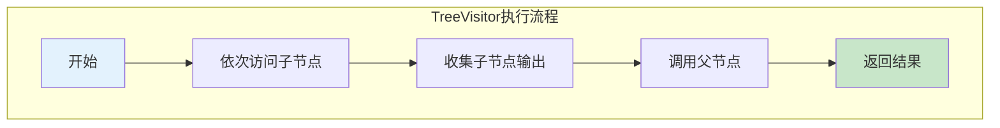
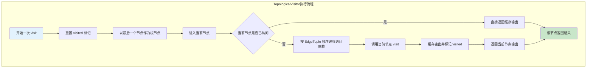

# EVG API

EVG（`Epilogue Visitor Graph`）是 CATLASS 当前用于组织 GEMM 尾处理的图式接口。本文只保留接入、参数顺序和节点口径；执行模型见 [01_evg_design](../2_Design/03_evg/01_evg_design.md)，扩展约束见 [02_evg_extension](../2_Design/03_evg/02_evg_extension.md)。

## 核心入口

| 层级   | 入口                                                                                                                                                  | 作用                                              |
| ------ | ----------------------------------------------------------------------------------------------------------------------------------------------------- | ------------------------------------------------- |
| Kernel | `BasicMatmulTlaVisitor`<br>代码路径：`include/catlass/gemm/kernel/basic_matmul_tla_visitor.hpp`                                                       | AIC 把 MMAD 结果写到 GM workspace，AIV 再执行 EVG |
| Kernel | `BasicMatmulTlaUbVisitor`<br>代码路径：`include/catlass/gemm/kernel/basic_matmul_tla_ub_visitor.hpp`                                                  | AIC 把结果保留在 UB，AIV 直接在 UB 上执行 EVG     |
| Block  | `BlockEpilogue<EpilogueVisitor<...>, ArchTag, ComputeLength, EVG, ElementC>`<br>代码路径：`include/catlass/epilogue/block/block_epilogue_visitor.hpp` | 负责 tile 切分、双缓冲和三阶段调度                |
| Fusion | `TreeVisitor`<br>代码路径：`include/catlass/epilogue/fusion/tree_visitor.hpp`                                                                         | 用树结构描述尾处理                                |
| Fusion | `TopologicalVisitor`<br>代码路径：`include/catlass/epilogue/fusion/topological_visitor.hpp`                                                           | 用 DAG 描述尾处理并复用中间结果                   |

## 接入顺序

一个 EVG kernel 的组装顺序通常是：

1. 选 `BlockMmad`
2. 定义 `EVG`
3. 用 `EVG` 组装 `BlockEpilogue`
4. 选择 visitor kernel
5. 构造 `EVG::Arguments`
6. 把 `EVG::Arguments` 填进 kernel `Arguments`

最常见的写法如下：

```cpp
using EVG = Epilogue::Fusion::TreeVisitor<
    Epilogue::Fusion::VisitorAuxStore<ElementC, LayoutC>,
    Epilogue::Fusion::TreeVisitor<
        Epilogue::Fusion::VisitorCompute<Epilogue::Fusion::Add, ElementC>,
        Epilogue::Fusion::VisitorAccLoad<ElementC>,
        Epilogue::Fusion::VisitorAuxLoad<ElementC, LayoutC>
    >
>;

using BlockEpilogue = Epilogue::Block::BlockEpilogue<
    Epilogue::EpilogueVisitor<false>,
    ArchTag,
    Int<computeLength>,
    EVG,
    ElementC
>;

using MatmulKernel =
    Gemm::Kernel::BasicMatmulTlaVisitor<BlockMmad, BlockEpilogue, BlockScheduler>;
```

如果使用 UB workspace 路径，改动点主要有两个：

- `Epilogue::EpilogueVisitor<true>`
- kernel 换成 `BasicMatmulTlaUbVisitor`

并且 `VisitorAccLoad` 通常会写成：

```cpp
using EpilogueDispatchPolicy = Epilogue::EpilogueVisitor<true>;
using AccLoad = Epilogue::Fusion::VisitorAccLoad<
    ElementC,
    EpilogueDispatchPolicy::USE_UB_WORKSPACE
>;
```

## TreeVisitor

`TreeVisitor<NodeOp, ChildOps...>` 适合树状表达式。

### 形态

```cpp
using EVG = Epilogue::Fusion::TreeVisitor<
    ParentOp,
    ChildOp1,
    ChildOp2
>;
```

### 参数顺序

`TreeVisitor` 的 `Arguments` 顺序和模板顺序不同，规则是“先子后父”。

```cpp
typename EVG::Arguments evg_args{
    {
        ChildOp1::Arguments{},
        ChildOp2::Arguments{},
        ParentOp::Arguments{}
    }
};
```

如果有嵌套 `TreeVisitor`，就按每一层“先子后父”的规则递归书写。

### Arguments 写法

`Arguments` 本质上是聚合结构，可以直接用花括号嵌套构造，不必先把每一层都显式写成 `XXX::Arguments` 变量。

例如 `D = C + X` 可以直接写成：

```cpp
typename EVG::Arguments evg_args{
    {
        {},
        {deviceX, layoutX},
        {}
    },
    {deviceD, layoutD}
};
```

这里的 `{}`、`{deviceX, layoutX}`、`{deviceD, layoutD}` 会按当前位置自动匹配到对应节点的 `Arguments` 类型。只要嵌套层次和顺序正确，就不需要显式写类型名。

### 适用场景

- `D = C + X`
- `D = silu(C)`
- `D = cast(add(C, X))`

### 执行流程



## TopologicalVisitor

`TopologicalVisitor<EdgeTuple, Ops...>` 适合中间结果要复用的场景。

### 形态

```cpp
using Edges = tla::tuple<
    tla::seq<>,
    tla::seq<0>,
    tla::seq<1>,
    tla::seq<2>,
    tla::seq<2>,
    tla::seq<3, 4>,
    tla::seq<5>
>;

using EVG = Epilogue::Fusion::TopologicalVisitor<
    Edges,
    Op0, Op1, Op2, Op3, Op4, Op5, Op6
>;
```

### 参数顺序

`TopologicalVisitor` 的 `Arguments` 严格按 `Ops...` 的平铺顺序书写：

```cpp
typename EVG::Arguments evg_args{
    Op0::Arguments{},
    Op1::Arguments{},
    Op2::Arguments{},
    Op3::Arguments{},
    Op4::Arguments{},
    Op5::Arguments{},
    Op6::Arguments{}
};
```

### Arguments 写法

`TopologicalVisitor` 同样可以直接用花括号按节点顺序填写，不必逐个显式写类型：

```cpp
typename EVG::Arguments evg_args{
    {},
    {{2.0f}},
    {},
    {{-1.0f}},
    {{1.0f}},
    {},
    {deviceD, layoutD}
};
```

判断规则很简单：

- 第几个节点，就写在第几个位置
- 节点 `Arguments` 里有几个字段，就按字段顺序写几层花括号
- 没有字段时直接写 `{}` 即可

### 适用场景

- 同一个中间结果被多个后继节点消费
- 希望避免在一个 tile 上重复计算

### 执行流程



这里的缓存只覆盖当前这次 `visit<Stage>(...)` 调用，也就是当前 tile 的当前阶段；进入下一个阶段时会重新从根节点开始一轮访问。两种组织方式的取舍见设计文档中的“图组织方式”。

## 节点总览

当前实现中，EVG 常用节点如下。

| 节点                                                    | 头文件                      | 作用                             |
| ------------------------------------------------------- | --------------------------- | -------------------------------- |
| `VisitorAccLoad<Element, USE_UB_WORKSPACE>`             | `visitor_acc_load.hpp`      | 读取 GEMM 结果                   |
| `VisitorAuxLoad<Element, Layout>`                       | `visitor_aux_load.hpp`      | 从外部 GM 读取输入               |
| `VisitorCompute<ComputeFn, ElementCompute, Scalars...>` | `visitor_compute.hpp`       | 做逐元素计算                     |
| `VisitorCast<ElementTo, ElementFrom, RoundStyle>`       | `visitor_cast.hpp`          | 做类型转换                       |
| `VisitorAuxStore<Element, Layout>`                      | `visitor_aux_store.hpp`     | 把结果写回 GM                    |
| `VisitorRowBroadcast<Element, Layout>`                  | `visitor_row_broadcast.hpp` | 读取 `1 x N` 行向量并广播到 tile |

## 阶段与放置原则

所有节点都运行在统一的三阶段模型里：

- `LOAD`
- `COMPUTE`
- `STORE`

但不是每个节点三个阶段都会做事：

- `VisitorAccLoad`、`VisitorAuxLoad` 主要工作在 `LOAD`
- `VisitorCompute`、`VisitorCast` 主要工作在 `COMPUTE`
- `VisitorAuxStore` 主要工作在 `STORE`
- `VisitorRowBroadcast` 同时跨 `LOAD` 和 `COMPUTE`

按图来放时，可以先用这个简单规则判断：

- 叶子节点放数据源：`VisitorAccLoad`、`VisitorAuxLoad`、`VisitorRowBroadcast`
- 中间节点放变换和计算：`VisitorCast`、`VisitorCompute`
- 根节点放输出：`VisitorAuxStore`

如果是 `TopologicalVisitor`，也是同样的职责，只是节点不再嵌套，而是按依赖顺序平铺。

阶段和节点职责关系图、`BlockEpilogue` 的双缓冲流水时序图都已经放到设计文档，见 [01_evg_design](../2_Design/03_evg/01_evg_design.md) 的“三阶段执行模型”。

## 节点说明

下面按节点分别说明模板参数、放置位置、`Arguments` 写法和特殊要求。

先看一眼速查表会更方便：

| 节点                  | 常见放置位置 | 输入路数 | 直接写进 `Arguments` 的形态 | 特别限制                             |
| --------------------- | ------------ | -------- | --------------------------- | ------------------------------------ |
| `VisitorAccLoad`      | 叶子节点     | 0        | `{}`                        | UB 通路下直接消费 MMAD 的 UB 结果    |
| `VisitorAuxLoad`      | 叶子节点     | 0        | `{ptr, layout}`             | `layout` 描述完整张量                |
| `VisitorAuxStore`     | 根节点       | 1        | `{ptr, layout}`             | 当前实现里真正负责落盘               |
| `VisitorCast`         | 中间节点     | 1        | `{}`                        | 输入类型与 `ElementFrom` 一致        |
| `VisitorRowBroadcast` | 叶子节点     | 0        | `{ptr, layout}`             | `layout` 使用 `(1, n)` 二维 layout   |
| `VisitorCompute`      | 中间节点     | 1 或多路 | `{}` 或 `{{...}}`           | 所有输入类型与 `ElementCompute` 一致 |

### VisitorAccLoad

```cpp
VisitorAccLoad<Element, USE_UB_WORKSPACE>
```

- `Element`：读取出来的元素类型，通常与 MMAD 输出类型一致
- `USE_UB_WORKSPACE`：是否直接从 UB 读取 MMAD 结果

放置位置与使用要求：

- 通常作为叶子节点使用
- 不接收子节点输入
- 输出当前 tile 的 `C`
- 在 GM workspace 路径下，主要在 `LOAD` 阶段把数据搬到 UB
- 在 UB workspace 路径下，直接从 UB 中取当前 MMAD 结果
- 通常放在 `VisitorCompute`、`VisitorCast` 等计算节点的下游

常见写法：

```cpp
using AccLoad0 = Epilogue::Fusion::VisitorAccLoad<ElementC>;
using AccLoad1 = Epilogue::Fusion::VisitorAccLoad<ElementC, true>;
```

对应的 `Arguments`：

```cpp
typename AccLoad0::Arguments acc_args{};
typename AccLoad1::Arguments acc_ub_args{};
```

直接写进整张图时就是：

```cpp
{}
```

### VisitorAuxLoad

```cpp
VisitorAuxLoad<Element, Layout>
```

- `Element`：外部输入张量的元素类型
- `Layout`：这个外部输入对应的 layout 类型

放置位置与使用要求：

- 通常作为叶子节点使用
- 不接收子节点输入
- 在 `LOAD` 阶段从 GM 按当前 tile 的全局坐标读取数据
- 适合放在 `VisitorCompute`、`VisitorCast` 等计算节点的下游
- `layout` 描述完整输入张量，而不是当前 tile
- `layout` 传的是具体 layout 对象，不是 layout tag
- `layout` 类型和模板里的 `Layout` 一致
- `layout` 和 `ptr` 指向的数据真实排布一致

常见写法：

```cpp
using XLoad = Epilogue::Fusion::VisitorAuxLoad<ElementC, LayoutX>;
```

对应的 `Arguments`：

```cpp
typename XLoad::Arguments x_args{deviceX, layoutX};
```

直接写进整张图时就是：

```cpp
{deviceX, layoutX}
```

可写成：

```cpp
auto layoutX = tla::MakeLayout<ElementC, layout::RowMajor>(m, n);
using LayoutX = decltype(layoutX);
using XLoad = Epilogue::Fusion::VisitorAuxLoad<ElementC, LayoutX>;
```

### VisitorAuxStore

```cpp
VisitorAuxStore<Element, Layout>
```

- `Element`：最终写回数据的元素类型
- `Layout`：输出张量的 layout 类型

放置位置与使用要求：

- 接收一个输入，一般作为输出节点使用
- 典型放法是作为整张图的根节点，负责最终写回
- 真正写回外部内存的动作发生在 `STORE` 阶段
- 当前实现会把输入透传返回，因此技术上仍可继续参与组合
- 文档和样例里，通常把它放在最后作为结果落盘节点
- 输入元素类型和模板里的 `Element` 一致；不一致时先插入 `VisitorCast`
- `layout` 描述完整输出张量，而不是当前 tile
- `layout` 传的是具体 layout 对象，不是 layout tag
- `layout` 类型和模板里的 `Layout` 一致
- `layout` 和输出 GM 的真实排布一致

常见写法：

```cpp
using Store = Epilogue::Fusion::VisitorAuxStore<ElementC, LayoutD>;
```

对应的 `Arguments`：

```cpp
typename Store::Arguments store_args{deviceD, layoutD};
```

直接写进整张图时就是：

```cpp
{deviceD, layoutD}
```

可写成：

```cpp
auto layoutD = tla::MakeLayout<ElementC, layout::RowMajor>(m, n);
using LayoutD = decltype(layoutD);
using Store = Epilogue::Fusion::VisitorAuxStore<ElementC, LayoutD>;
```

### VisitorCast

```cpp
VisitorCast<ElementTo, ElementFrom, RoundStyle>
```

- `ElementTo`：转换后的类型
- `ElementFrom`：输入类型
- `RoundStyle`：舍入方式，默认可用 `AscendC::RoundMode::CAST_NONE`

放置位置与使用要求：

- 接收一个输入，通常作为中间父节点使用
- 适合放在某个叶子节点或计算节点之上，再把结果交给后续计算节点
- 实际计算发生在 `COMPUTE` 阶段
- 输入类型与 `ElementFrom` 一致
- 输出类型固定为 `ElementTo`
- 如果上下游已经是同一类型，就没必要插这个节点
- 一般放在叶子节点或某个计算节点之上，不作为数据源或最终输出节点

常见写法：

```cpp
using CastFp16ToFp32 =
    Epilogue::Fusion::VisitorCast<float, half, AscendC::RoundMode::CAST_NONE>;
```

对应的 `Arguments`：

```cpp
typename CastFp16ToFp32::Arguments cast_args{};
```

直接写进整张图时就是：

```cpp
{}
```

### VisitorRowBroadcast

```cpp
VisitorRowBroadcast<Element, Layout>
```

- `Element`：行向量元素类型
- `Layout`：这条 `1 x N` 输入的 layout 类型

这里需要注意：当前实现按二维 tensor 处理这一路输入，所以 `Layout` 使用描述 `(1, n)` 的 layout 类型，而不是只描述 `(n)` 的 vector layout 类型。

放置位置与使用要求：

- 通常作为叶子节点使用
- 不接收子节点输入
- `LOAD` 阶段读取当前列范围对应的 `1 x tile_n`
- `COMPUTE` 阶段把这一行复制扩展成当前 `tile_m x tile_n`
- 适合用于 bias 这类“按列共享、按行广播”的输入
- 当前实现按 `(1, n)` 的二维 layout 处理，而不是 `(n)` 的一维 vector layout
- `layout` 传的是具体 layout 对象，不是 layout tag
- `layout` 类型和模板里的 `Layout` 一致

常见写法：

```cpp
auto layoutBias = tla::MakeLayout<ElementC, layout::RowMajor>(1, n);
using LayoutBias = decltype(layoutBias);
using BiasLoad = Epilogue::Fusion::VisitorRowBroadcast<ElementC, LayoutBias>;
```

对应的 `Arguments`：

```cpp
typename BiasLoad::Arguments bias_args{deviceBias, layoutBias};
```

直接写进整张图时就是：

```cpp
{deviceBias, layoutBias}
```

### VisitorCompute

```cpp
VisitorCompute<ComputeFn, ElementCompute, Scalars...>
```

三个位置分别表示：

- `ComputeFn`：具体算子，例如 `Add`、`Exp`、`Muls`
- `ElementCompute`：算子工作的元素类型
- `Scalars...`：额外标量参数类型；没有就不写

使用口径：

- 通常作为中间计算节点
- 输入来自 `AccLoad`、`AuxLoad`、`RowBroadcast`、`Cast` 或其他 `Compute`
- 实际计算发生在 `COMPUTE` 阶段
- 输入个数与 `ComputeFn` 语义一致
- 所有输入类型都与 `ElementCompute` 一致
- 类型不一致时先插 `VisitorCast`

常见例子：

```cpp
using AddOp = Epilogue::Fusion::VisitorCompute<Epilogue::Fusion::Add, ElementC>;
using ExpOp = Epilogue::Fusion::VisitorCompute<Epilogue::Fusion::Exp, ElementC>;
using MulsOp = Epilogue::Fusion::VisitorCompute<Epilogue::Fusion::Muls, ElementC, ElementC>;
using AddsOp = Epilogue::Fusion::VisitorCompute<Epilogue::Fusion::Adds, ElementC, ElementC>;
using LeakyReluOp =
    Epilogue::Fusion::VisitorCompute<Epilogue::Fusion::LeakyRelu, ElementC, ElementC>;
```

对应的 `Arguments` 写法如下：

```cpp
typename AddOp::Arguments add_args{};
typename ExpOp::Arguments exp_args{};
typename MulsOp::Arguments muls_args{{2.0f}};
typename AddsOp::Arguments adds_args{{1.0f}};
typename LeakyReluOp::Arguments leaky_args{{0.1f}};
```

如果直接写在整张图里，也可以只写花括号：

```cpp
typename EVG::Arguments evg_args{
    {},
    {{2.0f}},
    {},
    {deviceD, layoutD}
};
```

这里 `{{2.0f}}` 之所以是两层花括号，是因为 `VisitorCompute::Arguments` 里包了一层 `scalars` 元组。`Scalars...` 有多个标量时，就继续按顺序写：

```cpp
using SomeOp = Epilogue::Fusion::VisitorCompute<SomeComputeFn, ElementC, float, int32_t>;
typename SomeOp::Arguments some_args{{1.0f, 2}};
```

直接写进整张图时，对应位置就写：

```cpp
{{1.0f, 2}}
```

`VisitorCompute` 会检查所有输入类型是否都等于 `ElementCompute`，不一致时先插 `VisitorCast`。

## 常用 ComputeFn

`VisitorCompute` 依赖 `operations.hpp` 中的算子定义。当前实现里常用的有：

| 类型       | 算子                                       |
| ---------- | ------------------------------------------ |
| 一元       | `Exp`、`Relu`、`Silu`、`Sqrt`、`RsqrtFast` |
| 带标量     | `LeakyRelu`、`Muls`、`Adds`                |
| 二元或多元 | `Add`、`Sub`、`Mul`、`Div`、`Max`、`Min`   |
| 组合       | `AddRelu`                                  |

## BlockEpilogue 关键参数

EVG 专用的 `BlockEpilogue` 模板实参顺序如下：

```cpp
using BlockEpilogue = Epilogue::Block::BlockEpilogue<
    Epilogue::EpilogueVisitor<false>,
    ArchTag,
    Int<computeLength>,
    EVG,
    ElementC
>;
```

几个关键点：

- `EpilogueVisitor<false>`：从 GM workspace 取 MMAD 结果
- `EpilogueVisitor<true>`：直接从 UB 取 MMAD 结果
- `computeLength`：单次 tile 处理的元素数，按 `BYTE_PER_C0` 对齐
- `EVG`：整张尾处理图
- `ElementC`：MMAD 输出元素类型

## Kernel 侧 Arguments

以 `BasicMatmulTlaVisitor` 为例，`Arguments` 里除了 A、B、C 与 layout 外，还需要把 `evg_args` 放进去。

```cpp
struct Arguments {
    GemmCoord problemShape;
    GM_ADDR ptrA; LayoutA layoutA;
    GM_ADDR ptrB; LayoutB layoutB;
    GM_ADDR ptrC; LayoutC layoutC;
    GM_ADDR ptrBias{nullptr};
    typename BlockEpilogue::EVG::Arguments evg_args;
};
```

这个 `Arguments` 也可以直接用花括号整体构造，不需要先单独声明内部类型：

```cpp
typename MatmulKernel::Arguments arguments{
    problemShape,
    deviceA, layoutA,
    deviceB, layoutB,
    deviceD, layoutD,
    nullptr,
    {
        {
            {},
            {deviceX, layoutX},
            {}
        },
        {deviceD, layoutD}
    }
};
```

写时主要对齐两点：

- 外层字段顺序和 `MatmulKernel::Arguments` 一致
- `evg_args` 内部嵌套顺序和 `EVG::Arguments` 一致

layout 相关要求放在这里看最合适：

- `layoutA/layoutB` 传完整输入矩阵的具体 layout 对象
- 传的是 layout 对象，不是 layout tag
- 这些 layout 会直接用于构造完整 GM tensor
- `layoutC` 在 visitor kernel 的公开接口里仍然保留，但当前 visitor 路径真正写回时，实际以 `VisitorAuxStore` 里传入的 layout 为准

需要注意的是，当前 visitor kernel 的 `ToUnderlyingArguments()` 实现并不消费 `ptrC/layoutC`，真正的写回位置由 `evg_args` 中的 `VisitorAuxStore` 决定。

如果使用 GM workspace 路径：

- `GetWorkspaceSize()` 会返回 `C workspace + EVG workspace`

如果使用 UB workspace 路径：

- `GetWorkspaceSize()` 只返回 `EVG workspace`

## computeLength 选择

`computeLength` 表示当前链路在每次迭代里处理的元素个数。这个值理论上越大越有利于减少迭代次数、提升效率，但它不能超过当前 UB 空间所能容纳的上限，所以实际使用时通常是先计算一个可接受的最大值，再据此选定 `computeLength`。

计算时看四件事：

- 可分给 EVG 的 UB 总量（GM 通路用 `ArchTag::UB_SIZE`；UB 通路用 `evgUbBudget`）
- 同时驻留的 UB buffer 数量（记为 `evgUbNodes`）
- epilogue 双缓冲阶段数（记为 `evgUbStages`，当前样例固定为 `2`）
- 按 `BYTE_PER_C0` 向下对齐（用 `RoundDown`）

### GM workspace 通路

```cpp
constexpr uint32_t evgUbNodes = N;    // 当前 EVG 中单独占 UB 的 Visitor 数
constexpr uint32_t evgUbStages = 2;   // epilogue 双缓冲
constexpr uint32_t computeLength = RoundDown(
    ArchTag::UB_SIZE / evgUbNodes / evgUbStages / sizeof(ElementC), BYTE_PER_C0);
```

`evgUbNodes` 为图中单独占 UB 的 Visitor 数，按各节点实现逐一对照。公式中的 `sizeof(ElementC)` 假设各槽元素类型一致；含 `VisitorCast` 时各槽 `sizeof` 不同，不能直接套用。

| Visitor | 计入 `evgUbNodes` | 单槽字节 | 说明 |
|---------|-------------------|----------|------|
| `VisitorAccLoad`（GM 通路） | 是 | `sizeof(Element)` | `USE_UB_WORKSPACE = false` |
| `VisitorAccLoad`（UB 通路） | 否 | — | `USE_UB_WORKSPACE = true`，复用 MMAD 写入 UB 的 `C` |
| `VisitorAuxLoad` | 是 | `sizeof(Element)` | |
| `VisitorRowBroadcast` | 是 | `sizeof(Element)` | |
| `VisitorCompute` | 是 | `sizeof(ElementCompute)` | |
| `VisitorCast` | 是 | `sizeof(ElementTo)` | 混合精度时不能统一用 `sizeof(ElementC)` |
| `VisitorAuxStore` | 否 | — | 当前实现不写回 UB 计算 buffer |

### 计算示例 1：GM workspace 通路的 `D = C + X`（add）

`AccLoad`、`AuxLoad`、`Compute` 各占一块 UB，`evgUbNodes = 3`：

```cpp
constexpr uint32_t evgUbNodes = 3;    // AccLoad + AuxLoad + Compute
constexpr uint32_t evgUbStages = 2;
constexpr uint32_t computeLength = RoundDown(
    ArchTag::UB_SIZE / evgUbNodes / evgUbStages / sizeof(ElementC), BYTE_PER_C0);
```

### 计算示例 2：GM workspace 单算子（sigmoid / silu / leaky_relu）

`AccLoad + Compute`，`evgUbNodes = 2`。

### 计算示例 3：TopologicalVisitor（tanh）

`AccLoad` 与 7 个 `Compute` 各占 UB，`evgUbNodes = 8`。

### 计算示例 4：UB workspace 通路的 `D = C + X`（add_ub）

`VisitorAccLoad<..., true>` 复用 MMAD 写入 UB 前半段的 `C`，不单独占槽；`[0, L0C_SIZE/2)` 预留给 MMAD 结果，EVG 从 `L0C_SIZE/2` 起分配：

```cpp
constexpr uint32_t evgUbNodes = 2;    // AuxLoad + Compute
constexpr uint32_t evgUbStages = 2;
constexpr uint32_t evgUbBudget = ArchTag::UB_SIZE - ArchTag::L0C_SIZE / 2;
constexpr uint32_t computeLength = RoundDown(
    evgUbBudget / evgUbNodes / evgUbStages / sizeof(ElementC), BYTE_PER_C0);
```

### 使用规则

- 扩展 EVG 图或接入自定义 Visitor 时，按其实现确认是否占 UB 及单槽 `sizeof`
- UB 通路下，用 `evgUbBudget = UB_SIZE - L0C_SIZE/2` 代替整段 `UB_SIZE`
