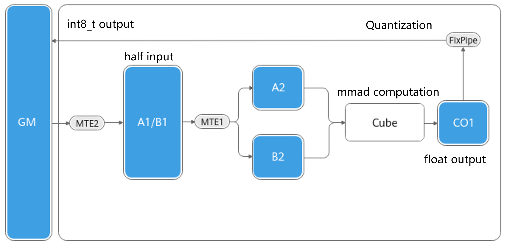
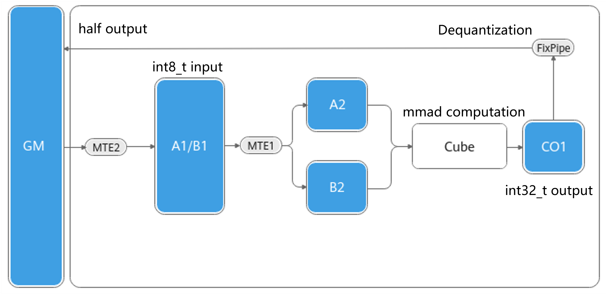

# GroupedMatmulSliceMPerTensorPerChannelDequant Example Readme

## Code Organization

```
├── 48_ascend950_grouped_matmul_slice_m_per_tensor_per_channel_dequant
│   ├── CMakeLists.txt # CMake build file
│   ├── README.md
│   └── grouped_matmul_slice_m_per_tensor_per_channel_dequant.cpp # Main file
```

## Function

This operator supports the splitting of matrix A along the m-axis, performing matrix multiplication with matrix B by group, and then performing per_tensor or per_channel dequantization.

Matrices A and B are of the `int8` type, the scale is of the `float` type, and the output is of the `half` type.

### Fixpipe Quantization/Dequantization

For specific input and output data types, Fixpipe allows you to configure the quantization/dequantization mode and parameters to quantize or dequantize the output C matrix elements when the computation result is moved from CO1 to Global Memory.

- Matmul quantization scenario: During Matmul computation, the left matrix A and right matrix B are of the `half` type, and the output C matrix is of the `int8_t` type. In this scenario, when the data of the C matrix is moved from CO1 to Global Memory, the quantization operation is performed to quantize the final result into the `int8_t` type, as shown in the following figure.

    

- Matmul dequantization scenario: During Matmul computation, the left matrix A and right matrix B are of the `int8_t` type, and the output C matrix is of the `half` type. In this scenario, when the data of the C matrix is moved from CO1 to Global Memory, the dequantization operation is performed to dequantize the final result into the corresponding half type, as shown in the following figure.

    

Fixpipe provides two different granularities of quantization/dequantization modes: per_tensor and per_channel.

1. per_tensor: Quantization/Dequantization is performed on the entire tensor, which has a unique scaling factor. This method can reduce the storage and computation costs of the model, but will reduce the model accuracy.
2. per_channel: performs quantization/dequantization on each channel of the tensor separately. The same scaling factor is shared within the same channel, while different scaling factors are used for different channels. This method can better preserve the model accuracy, but increases the model storage and computing costs.

## Example

- After obtaining the code, compile the corresponding operator executable file. For details, see [Template Library Quick Start](../../docs/en/1_Practice/01_quick_start.md#build-and-execution). This test case is an Ascend 950 operator. During compilation, you need to add -DCATLASS_ARCH=3510.
- Execute the operator.

```
# Compiling a specified case
bash scripts/build.sh 48_ascend950_grouped_matmul_slice_m_per_tensor_per_channel_dequant -DCATLASS_ARCH=3510
cd output/bin
# Executable file name | Number of groups | Matrix m-axis | n-axis | k-axis | Quantization mode | Device ID
# The number of groups and the dimensions of the matrix m-axis, n-axis, and k-axis must be greater than 0.
# The quantization mode can be 0 or 1. 0 indicates per_tensor, and 1 indicates per_channel.
# The device ID is optional. The default value is 0.
./48_ascend950_grouped_matmul_slice_m_per_tensor_per_channel_dequant 128 512 1024 2048 0 0
```

If the following result is displayed, the accuracy verification is successful.

```
Compare success.
```

## Instructions

The `DispatchPolicy MmadDequant` used by `GroupedMatmulSliceMPerTensorPerChannelDequant` by default supports the following template parameters:

|Template Parameter|Default Value|Description|
|---------|-----------------|-----------------|
|ArchTag| None| Specifies the architecture model.| 
|enableUnitFlag| false | Whether to enable Unitflag. This parameter must be set to `false` when the L0C multi-buffer is enabled.|
|useHF32| false | Whether to enable HF32. Only the float type is supported.|
|l0CStages| 1 | Specifies the number of L0C buffers. Setting this parameter to `2` enables the L0C dual-buffer.|
|enableL1Resident| false | Whether to enable L1 resident.|
|l1AStages | 2 | Number of buffers for loading matrix A to L1.|
|l1BStages | 2 | Number of buffers for loading matrix B to L1.|
|l0AStages | 2 | Number of buffers for loading matrix A to L0.|
|l0BStages | 2 | Number of buffers for loading matrix B to L0.|

Assume that the matrix shape is `M N K`, the tile size on L1 is `m1 n1 k1`, the number of blocks in the M direction is `mTiles = CeilDiv(M, m1)`, the number of blocks in the N direction is `nTiles = CeilDiv(N, n1)`, and the total number of tasks is `taskBlocks = mTiles × nTiles`. In the following two cases, `enableL1Resident` can be enabled:

1. `mTiles = 1`, `nTiles > CoreNum`, and `K < 2 × k1`. In this case, you can also set `l0CStages=2` (`enableUnitFlag` must be disabled). If the space is insufficient and `l0CStages=2` cannot be set, set `n1` to half of the original value.

2. `nTiles = 1`, `mTiles > CoreNum`, and `K < 2 × k1`. In this case, you can also set `l0CStages=2` (`enableUnitFlag` must be disabled). If the space is insufficient and `l0CStages=2` cannot be set, set `m1` to half of the original value.
