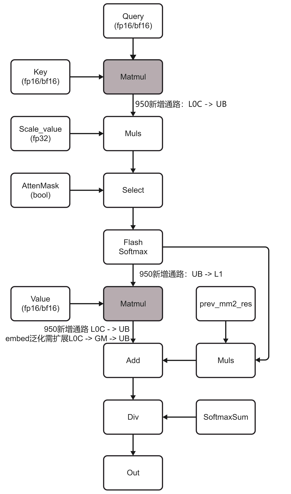
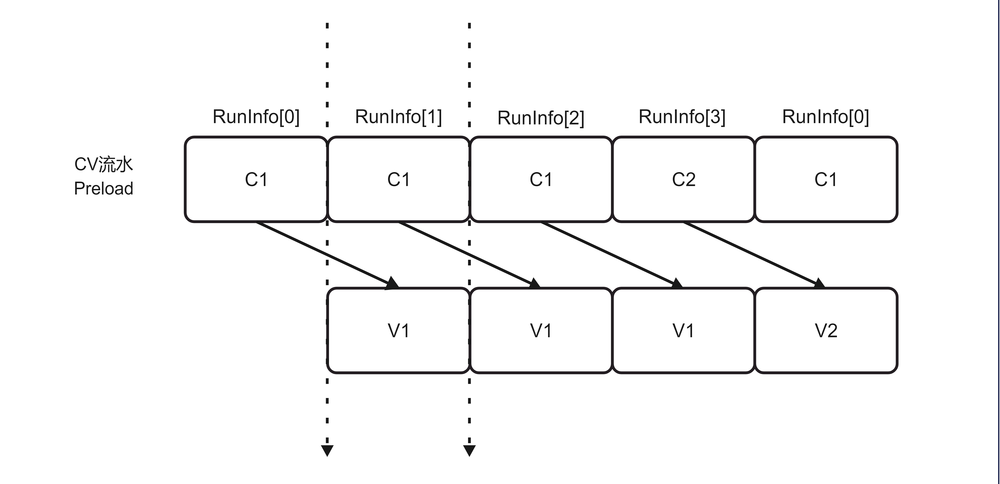

# CATLASS FlashAttention Infer设计文档

## 1. 概述

CATLASS FlashAttention Infer是基于CATLASS Gemm API实现的亲和昇腾Ascend950硬件的FlashAttention推理算子，算子的结构可以分为以下几部分：
* Tiling计算；
* Kernel实现；
* Kernel中依赖适合FlashAttention推理运算的Block和Epilogue组件；
* 使用的Block和Epilogue组件依赖模板库提供的Tile组件。

本文档详细描述 Flash Attention Infer算子的Kernel实现，包括主流程逻辑、Cube/Vector 流水线、L1/UB 内存分配等关键设计，以及Tiling切分策略描述。

### 1.1 算子功能

Flash Attention Infer 算子实现以下计算流程：

```
O = FlashAttention(Q, K, V, mask)
  = softmax(Q * K^T / sqrt(d)) * V
```

其中：
- Q: Query tensor，形状 [batch, qSeqlen, qHeads, headDim]
- K: Key tensor，形状 [batch, kvSeqlen, kvHeads, headDim]
- V: Value tensor，形状 [batch, kvSeqlen, kvHeads, headDim]
- mask: Attention mask（可选）
- O: Output tensor，形状 [batch, qSeqlen, qHeads, headDim]



* 支持GQA功能。
* 支持Paged Attention模式，通过blockTable实现KV Cache的分页管理。
* 支持Attention Mask功能，支持左上和右下两种mask模式。
* CV流水preload，AIC和AIV多级流水并行，提高计算效率。
* 当前模板Kernel暂未支持ActualSeq可变长特性。



---

## 2. 数据结构与类型定义

### 2.1 核心类型定义

```cpp
// L1 Tile Shape: <qSeqlen, kvSeqlen, embed>
using L1TileShape = tla::Shape<_128, _128, _128>;
using L0TileShape = L1TileShape;

// 数据类型
using ElementQ = Dtype;              // Q元素类型（FP16/BF16）
using ElementK = Dtype;              // K元素类型
using ElementV = Dtype;              // V元素类型
using ElementS = float;              // Score类型（FP32）
using ElementP = Dtype;              // P类型（OnlineSoftmax中间结果）
using ElementO = Dtype;              // O元素类型
using ElementOTmp = float;           // O临时类型（FP32）
using ElementMask = uint8_t;         // Mask类型

// Layout类型
using LayoutTagQ = layout::RowMajor;   // Q: 行优先
using LayoutTagK = layout::ColumnMajor; // K: 列优先
using LayoutTagV = layout::RowMajor;   // V: 行优先
using LayoutTagS = layout::RowMajor;   // S: 行优先
using LayoutTagP = layout::zN;         // P: zN格式
using LayoutTagO = layout::RowMajor;   // O: 行优先
```

### 2.2 核心组件类型

```cpp
// Q * K^T 矩阵乘法组件
using DispatchPolicyQK = Gemm::MmadFAIQK<ArchTag, enablePaFlag>;
using TileCopyQK = Gemm::Tile::PackedTileCopyTlaToUB<...>;
using TileMmadQK = Gemm::Tile::TileMmadTla<...>;
using BlockMmadQK = Gemm::Block::BlockMmadTla<...>;

// 在线Softmax组件
using DispatchPolicySoftmax = Epilogue::EpilogueAscend950FASoftmax<enableMaskFlag>;
using EpilogueOnlineSoftmax = Epilogue::Block::BlockEpilogue<...>;

// P * V 矩阵乘法组件
using DispatchPolicyPV = Gemm::MmadFAIPV<ArchTag, enablePaFlag>;
using TileCopyPV = Gemm::Tile::PackedTileCopyTlaToUB<...>;
using TileMmadPV = Gemm::Tile::TileMmadTla<...>;
using BlockMmadPV = Gemm::Block::BlockMmadTla<...>;

// O更新和归一化组件
using DispatchPolicyRescaleO = Epilogue::EpilogueAscend950FARescaleO;
using EpilogueRescaleO = Epilogue::Block::BlockEpilogue<...>;
```


#### Block Mmad

算子总共使用了两类Block Mmad组件，分别为：
* `BlockMmadQK`为BlockMmad模板类的偏特化，用于处理FlashAttention Infer中的Q与K的矩阵乘操作，头文件[block_mmad_fai_qk_tla.hpp](../../include/catlass/gemm/block/block_mmad_fai_qk_tla.hpp)。
* `BlockMmadPV`为BlockMmad模板类的偏特化，用于处理FlashAttention Infer中的P与V的矩阵乘操作，头文件[block_mmad_fai_pv_tla.hpp](../../include/catlass/gemm/block/block_mmad_fai_pv_tla.hpp)。

#### Block Epilogue

算子总共使用了两类Block Epilogue组件，分别为：
* `EpilogueOnlineSoftmax`为BlockEpilogue模板类的偏特化，用于处理FlashAttention Infer中的online softmax操作，头文件[block_epilogue_fa_softmax_ascend950.hpp](../../include/catlass/epilogue/block/block_epilogue_fa_softmax_ascend950.hpp)。
* `EpilogueRescaleO`为BlockEpilogue模板类的偏特化，用于处理FlashAttention Infer中的rescaleO操作，头文件[block_epilogue_fa_rescale_o_ascend950.hpp](../../include/catlass/epilogue/block/block_epilogue_fa_rescale_o_ascend950.hpp)。

#### Tile Mmad & Tile Copy

在Kernel使用的Block组件中，使用了位于tile_mmad.hpp中的TileMmadTla组件和位于tile_copy.hpp中的PackedTileCopyTlaToUB组件，并新增了针对FA Epilogue处理的TileCopySoftmax和TileCopyRescaleO组件，以及Ascend950新增的ub->l1通路CopyUb2L1Tla组件，例如：

```c++
using TileCopyQK = Gemm::Tile::PackedTileCopyTlaToUB<
    ArchTag, ElementQ, LayoutTagQ, ElementK, LayoutTagK, ElementS, LayoutTagS, void, Gemm::Tile::CopyL0CToUBMode::SPLIT_M>;
using TileMmadQK = Gemm::Tile::TileMmadTla<ArchTag, ElementQ, typename TileCopyQK::LayoutTagL1A>;

using TileCopySoftmax = Epilogue::Tile::TileCopySoftmax<
        ArchTag, ElementMask, ElementP, LayoutTagMask, LayoutTagP>;

using TileCopyRescaleO = Epilogue::Tile::TileCopyRescaleO<ArchTag, ElementO, LayoutTagO, LayoutTagOTmp>;

using CopyUbToL1P = Tile::CopyUb2L1Tla<ArchTag, decltype(vf1OutUb), TensorDst>;
```

这些Tile组件负责数据在GM、L1、L0和UB之间的搬运，以及矩阵乘法和Softmax的底层实现。PackedTileCopyTlaToUB支持TLA（Tensor Layout Abstraction）布局，能够高效地处理不同布局的数据搬运需求。Tile::CopyUb2L1Tla支持AIV Ub上的计算结果直接搬运到AIC L1上，相比之前Ub->GM->L1的搬运实现了效率提升。

---

## 3. 主Kernel类：FAInferKernel

### 3.1 类定义

**位置**：`fai_kernel.h:47-545`

```cpp
template <
    class BlockMmadQK,           // Q*K^T 矩阵乘法组件
    class BlockMmadPV,           // P*V 矩阵乘法组件
    class EpilogueOnlineSoftmax,  // 在线Softmax组件
    class EpilogueRescaleO,      // O更新组件
    bool PAGED_CACHE_FLAG>       // 是否启用Paged Attention
class FAInferKernel {
    // ...
};
```

### 3.2 成员变量

| 变量名 | 类型 | 说明 |
|--------|------|------|
| `bmm1TensorList[NUM2]` | LocalTensor<ElementS> | BMM1结果（S矩阵）双缓存 |
| `bmm2TensorList[NUM2]` | LocalTensor<ElementOTmp> | BMM2结果（O临时）双缓存 |
| `mm2AL1TensorList[KERNEL_TASK_NUM]` | LocalTensor<ElementP> | MM2输入（P矩阵）L1缓存 |
| `expUb[KERNEL_TASK_NUM]` | LocalTensor<ElementS> | exp值UB缓存 |
| `sumUb[KERNEL_TASK_NUM]` | LocalTensor<ElementS> | sum值UB缓存 |
| `maxUb[KERNEL_TASK_NUM]` | LocalTensor<ElementS> | max值UB缓存 |
| `constInfo` | ConstInfo | 常量信息 |
| `runInfo[4]` | RunInfo | 运行时信息（环形缓存） |
| `runParam` | RunParamStr | 运行参数 |
| `blockIdx` | uint32_t | 当前AI Core索引 |
| `subBlockIdx` | uint32_t | AIV核子索引 |

### 3.3 内存布局

#### 3.3.1 UB内存布局

```
+------------------------+  ubBufAddrStart = 0
| bmm1TensorList[0]      |  MM1_RESULT_SIZE = 64 * 128 * sizeof(float) = 32KB
+------------------------+
| bmm2TensorList[0]      |  MM2_RESULT_SIZE = 64 * 128 * sizeof(float) = 32KB
+------------------------+
| bmm1TensorList[1]      |  MM1_RESULT_SIZE = 32KB
+------------------------+
| bmm2TensorList[1]      |  MM2_RESULT_SIZE = 32KB
+------------------------+
| expUb[0]              |  SHARE_UB_SIZE = 64 * sizeof(float) = 256B (AIV)
+------------------------+
| maxUb[0]              |  SHARE_UB_SIZE = 256B (AIV)
+------------------------+
| sumUb[0]              |  SHARE_UB_SIZE = 256B (AIV)
+------------------------+
| expUb[1]              |  SHARE_UB_SIZE = 256B (AIV)
+------------------------+
| maxUb[1]              |  SHARE_UB_SIZE = 256B (AIV)
+------------------------+
| sumUb[1]              |  SHARE_UB_SIZE = 256B (AIV)
+------------------------+
| expUb[2]              |  SHARE_UB_SIZE = 256B (AIV)
+------------------------+
| maxUb[2]              |  SHARE_UB_SIZE = 256B (AIV)
+------------------------+
| sumUb[2]              |  SHARE_UB_SIZE = 256B (AIV)
+------------------------+
| Epilogue内部Buff        |  Epilogue内部再分配
+------------------------+
```

#### 3.3.2 L1内存布局

```
+------------------------+  l1BufAddrStart = 0
| mm2AL1TensorList[0]    |  MM2_LEFT_SIZE = 128 * 128 * sizeof(Dtype) = 32KB
+------------------------+
| mm2AL1TensorList[1]    |  MM2_LEFT_SIZE = 32KB
+------------------------+
| mm2AL1TensorList[2]    |  MM2_LEFT_SIZE = 32KB
+------------------------+
| BlockMmadQK内部L1     |  Block内部再分配
+------------------------+
| BlockMmadPV内部L1     |  Block内部再分配
+------------------------+
```

---

## 4. 多核Tiling算法
Tiling 切分算法，主要用于将计算任务均匀分配到多个 AI Core 上，实现高效的并行计算。
### 4.1 核心目标

- **负载均衡**：使每个 AI Core 的计算量尽可能均衡
- **内存高效**：合理利用片上内存（UB/L1）
- **并行优化**：最大化多核并行度


### 4.2. 数据结构

#### 4.2.1 FAInfo - 输入参数结构

```cpp
struct FAInfo {
    int64_t batchSize = 0;           // Batch大小
    int64_t numOfHeads = 0;          // Query头数
    int64_t numOfKVHeads = 0;        // Key/Value头数（用于GQA）
    int64_t seqSize = 0;             // Query序列长度
    int64_t seqInnerSize = 0;        // Key/Value序列长度
    int64_t headSize = 0;            // 每个头的维度

    uint32_t numBlocks = 0;          // 总block数（PFA）
    uint32_t blockSize = 0;          // 每个block的token数
    uint32_t maxBlockNumPerBatch = 0; // 每个batch的最大block数

    uint32_t maskType = SPARSE_MODE_NO_MASK; // Mask类型
    float scaleValue = 1.0;          // 缩放因子（通常为 1/sqrt(dk)）
    int64_t *actualSeqLengths{nullptr};      // 实际Q序列长度数组
    int64_t *actualSeqLengthsKV{nullptr};   // 实际KV序列长度数组
};
```

#### 4.2.2 FATilingData - 输出Tiling数据结构

```cpp
class FATilingData {
public:
    InputParamsRegbase inputParamsRegbase;      // 输入参数
    MultiCoreParamsRegbase multiCoreParamsRegbase; // 多核切分参数
};
```

InputParamsRegbase - 输入参数

| 字段 | 类型 | 说明 |
|------|------|------|
| batch | int64_t | Batch大小 |
| qHeads | int64_t | Query头数 |
| kvHeads | int64_t | Key/Value头数 |
| groupSize | int64_t | 分组大小（qHeads / kvHeads） |
| qSeqlen | int64_t | Query序列长度 |
| kvSeqlen | int64_t | Key/Value序列长度 |
| embed | int64_t | 嵌入维度（embedding dimension） |
| scaleValue | float | 缩放因子 |
| attenMaskCompressMode | uint8_t | Attention mask压缩模式 |
| isActualSeqLengthsNull | uint8_t | Q实际序列长度是否为空 |
| isActualSeqLengthsKVNull | uint8_t | KV实际序列长度是否为空 |
| actualSeqLengthsSize | uint32_t | Q实际序列长度数组大小 |
| actualSeqLengthsKVSize | uint32_t | KV实际序列长度数组大小 |
| headNumRatio | uint32_t | 头数比率（qHeads / kvHeads） |
| blockSize | uint32_t | Block大小 |
| blockTableDim2 | uint32_t | Block表维度 |
| paBlockNumSum | uint32_t | block总数 |
| attenMaskQSeqlen | uint32_t | Attention mask Q序列长度 |
| attenMaskKvSeqlen | uint32_t | Attention mask KV序列长度 |

MultiCoreParamsRegbase - 多核参数

| 字段 | 类型 | 说明 |
|------|------|------|
| coreNum | int32_t | 实际使用的核数 |
| totalSize | int64_t | 总计算量（block数） |
| qSeqlenOuterSize | int64_t | Q序列外层块数 |
| splitFactorSize | int64_t | `totalSize / coreNum` |
| splitFactorTailSize | int64_t | `totalSize % coreNum` |
| bnAxisStartIdx[MAX_CORE_NUM] | uint32_t | Batch-Head轴起始索引数组 |
| sparseStartIdx[MAX_CORE_NUM] | int64_t | qSeq起始索引数组 |


### 4.3. 核心算法流程

#### 4.3.1 主函数：GetFATilingParam

**位置**：`fai_tiling.h:283-333`

**函数签名**：
```cpp
int32_t GetFATilingParam(const FAInfo &faInfo, uint32_t blockDim, FATilingData& faTilingData)
```

**参数说明**：
- `faInfo`：输入参数
- `blockDim`：可用的AI Core数量
- `faTilingData`：输出Tiling数据

**算法流程**：

```
1. 填充输入参数（FillInputParams）
   ├─ 复制基本信息（batch, qHeads, kvHeads, seqSize等）
   ├─ 计算groupSize = qHeads / kvHeads
   └─ 设置mask类型和缩放因子

2. 填充实际序列长度（FillActualSeqLengths）
   ├─ 如果actualSeqLengths为空，使用qSeqlen填充
   ├─ 如果actualSeqLengthsKV为空，使用kvSeqlen填充
   └─ 保存到actualSeqLengths和actualSeqLengthsKV数组

3. 计算总Block数量
   ├─ 遍历每个batch
   ├─ 对每个batch计算preTokensLeftUp和nextTokensLeftUp
   ├─ 修正行无效情况（FixParamWithRowInvalid）
   └─ 累加每个batch的有效block数

4. 计算目标权重
   coreWeightTarget = (totalBlockNumsOneHead * qHeads) / blockDim

5. 执行多核切分（ComputeSplitNBSeq）
   ├─ 使用贪心算法沿Batch/HeadNum/QSeqLen三轴切分
   ├─ 填充bnAxisStartIdx和sparseStartIdx数组
   └─ 确定实际使用的核数

6. 填充输出参数
   ├─ qSeqlenOuterSize = ceil(qSeqlen / BLOCK_BASE_SIZE)
   ├─ coreNum = 实际使用的核数
   ├─ totalSize = 总计算量
   ├─ splitFactorSize = ceil(totalSize / coreNum)
   └─ splitFactorTailSize = totalSize % splitFactorSize
```


#### 4.3.2 ComputeSplitNBSeq - 贪心多核切分

**位置**：`fai_tiling.h:183-235`

**功能**：沿Batch/HeadNum/QSeqLen三轴使用贪心算法切分任务

**参数**：
- `batchSize`：Batch大小
- `tilingElementArrayLen`：Tiling数组长度（MAX_CORE_NUM）
- `actualSeqLengths`：Q实际序列长度数组
- `actualSeqLengthsKV`：KV实际序列长度数组
- `sOuterSize`：外层块大小（128）
- `sInnerSize`：内层块大小（128）
- `coreWeightTarget`：每个核的目标计算量
- `curCore`（输入/输出）：当前核索引

**算法流程**：

```
初始化:
  bnAxisStartIdx[MAX_CORE_NUM] = 0
  qSeqAxisStartIdx[MAX_CORE_NUM] = 0
  curWeight = 0
  curCore = 0

遍历三轴:
  for batchIdx in [0, batchSize):
    for headNum in [0, qHeads):
      1. 计算preTokensLeftUp和nextTokensLeftUp
      2. 修正行无效情况
      3. 计算outerBlockNums和innerBlockNums

      for sOuterIndex in [0, outerBlockNums):
        1. 计算当前行对应的inner block数:
           sInnerBlockNums = GetSInnerBlockNums(...)

        2. 贪心判断是否切换到新核:
           diff = coreWeightTarget * (curCore + 1) - curWeight
           if sInnerBlockNums - diff > diff:
              curCore += 1
              bnAxisStartIdx[curCore] = batchIdx * qHeads + headNum
              qSeqAxisStartIdx[curCore] = sOuterIndex

        3. 累加当前行的计算量:
           curWeight += sInnerBlockNums
```

**贪心策略**：
- 每次添加一个外层块（sOuterBlock）时，检查是否超过目标计算量
- 如果 `sInnerBlockNums - diff > diff`，说明当前核的计算量已经接近目标，切换到新核
- 这种策略确保每个核的计算量尽可能均衡
---

## 5. 主流程逻辑

### 5.1 Init函数

**位置**：`fai_kernel.h:82-161`

**功能**：初始化Kernel参数和内存分配

```cpp
CATLASS_DEVICE void Init(FAIKernelParams const& params)
```

**流程**：

```
1. 获取当前Core索引
   ├─ AIC: blockIdx = GetBlockIdx()
   └─ AIV: blockIdx = GetBlockIdx() >> 1

2. 获取AIV核索引
   subBlockIdx = GetSubBlockIdx()  // 0: AIV0, 1: AIV1

3. 从Tiling数据中读取参数
   ├─ 基本参数（batch, qHeads, kvHeads, seqSize等）
   ├─ Scale值
   ├─ Mask类型
   ├─ 多核切分参数
   └─ Paged Attention参数

4. 初始化同步事件
   ├─ MM2_RES_INTRA_EVENT[2] = {7, 8}
   ├─ MM1_RES_INTRA_EVENT[2] = {9, 10}
   └─ 设置初始Flag

5. 分配UB内存
   ├─ bmm1TensorList[2]（AIC/AIV共享）
   ├─ bmm2TensorList[2]（AIC/AIV共享）
   ├─ expUb[3]（AIV）
   ├─ maxUb[3]（AIV）
   └─ sumUb[3]（AIV）

6. 分配L1内存
   └─ mm2AL1TensorList[3]（AIC/AIV共享）
```

### 5.2 operator()函数

**位置**：`fai_kernel.h:163-457`

**功能**：Kernel主执行函数

```cpp
CATLASS_DEVICE void operator()(FAIKernelParams const &params)
```

**流程**：

```
1. 初始化
   ├─ Init(params)
   ├─ 创建BlockMmadQK实例
   ├─ 创建BlockMmadPV实例
   ├─ 创建EpilogueOnlineSoftmax实例
   └─ 创建EpilogueRescaleO实例

2. 检查Core是否有效
   if (blockIdx >= coreNum) return;

3. 创建输入输出Tensor
   ├─ Q: [batch * qSeqlen, kvHeads * groupSize * embed]
   ├─ K: [kvHeads * embed, batch * kvSeqlen]
   ├─ V: [batch * kvSeqlen, kvHeads * embed]
   ├─ Mask: [batch * qSeqlen, kvSeqlen]
   └─ O: [batch * qSeqlen, kvHeads * groupSize * embed]

4. 确定核内切分范围
   ├─ bnAxisStartIdx = multiCoreParamsRegbase.bnAxisStartIdx[blockIdx]
   ├─ bnAxisEndIdx = multiCoreParamsRegbase.bnAxisStartIdx[blockIdx + 1]
   └─ qSeqAxisStartIdx = multiCoreParamsRegbase.sparseStartIdx[blockIdx]

5. 主循环：三重循环
   for bnIdx in [bnAxisStartIdx, bnAxisEndIdx):
       ├─ 计算batch和head索引
       ├─ for qSeqAxisIndex in [qSeqAxisStartIdx, qSeqAxisEnd):
       │   ├─ 计算Q序列坐标
       │   └─ for kvSeqLoopCount in [kvSeqLoopStartIdx, kvSeqLoopLimit]:
       │       ├─ Step 1: AIC执行Q*K^T
       │       ├─ Step 2: AIV执行Softmax
       │       ├─ Step 3: AIC执行P*V
       │       └─ Step 4: AIV执行O更新
       └─ qSeqAxisStartIdx = 0
```

### 5.3 三重循环详解

#### 5.3.1 第一层循环：Batch-Head轴

**位置**：`fai_kernel.h:249-454`

```cpp
for (uint32_t bnIdx = bnAxisStartIdx; bnIdx < bnAxisEndIdx; ++bnIdx) {
    bool lastBN = (bnIdx == bnAxisEndIdx - 1);

    // 计算batch和head索引
    runParam.batchOuterIdx = bnIdx / (kvHeads * headNumRatio);
    runParam.kvHeadsOuterIdx = (bnIdx / headNumRatio) % kvHeads;
    runParam.groupIdx = bnIdx % headNumRatio;

    // 计算实际序列长度
    ComputeParamBatch(runParam, constInfo, attenMaskInfo);

    // 计算Q序列循环信息
    ComputeQseqLoopInfo<qSeqlenTemplateType>(runParam, constInfo, lastBN, nextQSeqAxisIdx);

    // ...
}
```

**说明**：
- 按照Tiling切分的结果遍历Batch-Head轴
- 支持GQA（Grouped Query Attention）：多个Query head共享KV head

#### 5.3.2 第二层循环：Q序列轴

**位置**：`fai_kernel.h:256-453`

```cpp
int64_t tempQSeqAxisEnd = lastBN ? (runParam.qSeqLoopTimes + 3) : runParam.qSeqLoopTimes;
for (int64_t qSeqAxisIndex = qSeqAxisStartIdx; qSeqAxisIndex < tempQSeqAxisEnd; ++qSeqAxisIndex) {
    // 处理最后3个特殊循环（用于尾块流水执行）
    bool notLastThreeLoop = true;
    bool notLastTwoLoop = true;
    if (lastBN) {
        int32_t extraQSeqAxis = qSeqAxisIndex - runParam.qSeqLoopTimes;
        switch (extraQSeqAxis) {
            case -1: isLastBmm1 = true; break;
            case 0: notLastThreeLoop = false; break;
            case 1: notLastThreeLoop = false; notLastTwoLoop = false; break;
            case 2: notLast = false; notLastThreeLoop = false; notLastTwoLoop = false; break;
        }
    }

    if (notLastThreeLoop) {
        // 计算Q序列参数
        runParam.qSeqOuterAxisIdx = qSeqAxisIndex % qSeqlenOuterSize;
        ComputeParamQSeq<qSeqlenTemplateType>(runParam, constInfo, qSeqAxisIndex);

        // 计算KV序列循环信息
        ComputeKvSeqLoopInfo<kvSeqlenTemplateType>(runParam, constInfo);
    }

    // ...
}
```

**说明**：
- Q序列按128（BLOCK_BASE_SIZE）切分
- 最后3个循环用于尾块流水执行（确保所有任务完成）

#### 5.3.3 第三层循环：KV序列轴

**位置**：`fai_kernel.h:291-452`

```cpp
for (int64_t kvSeqLoopCount = runParam.kvSeqLoopStartIdx; kvSeqLoopCount <= kvSeqLoopLimit; ++kvSeqLoopCount) {
    // Step 1: AIC执行Q*K^T
    if (notLastThreeLoop) {
        SetRunInfo(runInfo[taskId & 3], runParam, taskId, kvSeqLoopCount, kvSeqLoopLimit, multiCoreInnerIdx);
        if ASCEND_IS_AIC {
            // 准备输入Tensor
            auto tensorInQ = GetTile(tensorQWithLayout, ...);
            auto tensorInK = GetTile(tensorKWithLayout, ...);
            auto tensorMM1OWithLayout = MakeTensor(bmm1TensorList[taskIdMod2], ...);

            // 执行Q*K^T
            blockMmadMmadQK(tensorInQ, tensorInK, tensorMM1OWithLayout, ...);

            // 设置同步Flag
            CrossCoreSetFlag<SYNC_MODE, PIPE_FIX>(SYNC_C1_V1_FLAG[taskIdMod2]);
        }
    }

    // Step 2: AIV执行Softmax
    if (taskId > 0 && notLastTwoLoop) {
        if ASCEND_IS_AIV {
            // 等待BMM1完成
            CrossCoreWaitFlag<SYNC_MODE, PIPE_V>(SYNC_C1_V1_FLAG[taskIdMod2]);

            // 准备输入Tensor
            auto bmm1Tensor = MakeTensor(bmm1TensorList[taskIdMod2], ...);
            auto l1Vf1OutTile = GetTile(mm2AL1TensorList[taskIdMod3], ...);
            auto gmMaskTile = GetTile(tensorMaskWithLayout, ...);

            // 执行在线Softmax
            epilogueOnlineSoftmax(l1Vf1OutTile, sumUb[multiCoreIdxMod3], maxUb[multiCoreIdxMod3],
                                expUb[taskIdMod3], bmm1Tensor, gmMaskTile, ...);
        }
    }

    // Step 3: AIC执行P*V
    if (taskId > 1 && notLast) {
        if ASCEND_IS_AIC {
            // 等待Softmax完成
            CrossCoreWaitFlag<SYNC_MODE, PIPE_MTE1>(SYNC_V1_C2_FLAG[taskIdMod3]);

            // 准备输入Tensor
            auto mm2AL1Tensor = MakeTensor(mm2AL1TensorList[taskIdMod3], ...);
            auto tensorInV = GetTile(tensorVWithLayout, ...);
            auto mm2OutTensor = MakeTensor(bmm2TensorList[taskIdMod2], ...);

            // 执行P*V
            blockMmadMmadPV(mm2AL1Tensor, tensorInV, mm2OutTensor, ...);

            // 设置同步Flag
            CrossCoreSetFlag<SYNC_MODE, PIPE_FIX>(SYNC_C2_V2_FLAG[taskIdMod2]);
        }
    }

    // Step 4: AIV执行O更新
    if (taskId > 2) {
        if ASCEND_IS_AIV {
            // 等待BMM2完成
            CrossCoreWaitFlag<SYNC_MODE, PIPE_V>(SYNC_C2_V2_FLAG[taskIdMod2]);

            // 准备输入Tensor
            auto bmm2Tensor = MakeTensor(bmm2TensorList[taskIdMod2], ...);
            auto attenOutGmTile = GetTile(attentionOutGmWithLayout, ...);

            // 执行O更新和归一化
            epilogueRescaleO(attenOutGmTile, expUb[taskIdMod3], sumUb[multiCoreIdxMod3],
                            bmm2Tensor, isFirstLoop, isLastUpdate, ...);
        }
    }

    ++taskId;
}
```

**说明**：
- 四阶段流水线：Q*K^T → Softmax → P*V → O更新
- 使用taskId实现CV流水线

---

## 6. 流水线详解

### 6.1 流水线时序图


### 6.2 同步机制

#### 6.2.1 事件定义

```cpp
// AIC → AIV 同步事件
constexpr uint64_t SYNC_C1_V1_FLAG[2] = {0, 1};   // BMM1完成
constexpr uint64_t SYNC_V1_C2_FLAG[3] = {2, 3, 4}; // Softmax完成
constexpr uint64_t SYNC_C2_V2_FLAG[2] = {5, 6};   // BMM2完成

// AIC内部事件
constexpr uint64_t MM1_RES_INTRA_EVENT[2] = {9, 10}; // BMM1内部同步
constexpr uint64_t MM2_RES_INTRA_EVENT[2] = {7, 8};  // BMM2内部同步
```

#### 6.2.2 同步流程

```
Step 1: AIC执行Q*K^T
  ├─ 等待L0C可用
  ├─ 执行Cube计算
  ├─ 等待AIV处理完成（反向同步）
  ├─ 拷贝结果到UB
  └─ 设置SYNC_C1_V1_FLAG通知AIV

Step 2: AIV执行Softmax
  ├─ 等待SYNC_C1_V1_FLAG（AIC通知）
  ├─ 执行Softmax计算
  ├─ 拷贝结果到L1
  └─ 设置SYNC_V1_C2_FLAG通知AIC

Step 3: AIC执行P*V
  ├─ 等待SYNC_V1_C2_FLAG（AIV通知）
  ├─ 读取OnlineSoftmax中间结果（L1）
  ├─ 执行Cube计算
  ├─ 等待AIV处理完成（反向同步）
  ├─ 拷贝结果到UB
  └─ 设置SYNC_C2_V2_FLAG通知AIV

Step 4: AIV执行O更新
  ├─ 等待SYNC_C2_V2_FLAG（AIC通知）
  ├─ 读取BMM2结果
  ├─ 执行O更新和归一化
  └─ 写入GM
```

---

## 7. BlockMmadQK：Q*K^T矩阵乘法

### 7.1 类定义

**位置**：`block_mmad_fai_qk_tla.hpp:43-362`

```cpp
template <
    bool PAGED_CACHE_FLAG_,
    bool ENABLE_UNIT_FLAG_,
    class L1TileShape_,
    class L0TileShape_,
    class ElementA_,    // Q
    class ElementB_,    // K
    class ElementC_,    // S
    class ElementBias_,
    class TileCopy_,
    class TileMmad_
>
struct BlockMmadTla<MmadFAIQK<Arch::Ascend950, ...>, ...> {
    // ...
};
```

### 7.2 内存布局

#### 7.2.1 L1内存布局

```
+------------------------+  l1BufAddrStart
| L1A[Stage 0]         |  L1A_TILE_SIZE = 128 * 128 * sizeof(Dtype) = 32KB
+------------------------+
| L1B[Stage 0]         |  L1B_TILE_SIZE = 128 * 128 * sizeof(Dtype) = 32KB
+------------------------+
| L1A[Stage 1]         |  32KB
+------------------------+
| L1B[Stage 1]         |  32KB
+------------------------+
| ...                  |  ...
+------------------------+
```

#### 7.2.2 L0内存布局

```
L0A Buffer:
+------------------------+
| L0A[Stage 0]         |  L0A_TILE_SIZE = 128 * 128 * sizeof(Dtype) = 32KB
+------------------------+
| L0A[Stage 1]         |  32KB
+------------------------+

L0B Buffer:
+------------------------+
| L0B[Stage 0]         |  L0B_TILE_SIZE = 128 * 128 * sizeof(Dtype) = 32KB
+------------------------+
| L0B[Stage 1]         |  32KB
+------------------------+

L0C Buffer:
+------------------------+
| L0C[Stage 0]         |  L0C_TILE_SIZE = 128 * 128 * sizeof(float) = 32KB
+------------------------+
| L0C[Stage 1]         |  32KB
+------------------------+
```

### 7.3 多级流水线

#### 7.3.1 流水线阶段

```
Stage:  GM → L1  → L0  → Cube → L0C → UB
```

#### 7.3.2 流操作流程

```cpp
void operator()(TensorA& tensorA, TensorB& tensorB, TensorC& tensorC, ...) {
    // 1. 等待L0C可用
    WaitFlag<FIX_M>(l0CEventList_[l0CListId_]);

    // 2. 计算K方向循环次数
    int32_t kLoops = (blockK + L0_TILE_K - 1) / L0_TILE_K;

    for (int32_t kIdx = 0; kIdx < kLoops; ++kIdx) {
        // 3. 加载Q从GM到L1A（仅第一次）
        if (isFirstLoop) {
            WaitFlag<MTE1_MTE2>(l1AEventList_[l1AListId_]);
            CopyInL1A(tensorL1A, tensorA, blockM, tileK, kIdx * L0_TILE_K);
            SetFlag<MTE2_MTE1>(l1AEventList_[l1AListId_]);
            WaitFlag<MTE2_MTE1>(l1AEventList_[l1AListId_]);
        }

        // 4. 加载K从GM到L1B
        WaitFlag<MTE1_MTE2>(l1BEventList_[l1BListId_]);
        CopyInL1B(tensorL1B, tensorB, blockTable, tileK, blockN, kIdx * L0_TILE_K, blockSize);
        SetFlag<MTE2_MTE1>(l1BEventList_[l1BListId_]);
        WaitFlag<MTE2_MTE1>(l1BEventList_[l1BListId_]);

        // 5. 加载Q从L1A到L0A
        WaitFlag<M_MTE1>(l0AEventList_[l0ListId_]);
        copyL1ToL0A(tensorL0A, tensorL1TileA);

        // 6. 加载K从L1B到L0B
        WaitFlag<M_MTE1>(l0BEventList_[l0ListId_]);
        copyL1ToL0B(tensorL0B, tensorL1TileB);

        // 7. 执行Cube矩阵乘法
        SetFlag<MTE1_M>(l0CEventList_[l0CListId_]);
        WaitFlag<MTE1_M>(l0CEventList_[l0CListId_]);
        tileMmad(tensorL0C, tensorL0A, tensorL0B, tileM, tileN, tileK, initC);

        // 8. 更新Stage索引
        SetFlag<M_MTE1>(l0AEventList_[l0ListId_]);
        SetFlag<M_MTE1>(l0BEventList_[l0ListId_]);
        l0ListId_ = (l0ListId_ + 1 < STAGES) ? (l0ListId_ + 1) : 0;
    }

    // 9. 拷贝结果到UB
    SetFlag<M_FIX>(l0CEventList_[l0CListId_]);
    WaitFlag<M_FIX>(l0CEventList_[l0CListId_]);

    // 10. 等待AIV处理完成
    CrossCoreWaitFlag<SYNC_MODE, PIPE_FIX>(MM1_RES_INTRA_EVENT[taskId]);

    // 11. 拷贝L0C到UB
    CopyL0CToDst copyL0CToDst;
    copyL0CToDst(tensorC, tensorL0C);

    // 12. 释放L0C
    SetFlag<FIX_M>(l0CEventList_[l0CListId_]);
    l0CListId_ = (l0CListId_ + 1 < STAGES) ? (l0CListId_ + 1) : 0;
}
```

### 7.4 Paged Attention支持

```cpp
void CopyInL1B(TensorL1B& tensorL1B, TensorB& tensorB, ...) {
    if constexpr(PAGED_CACHE_FLAG_) {
        // 分页加载：根据blockTable查找物理block
        int32_t blockLoops = (tileN + blockSize - 1) / blockSize;
        for (int32_t blockIdx = 0; blockIdx < blockLoops; ++blockIdx) {
            int32_t curCopyCol = blockIdx == blockLoops - 1 ? tileN - copyColCnt : blockSize;
            int32_t idInBlockTable = blockTable.GetValue(blockIdx);  // 获取物理block ID

            // 从物理block加载数据
            auto tensorTileB = GetTile(tensorB, MakeCoord(kOffset, idInBlockTable * blockSize), ...);
            copyGmToL1B(tensorL1TileB, tensorTileB);
            copyColCnt += curCopyCol;
        }
    } else {
        // 普通加载
        auto tensorTileB = GetTile(tensorB, MakeCoord(kOffset, 0), ...);
        copyGmToL1B(tensorL1TileB, tensorTileB);
    }
}
```

---

## 8. EpilogueOnlineSoftmax：在线Softmax

### 8.1 类定义

**位置**：`block_epilogue_fa_softmax_ascend950.hpp:32-424`

```cpp
template <
    class L1TileShape_,
    class PType_,      // P类型
    class SType_,      // S类型
    class MaskType_,   // Mask类型
    bool ATTENTION_MASK_FLAG_
>
class BlockEpilogue<EpilogueAscend950FASoftmax<ATTENTION_MASK_FLAG_>, ...> {
    // ...
};
```

### 8.2 内存布局

#### 8.2.1 UB内存布局

```
+------------------------+
| expSumUb              |  HALF_VEC_SIZE = 64 * sizeof(float) = 256B
+------------------------+
| nowMaxUb              |  HALF_VEC_SIZE = 256B
+------------------------+
| vf1OutUb[0]          |  HALF_SCM_BLOCK_SIZE = 64 * 128 * sizeof(Dtype) = 16KB
+------------------------+
| attenMaskUb[0]       |  HALF_MASK_BLOCK_SIZE = 64 * 128 * sizeof(uint8_t) = 8KB
+------------------------+
| vf1OutUb[1]          |  16KB
+------------------------+
| attenMaskUb[1]       |  8KB
+------------------------+
```

### 8.3 在线Softmax算法

#### 8.3.1 数学原理

标准Softmax：
```
P[i,j] = exp(S[i,j] - max(S[i,:])) / sum(exp(S[i,:] - max(S[i,:])))
```

在线Softmax（分步计算）：
```
初始化:
  max[i] = -inf
  sum[i] = 0

对于每个KV块k:
  1. 计算当前块的S[i,k] = Q[i] * K[k]^T / scale
  2. 计算当前基本块的max_k[i] = max(S[i,k])
  3. 更新一行全局max: max[i] = max(max[i], max_k[i])
  4. 计算exp值: exp_k[i] = exp(S[i,k] - max[i])
  5. 更新全局sum: sum[i] = sum[i] * exp(max_old - max_new) + sum(exp_k[i])
  6. 计算P[i,k] = exp_k[i] / sum[i]
```

#### 8.3.2 实现流程

```cpp
void operator()(TensorDst &vf1OutL1, LocalTensor<ElementS>&sumUb, ...) {
    // 1. 准备输入输出Tensor
    auto vf1OutUb = MakeTensor(vf1OutUbList[taskIdMod2], ...);

    // 2. 加载Mask（如果启用）
    if constexpr (ATTENTION_MASK_FLAG) {
        WaitFlag<V_MTE2>(taskIdMod2);
        CopyGm2UbMask copyGm2UbMask;
        copyGm2UbMask(attenMaskUb, attenMaskGm);
        SetFlag<MTE2_V>(taskIdMod2);
        WaitFlag<MTE2_V>(taskIdMod2);
    }

    // 3. 准备max和sum指针
    if (isUpdate) {
        lastMaxUbAddr = lastMaxUb.GetPhyAddr();
        nowMaxUbAddr = nowMaxUb.GetPhyAddr();
        expSumUbAddr = expSumUb.GetPhyAddr();
    } else {
        nowMaxUbAddr = lastMaxUb.GetPhyAddr();  // 第一次使用lastMax作为nowMax
        expSumUbAddr = sumUb.GetPhyAddr();
    }

    // 4. 计算Mask和Scale
    //    S[i,j] = Q[i] * K[j]^T / scale
    //    如果有mask，将mask为0的位置设置为-3e38
    ComputeMaskandScale<ElementS, S2_BASE_SIZE, NRange, ATTENTION_MASK_FLAG>(
        inputAddr, maskUbAddr, maskUbUnrollAddr, nowMaxUbAddr, m, tailN, scaleValue);

    // 5. 更新max
    if (isUpdate) {
        UpdateMax<ElementS>(nowMaxUbAddr, lastMaxUbAddr, tailM);
    }

    // 6. 计算exp和sum
    //    exp_k[i] = exp(S[i,k] - max[i])
    //    sum[i] = sum[i] + sum(exp_k[i])
    WaitFlag<MTE3_V>(taskIdMod3);
    ComputeExpSubSum<ElementP, ElementS, S2_BASE_SIZE, NRange>(
        outputAddr, inputAddr, nowMaxUbAddr, expSumUbAddr, m, blockStride);

    // 7. 拷贝结果到L1
    SetFlag<V_MTE3>(taskIdMod2);
    WaitFlag<V_MTE3>(taskIdMod2);
    CopyUb2L1P copyUb2L1P;
    copyUb2L1P(vf1OutL1, vf1OutUb);

    // 8. 通知AIC
    SetFlag<MTE3_V>(taskIdMod3);
    CrossCoreSetFlag<SYNC_MODE, PIPE_MTE3>(SYNC_V1_C2_FLAG);

    // 9. 更新exp sum和exp max（用于O更新）
    if (isUpdate) {
        UpdateExpSumAndExpMax<ElementS>(
            sumUbAddr, expMaxUbAddr, lastMaxUbAddr, expSumUbAddr, nowMaxUbAddr, tailM);
    }
}
```

---

## 9. BlockMmadPV：P*V矩阵乘法

### 9.1 类定义

**位置**：`block_mmad_fai_pv_tla.hpp:43-317`

```cpp
template <
    bool PAGED_CACHE_FLAG_,
    bool ENABLE_UNIT_FLAG_,
    class L1TileShape_,
    class L0TileShape_,
    class ElementA_,    // P
    class ElementB_,    // V
    class ElementC_,    // O_tmp
    class ElementBias_,
    class TileCopy_,
    class TileMmad_
>
struct BlockMmadTla<MmadFAIPV<Arch::Ascend950, ...>, ...> {
    // ...
};
```

### 9.2 与BlockMmadQK的区别

| 特性 | BlockMmadQK | BlockMmadPV |
|------|-------------|-------------|
| 输入A | Q (GM) | P (L1) |
| 输入B | K (GM) | V (GM) |
| 输出C | S (UB) | O_tmp (UB) |
| L1A | 从GM加载 | 输入L1 |
| L1B | 从GM加载 | 从GM加载 |
| K循环 | 沿embed维度切分 | 无 |
| N循环 | 无 | 沿embed维度切分 |

### 9.3 流操作流程

```cpp
void operator()(TensorA& tensorA, TensorB& tensorB, TensorC& tensorC, ...) {
    // 1. 加载V从GM到L1B
    WaitFlag<MTE1_MTE2>(l1BEventList_[l1BListId_]);
    CopyInL1B(tensorL1B, tensorB, blockTable, blockK, blockN, blockSize);
    SetFlag<MTE2_MTE1>(l1BEventList_[l1BListId_]);
    WaitFlag<MTE2_MTE1>(l1BEventList_[l1BListId_]);

    // 2. 等待L0C可用
    WaitFlag<FIX_M>(l0CEventList_[l0CListId_]);

    // 3. 计算N方向循环次数（沿embed维度）
    uint32_t nLoops = (blockN + L0_TILE_N - 1) / L0_TILE_N;
    uint32_t tailSize = blockN % L0_TILE_N;
    uint32_t tailN = tailSize ? tailSize : L0_TILE_N;

    // 4. 加载P从L1到L0A（仅第一次）
    WaitFlag<M_MTE1>(l0AEventList_[l0AListId_]);
    for (uint32_t nIdx = 0; nIdx < nLoops; nIdx++) {
        uint32_t tileN = (nIdx == (nLoops - 1)) ? tailN : L0_TILE_N;

        // 加载P从L1到L0A（仅第一次）
        if (nIdx == 0) {
            auto tensorL1TileA = GetTile(tensorA, MakeCoord(0, 0), MakeShape(blockM, blockK));
            copyL1ToL0A(tensorL0A, tensorL1TileA);
        }

        // 加载V从L1B到L0B
        WaitFlag<M_MTE1>(l0BEventList_[l0BListId_]);
        auto tensorL1TileB = GetTile(tensorL1B, MakeCoord(0, nIdx * L0_TILE_N), MakeShape(blockK, tileN));
        copyL1ToL0B(tensorL0B, tensorL1TileB);

        // 执行Cube矩阵乘法
        SetFlag<MTE1_M>(l0CEventList_[l0CListId_]);
        WaitFlag<MTE1_M>(l0CEventList_[l0CListId_]);
        auto tensorTileL0C = GetTile(tensorL0C, MakeCoord(0, nIdx * L0_TILE_N), MakeShape(tileM, tileN));
        tileMmad(tensorTileL0C, tensorL0A, tensorL0B, tileM, tileN, tileK, init=true);

        // 更新Stage索引
        SetFlag<M_MTE1>(l0BEventList_[l0BListId_]);
        l0BListId_ = (l0BListId_ + 1 < STAGES) ? (l0BListId_ + 1) : 0;
    }
    SetFlag<M_MTE1>(l0AEventList_[l0AListId_]);
    l0AListId_ = (l0AListId_ + 1 < STAGES) ? (l0AListId_ + 1) : 0;

    // 5. 拷贝结果到UB
    SetFlag<M_FIX>(l0CEventList_[l0CListId_]);
    WaitFlag<M_FIX>(l0CEventList_[l0CListId_]);

    // 6. 等待AIV处理完成
    CrossCoreWaitFlag<SYNC_MODE, PIPE_FIX>(MM2_RES_INTRA_EVENT[taskId]);

    // 7. 拷贝L0C到UB
    CopyL0CToDst copyL0CToDst;
    copyL0CToDst(tensorC, tensorL0C);

    // 8. 释放L0C
    SetFlag<FIX_M>(l0CEventList_[l0CListId_]);
    l0CListId_ = (l0CListId_ + 1 < STAGES) ? (l0CListId_ + 1) : 0;
}
```

---

## 10. EpilogueRescaleO：O更新和归一化

### 10.1 类定义

**位置**：`block_epilogue_fa_rescale_o_ascend950.hpp:29-216`

```cpp
template <
    class L1TileShape_,
    class OType_,       // O类型
    class OTmpType_    // O_tmp类型
>
class BlockEpilogue<EpilogueAscend950FARescaleO, ...> {
    // ...
};
```

### 10.2 内存布局

```
+------------------------+
| vf2OutUb              |  VEC2_UB_SIZE = 64 * 128 * sizeof(float) = 32KB
+------------------------+
```

### 10.3 O更新算法

#### 10.3.1 数学原理

标准Flash Attention：
```
O = softmax(Q * K^T / sqrt(d)) * V
```

在线计算：
```
初始化:
  O[i] = 0
  max[i] = -inf
  sum[i] = 0

对于每个KV块k:
  1. 计算S[i,k] = Q[i] * K[k]^T / scale
  2. 计算max_k[i] = max(S[i,k])
  3. 更新max: max[i] = max(max[i], max_k[i])
  4. 计算exp_k[i] = exp(S[i,k] - max[i])
  5. 更新sum: sum[i] = sum[i] * exp(max_old - max_new) + sum(exp_k[i])
  6. 计算O_tmp[i] = exp_k[i] * V[k] # BlockMmadPV计算
  # 步骤7和步骤8为EpilogueRescaleO流程，其中exp(max_old - max_new)在EpilogueOnlineSoftmax已计算
  7. 更新O: O[i] = O[i] * exp(max_old - max_new) + O_tmp[i]
  8. 归一化: O[i] = O[i] / sum[i]
```

#### 10.3.2 实现流程

```cpp
void operator()(TensorDst &attenOutGm, const LocalTensor<ElementOTmp> &expMaxUb,
               const LocalTensor<ElementOTmp> &sumUb, TensorSrc &bmm2Res,
               bool isFirstLoop, bool isLastUpdate, uint64_t MM2_RES_INTRA_EVENT) {
    // 1. 等待MTE3完成
    WaitFlag<MTE3_V>(eventOMTE3V);

    // 2. 准备buffer指针
    __ubuf__ float *vec2ResUbAddr = vf2OutUb.GetPhyAddr();
    __ubuf__ float *bmm2UbAddr = bmm2Res.data().GetPhyAddr();
    __ubuf__ float *expMaxUbAddr = expMaxUb.GetPhyAddr();
    __ubuf__ float *sumUbAddr = sumUb.GetPhyAddr();

    // 3. 更新O
    if (isFirstLoop) {
        // 第一次：直接复制
        DataCopy(vf2OutUb, bmm2Res.data(), m * n);
    } else if (!isLastUpdate) {
        // 中间步骤：O = O * exp(max_old - max_new) + O_tmp
        FlashUpdateNew<ElementOTmp, D_BASE_SIZE>(
            vec2ResUbAddr, bmm2UbAddr, expMaxUbAddr, m, nLoops, tailN);
    } else {
        // 最后一次：O = (O * exp(max_old - max_new) + O_tmp) / sum
        FlashUpdateLastNew<ElementOTmp, D_BASE_SIZE>(
            vec2ResUbAddr, bmm2UbAddr, expMaxUbAddr, sumUbAddr, m, nLoops, tailN);
    }

    // 4. 通知AIC
    CrossCoreSetFlag<SYNC_MODE, PIPE_V>(MM2_RES_INTRA_EVENT);

    // 5. 针对只有一轮的特殊场景，第一次且是最后一次需更新
    if (isFirstLoop && isLastUpdate) {
        // 只有一个KV块：O = O / sum
        LastDivNew<ElementOTmp, D_BASE_SIZE>(
            vec2ResUbAddr, bmm2UbAddr, sumUbAddr, m, nLoops, tailN);
    }

    if (isLastUpdate) {
        // 6. 类型转换（FP32 → FP16/BF16）
        LocalTensor<ElementO> attenOut;
        attenOut.SetAddr(vf2OutUb.address_);
        Cast(attenOut, vf2OutUb, RoundMode::CAST_ROUND, m * D_BASE_SIZE);

        // 7. 拷贝到GM
        SetFlag<V_MTE3>(eventOVMTE3);
        WaitFlag<V_MTE3>(eventOVMTE3);
        CopyUbToGmO copyUbToGmO;
        copyUbToGmO(attenOutGm, attenOutUb);
    }

    // 8. 释放资源
    SetFlag<MTE3_V>(eventOMTE3V);
}
```

---

## 11. 下一步优化建议
1. 当前仅实现了BlockMmadQK L0c输出-> UB -> EpilogueSoftMax，受UB空间限制，当前模板仅支持embed <= 128，若需支持更大embedSize需要扩展L0c输出-> GM -> UB -> EpilogueSoftMax流程。
2. 当前模板Kernel未支持ActualSeq可变长特性，需适配。