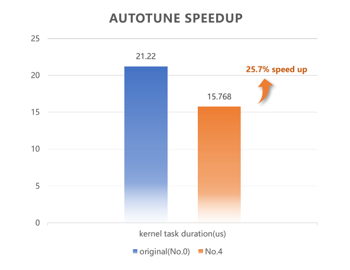
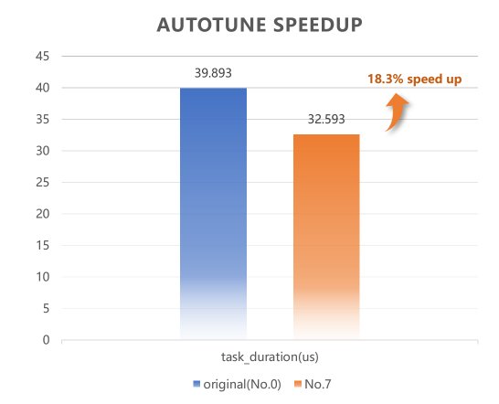

# Autotune Readme
## Autotune自动寻优功能简介
算子的运行性能与算子定义相关，比如matmul在Kernel层算子定义中使用不同的L1TileShape和L0TileShape参数时，算子的性能会有显著差异。
为协助开发者高效寻出目标场景下的最优Tiling参数，可使用mskpp库提供的autotune接口来实现自动寻优。
autotune接口启动后会遍历预设的搜索空间，用备选参数替换Kernel代码中被标记为"// tunable"的参数，实例化不同Tiling参数配置的Kernel，
并行完成Kernel编译与下发，最终展示不同Tiling参数下的Kernel运行耗时，供开发者选出最优Tiling参数。
自动寻优提供样例代码参考[00_basic_matmul_autotune.py](./00_basic_matmul_autotune.py)等。

## 代码组织
```
├── autotune
│   ├── helper
│   │   ├── act_type.py     # 模板库数据类型定义文件
│   │   ├── helper.py       # CMake编译文件
│   │   └── jit_build.sh    # 编译脚本
│   ├── images              # README图片文件目录
│   ├── 00_basic_matmul_autotune.py # 自动寻优样例文件
│   ├── 06_optimized_matmul_autotune.py
│   ├── 08_grouped_matmul_autotune.py
│   └── README.md
```

## CANN版本配套说明
- autotune自动寻优功能首次随 CANN 8.1.RC1.beta1 版本发布，需配套 CANN 8.1.RC1.beta1 及之后版本使用。
（参考《[CANN软件安装指南](https://www.hiascend.com/document/detail/zh/CANNCommunityEdition/800alpha002/softwareinst/instg/instg_0001.html?Mode=PmIns&OS=Ubuntu&Software=cannToolKit)》安装CANN开发套件包以及配套固件和驱动）

## 使用示例
- 运行00_basic_matmul_autotune自动寻优，
```
# python3 basic_matmul_autotune.py
```
以下是在AtlasA2 910B4硬件上运行的结果，
```
No.0: 21.220μs, {'L1TileShape': 'GemmShape<128, 256, 256>', 'L0TileShape': 'GemmShape<128, 256, 64>'}
No.1: 21.986μs, {'L1TileShape': 'GemmShape<128, 256, 128>', 'L0TileShape': 'GemmShape<128, 256, 64>'}
No.2: 17.728μs, {'L1TileShape': 'GemmShape<128, 128, 256>', 'L0TileShape': 'GemmShape<128, 128, 64>'}
No.3: 16.270μs, {'L1TileShape': 'GemmShape<64, 128, 128>', 'L0TileShape': 'GemmShape<64, 128, 128>'}
No.4: 15.768μs, {'L1TileShape': 'GemmShape<64, 128, 256>', 'L0TileShape': 'GemmShape<64, 128, 128>'}
No.5: 16.990μs, {'L1TileShape': 'GemmShape<64, 128, 512>', 'L0TileShape': 'GemmShape<64, 128, 128>'}
No.6: 21.980μs, {'L1TileShape': 'GemmShape<64, 64, 128>', 'L0TileShape': 'GemmShape<64, 64, 128>'}
No.7: 20.160μs, {'L1TileShape': 'GemmShape<64, 64, 256>', 'L0TileShape': 'GemmShape<64, 64, 128>'}
No.8: 22.312μs, {'L1TileShape': 'GemmShape<64, 64, 512>', 'L0TileShape': 'GemmShape<64, 64, 128>'}
No.9: 21.947μs, {'L1TileShape': 'GemmShape<128, 128, 128>', 'L0TileShape': 'GemmShape<128, 128, 128>'}
No.10: 18.052μs, {'L1TileShape': 'GemmShape<128, 128, 256>', 'L0TileShape': 'GemmShape<128, 128, 128>'}
No.11: 18.642μs, {'L1TileShape': 'GemmShape<128, 128, 512>', 'L0TileShape': 'GemmShape<128, 128, 128>'}
Best config: No.4
compare success.
```
该结果表示输入的problem shape为m=256、n=512、k=1024时，`basic_matmul_autotune.py`中预设搜索空间中的最优参数组合为：
L1TileShape: GemmShape<64, 128, 256>，
L0TileShape: GemmShape<64, 128, 128>，
性能提升如下图所示，算子运行提速25.7%。


- 运行06_optimized_matmul_autotune自动寻优，
```
# python3 06_optimized_matmul_autotune.py
```
以下是在AtlasA2 910B4硬件上一次运行的结果，
```
No.0: 39.893μs, {'L1TileShape': 'GemmShape<128, 256, 256>', 'L0TileShape': 'GemmShape<128, 256, 64>'}
No.1: 40.129μs, {'L1TileShape': 'GemmShape<256, 128, 256>', 'L0TileShape': 'GemmShape<256, 128, 64>'}
No.2: 39.659μs, {'L1TileShape': 'GemmShape<128, 128, 256>', 'L0TileShape': 'GemmShape<128, 128, 64>'}
No.3: 37.697μs, {'L1TileShape': 'GemmShape<128, 128, 512>', 'L0TileShape': 'GemmShape<128, 128, 64>'}
No.4: 40.629μs, {'L1TileShape': 'GemmShape<64, 256, 128>', 'L0TileShape': 'GemmShape<64, 256, 64>'}
No.5: 37.365μs, {'L1TileShape': 'GemmShape<64, 256, 256>', 'L0TileShape': 'GemmShape<64, 256, 64>'}
No.6: 40.105μs, {'L1TileShape': 'GemmShape<64, 128, 256>', 'L0TileShape': 'GemmShape<64, 128, 64>'}
No.7: 32.593μs, {'L1TileShape': 'GemmShape<128, 128, 256>', 'L0TileShape': 'GemmShape<128, 128, 128>'}
No.8: 36.339μs, {'L1TileShape': 'GemmShape<128, 128, 512>', 'L0TileShape': 'GemmShape<128, 128, 128>'}
No.9: 34.691μs, {'L1TileShape': 'GemmShape<64, 128, 256>', 'L0TileShape': 'GemmShape<64, 128, 128>'}
No.10: 36.607μs, {'L1TileShape': 'GemmShape<64, 128, 512>', 'L0TileShape': 'GemmShape<64, 128, 128>'}
No.11: 36.485μs, {'L1TileShape': 'GemmShape<128, 64, 512>', 'L0TileShape': 'GemmShape<128, 64, 128>'}
No.12: 42.007μs, {'L1TileShape': 'GemmShape<64, 64, 256>', 'L0TileShape': 'GemmShape<64, 64, 256>'}
No.13: 37.065μs, {'L1TileShape': 'GemmShape<64, 64, 512>', 'L0TileShape': 'GemmShape<64, 64, 256>'}
No.14: 37.605μs, {'L1TileShape': 'GemmShape<64, 64, 1024>', 'L0TileShape': 'GemmShape<64, 64, 256>'}
Best config: No.7
compare success.
```
该结果表示输入的problem shape为m=256、n=512、k=1024时，`optimized_matmul_autotune.py`中预设搜索空间中的最优参数组合为：
L1TileShape: GemmShape<128, 128, 256>，
L0TileShape: GemmShape<128, 128, 128>,
性能提升如下图所示，算子运行提速18.3%。


- 运行08_grouped_matmul_autotune自动寻优，
```
# python3 08_grouped_matmul_autotune.py
```
以下是在AtlasA2 910B4硬件上一次运行的结果，
```
No.0: 63.427μs, {'L1TileShape': 'GemmShape<128, 256, 256>', 'L0TileShape': 'GemmShape<128, 256, 64>'}
No.1: 63.787μs, {'L1TileShape': 'GemmShape<128, 256, 128>', 'L0TileShape': 'GemmShape<128, 256, 64>'}
No.2: 66.959μs, {'L1TileShape': 'GemmShape<128, 128, 128>', 'L0TileShape': 'GemmShape<128, 128, 64>'}
No.3: 64.377μs, {'L1TileShape': 'GemmShape<128, 128, 256>', 'L0TileShape': 'GemmShape<128, 128, 64>'}
No.4: 66.168μs, {'L1TileShape': 'GemmShape<128, 128, 512>', 'L0TileShape': 'GemmShape<128, 128, 64>'}
No.5: 65.285μs, {'L1TileShape': 'GemmShape<128, 256, 128>', 'L0TileShape': 'GemmShape<128, 256, 32>'}
No.6: 71.644μs, {'L1TileShape': 'GemmShape<256, 128, 128>', 'L0TileShape': 'GemmShape<256, 128, 32>'}
No.7: 65.689μs, {'L1TileShape': 'GemmShape<64, 128, 256>', 'L0TileShape': 'GemmShape<64, 128, 128>'}
No.8: 63.546μs, {'L1TileShape': 'GemmShape<64, 128, 512>', 'L0TileShape': 'GemmShape<64, 128, 128>'}
No.9: 74.791μs, {'L1TileShape': 'GemmShape<32, 128, 256>', 'L0TileShape': 'GemmShape<32, 128, 128>'}
No.10: 71.186μs, {'L1TileShape': 'GemmShape<32, 128, 512>', 'L0TileShape': 'GemmShape<32, 128, 128>'}
No.11: 77.818μs, {'L1TileShape': 'GemmShape<64, 64, 256>', 'L0TileShape': 'GemmShape<64, 64, 128>'}
No.12: 72.549μs, {'L1TileShape': 'GemmShape<64, 64, 512>', 'L0TileShape': 'GemmShape<64, 64, 128>'}
Best config: No.0
compare success.
```
该结果表示输入的problem shape为m=1024、n=768、k=512、problem_count=8时，在`grouped_matmul_autotune.py`中预设搜索空间中的最优参数组合为：
L1TileShape: GemmShape<128, 256, 256>，
L0TileShape: GemmShape<128, 256, 64>
搜索空间中未找到明显比原始Tiling参数配置更优的参数。