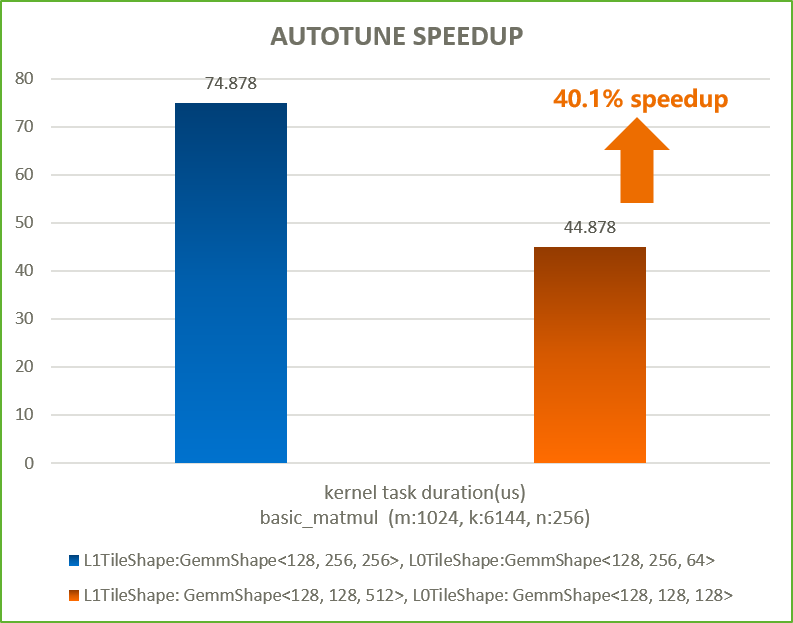
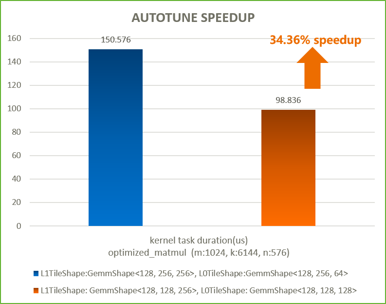
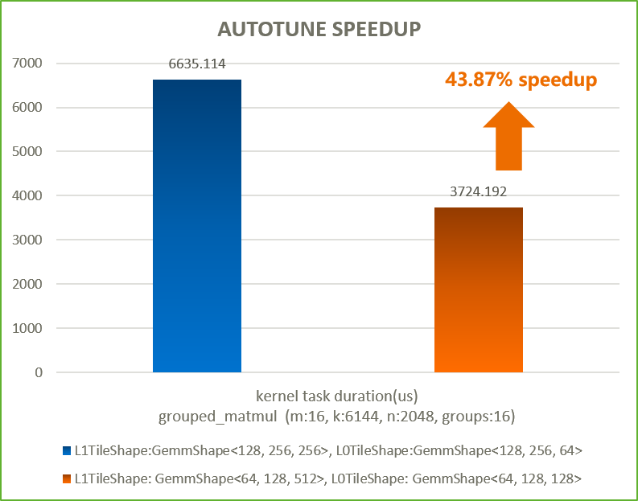

# Autotune Readme
## Autotune自动寻优功能简介
算子的运行性能与算子定义相关，比如matmul在Kernel层算子定义中使用不同的L1TileShape和L0TileShape参数时，算子的性能会有显著差异。
为协助开发者高效寻出目标场景下的最优Tiling参数，可使用[mskpp库](https://www.hiascend.com/document/detail/zh/canncommercial/81RC1/devaids/opdev/optool/atlasopdev_16_0154.html)提供的autotune接口来实现自动寻优。
autotune接口启动后会遍历预设的搜索空间，用备选参数替换Kernel代码中被标记为"// tunable"的参数，实例化不同Tiling参数配置的Kernel，
并行完成Kernel编译与下发，最终展示不同Tiling参数下的Kernel运行耗时，供开发者选出最优Tiling参数。
自动寻优提供样例代码参考[00_basic_matmul_autotune.py](./00_basic_matmul_autotune.py)等。

## 代码组织
```
├── autotune
│   ├── helper
│   │   ├── act_type.py     # 模板库数据类型定义文件
│   │   ├── helper.py       # CMake编译文件
│   │   └── jit_build.sh    # 编译脚本
│   ├── images              # README图片文件目录
│   ├── 00_basic_matmul_autotune.py # 自动寻优样例文件
│   ├── 06_optimized_matmul_autotune.py
│   ├── 08_grouped_matmul_autotune.py
│   └── README.md
```

## CANN版本配套说明
- autotune自动寻优功能首次随 CANN 8.1.RC1.beta1 版本发布，需配套 CANN 8.1.RC1.beta1 及之后版本使用。CANN开发套件包: [下载地址](https://www.hiascend.com/zh/developer/download/community/result?module=cann)

## 使用示例
- 运行00_basic_matmul_autotune自动寻优，
```
# python3 basic_matmul_autotune.py
```
以下是在AtlasA2 910B3硬件上运行的结果，
```
No.0: 75.188μs, {'L1TileShape': 'GemmShape<128, 256, 256>', 'L0TileShape': 'GemmShape<128, 256, 64>'}
No.6: 97.470μs, {'L1TileShape': 'GemmShape<64, 64, 128>', 'L0TileShape': 'GemmShape<64, 64, 128>'}
No.1: 80.262μs, {'L1TileShape': 'GemmShape<128, 256, 128>', 'L0TileShape': 'GemmShape<128, 256, 64>'}
No.7: 85.544μs, {'L1TileShape': 'GemmShape<64, 64, 256>', 'L0TileShape': 'GemmShape<64, 64, 128>'}
No.11: 45.426μs, {'L1TileShape': 'GemmShape<128, 128, 512>', 'L0TileShape': 'GemmShape<128, 128, 128>'}
No.9: 55.618μs, {'L1TileShape': 'GemmShape<128, 128, 128>', 'L0TileShape': 'GemmShape<128, 128, 128>'}
No.3: 71.228μs, {'L1TileShape': 'GemmShape<64, 128, 128>', 'L0TileShape': 'GemmShape<64, 128, 128>'}
No.2: 52.428μs, {'L1TileShape': 'GemmShape<128, 128, 256>', 'L0TileShape': 'GemmShape<128, 128, 64>'}
No.4: 67.940μs, {'L1TileShape': 'GemmShape<64, 128, 256>', 'L0TileShape': 'GemmShape<64, 128, 128>'}
No.8: 84.306μs, {'L1TileShape': 'GemmShape<64, 64, 512>', 'L0TileShape': 'GemmShape<64, 64, 128>'}
No.10: 48.516μs, {'L1TileShape': 'GemmShape<128, 128, 256>', 'L0TileShape': 'GemmShape<128, 128, 128>'}
No.5: 61.108μs, {'L1TileShape': 'GemmShape<64, 128, 512>', 'L0TileShape': 'GemmShape<64, 128, 128>'}
Best config: No.11
compare success.
```
该结果表示输入的problem shape为m=1024、n=256、k=6144时，`basic_matmul_autotune.py`中预设搜索空间中的最优参数组合为：
L1TileShape: GemmShape<128, 128, 512>，
L0TileShape: GemmShape<128, 128, 128>，
性能提升如下图所示，算子运行提速40.1%。


- 运行06_optimized_matmul_autotune自动寻优，
```
# python3 06_optimized_matmul_autotune.py
```
以下是在AtlasA2 910B3硬件上一次运行的结果，
```
No.9: 138.084μs, {'L1TileShape': 'GemmShape<64, 128, 256>', 'L0TileShape': 'GemmShape<64, 128, 128>'}
No.2: 107.888μs, {'L1TileShape': 'GemmShape<128, 128, 256>', 'L0TileShape': 'GemmShape<128, 128, 64>'}
No.11: 126.272μs, {'L1TileShape': 'GemmShape<128, 64, 512>', 'L0TileShape': 'GemmShape<128, 64, 128>'}
No.4: 172.840μs, {'L1TileShape': 'GemmShape<64, 256, 128>', 'L0TileShape': 'GemmShape<64, 256, 64>'}
No.13: 175.396μs, {'L1TileShape': 'GemmShape<64, 64, 512>', 'L0TileShape': 'GemmShape<64, 64, 256>'}
No.8: 105.456μs, {'L1TileShape': 'GemmShape<128, 128, 512>', 'L0TileShape': 'GemmShape<128, 128, 128>'}
No.7: 102.716μs, {'L1TileShape': 'GemmShape<128, 128, 256>', 'L0TileShape': 'GemmShape<128, 128, 128>'}
No.1: 90.292μs, {'L1TileShape': 'GemmShape<256, 128, 256>', 'L0TileShape': 'GemmShape<256, 128, 64>'}
No.12: 212.984μs, {'L1TileShape': 'GemmShape<64, 64, 256>', 'L0TileShape': 'GemmShape<64, 64, 256>'}
No.5: 166.016μs, {'L1TileShape': 'GemmShape<64, 256, 256>', 'L0TileShape': 'GemmShape<64, 256, 64>'}
No.3: 109.108μs, {'L1TileShape': 'GemmShape<128, 128, 512>', 'L0TileShape': 'GemmShape<128, 128, 64>'}
No.10: 128.888μs, {'L1TileShape': 'GemmShape<64, 128, 512>', 'L0TileShape': 'GemmShape<64, 128, 128>'}
No.0: 155.212μs, {'L1TileShape': 'GemmShape<128, 256, 256>', 'L0TileShape': 'GemmShape<128, 256, 64>'}
No.14: 166.260μs, {'L1TileShape': 'GemmShape<64, 64, 1024>', 'L0TileShape': 'GemmShape<64, 64, 256>'}
No.6: 157.184μs, {'L1TileShape': 'GemmShape<64, 128, 256>', 'L0TileShape': 'GemmShape<64, 128, 64>'}
Best config: No.1
compare success.
```
该结果表示输入的problem shape为m=1024、n=576、k=6144时，`optimized_matmul_autotune.py`中预设搜索空间中的最优参数组合为：
L1TileShape: GemmShape<128, 128, 256>，
L0TileShape: GemmShape<128, 128, 128>,
性能提升如下图所示，算子运行提速34.36%。


- 运行08_grouped_matmul_autotune自动寻优，
```
# python3 08_grouped_matmul_autotune.py
```
以下是在AtlasA2 910B3硬件上一次运行的结果，
```
No.3: 6933.814μs, {'L1TileShape': 'GemmShape<128, 128, 256>', 'L0TileShape': 'GemmShape<128, 128, 64>'}
No.9: 6672.344μs, {'L1TileShape': 'GemmShape<32, 128, 256>', 'L0TileShape': 'GemmShape<32, 128, 128>'}
No.10: 3820.252μs, {'L1TileShape': 'GemmShape<32, 128, 512>', 'L0TileShape': 'GemmShape<32, 128, 128>'}
No.0: 6311.324μs, {'L1TileShape': 'GemmShape<128, 256, 256>', 'L0TileShape': 'GemmShape<128, 256, 64>'}
No.6: 12419.114μs, {'L1TileShape': 'GemmShape<256, 128, 128>', 'L0TileShape': 'GemmShape<256, 128, 32>'}
No.1: 10879.374μs, {'L1TileShape': 'GemmShape<128, 256, 128>', 'L0TileShape': 'GemmShape<128, 256, 64>'}
No.7: 7187.830μs, {'L1TileShape': 'GemmShape<64, 128, 256>', 'L0TileShape': 'GemmShape<64, 128, 128>'}
No.4: 3851.556μs, {'L1TileShape': 'GemmShape<128, 128, 512>', 'L0TileShape': 'GemmShape<128, 128, 64>'}
No.8: 3830.396μs, {'L1TileShape': 'GemmShape<64, 128, 512>', 'L0TileShape': 'GemmShape<64, 128, 128>'}
No.5: 11467.018μs, {'L1TileShape': 'GemmShape<128, 256, 128>', 'L0TileShape': 'GemmShape<128, 256, 32>'}
No.2: 12487.734μs, {'L1TileShape': 'GemmShape<128, 128, 128>', 'L0TileShape': 'GemmShape<128, 128, 64>'}
No.12: 3985.550μs, {'L1TileShape': 'GemmShape<64, 64, 512>', 'L0TileShape': 'GemmShape<64, 64, 128>'}
No.11: 7437.658μs, {'L1TileShape': 'GemmShape<64, 64, 256>', 'L0TileShape': 'GemmShape<64, 64, 128>'}
Best config: No.10
compare success.
```
该结果表示输入的problem shape为m=16、n=2048、k=6144、problem_count=16时，在`grouped_matmul_autotune.py`中预设搜索空间中的最优参数组合为：
L1TileShape: GemmShape<64, 128, 512>，
L0TileShape: GemmShape<64, 128, 128>
性能提升如下图所示，算子运行提速43.87%。
